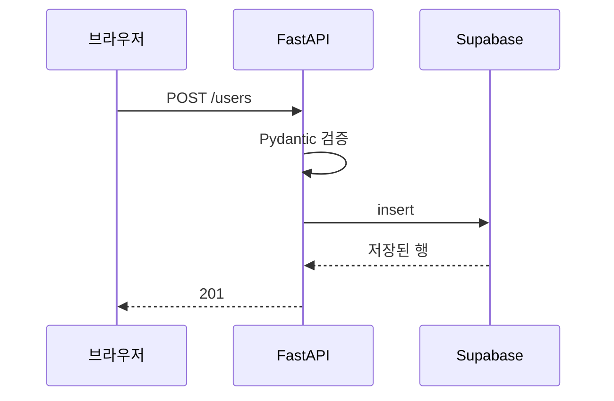

# FastAPI와 Supabase 연동 — 사용자·서비스 데이터 관리

> [!warning] 이용 조건
> 본 교육자료는 수강생 개인의 학습 목적에 한하여 이용할 수 있으며, 외부 AI 서비스에 업로드하거나 동영상을 포함한 2차 콘텐츠로 제작·재배포하는 행위를 금지합니다. 예외적 이용은 출처 표기, 비상업적 사용, 강사의 사전 동의를 모두 충족하는 경우에 한하여 허용됩니다.

> **교육생 배포용 실습 가이드**
> 이 문서 하나만 따라 하면 실습을 처음부터 끝까지 완성할 수 있습니다.
> 수업 중 놓친 부분이 있어도 이 문서로 혼자 복습할 수 있도록 모든 결과 코드를 포함했습니다.
>
> **코드 복사 방법 (Obsidian)** — `Ctrl + E`를 눌러 **읽기 모드**로 전환한 뒤, 코드 블록 위에 마우스를 올리면 우측 상단에 복사 버튼이 나타납니다. 편집 모드에서는 보이지 않습니다.

| 항목 | 내용 |
| --- | --- |
| 교육 일차 | **12일차** |
| 과정 | FastAPI와 Supabase 연동 |
| 주제 | 웹 API 개념, FastAPI 라우터·Pydantic 검증, 사용자·대화·메시지 CRUD API, 상태 코드와 오류 처리 |
| 예제 도메인 | 챗봇 서비스 (사용자 / 대화 / 메시지) |
| 소요 시간 | 이론 약 90분 + 실습 약 5시간 + 연습문제 약 60분 |
| 선수 조건 | 이전 차수(Supabase 시작)에서 만든 `users` / `conversations` / `messages` 테이블과 데이터 |
| 사용 도구 | VS Code, 파이썬, 브라우저(Swagger UI) |

---

## 0. 시작 전 체크리스트

- [ ] Supabase 프로젝트에 `users`, `conversations`, `messages` 테이블이 있다
- [ ] `users` 4건, `conversations` 4건, `messages` 9건이 들어 있다
- [ ] `uv --version` 실행 시 버전이 출력된다
- [ ] 이전 차수의 `.env`에 `SUPABASE_URL`, `SUPABASE_SERVICE_ROLE_KEY`가 채워져 있다

데이터 상태는 Supabase SQL Editor에서 아래로 확인합니다.

```sql
select
    (select count(*) from users)         as 사용자수,
    (select count(*) from conversations) as 대화수,
    (select count(*) from messages)      as 메시지수;
```

`4 / 4 / 9`가 나오면 됩니다. 테이블이 없다면 이전 차수 문서의 SQL을 먼저 실행합니다.

> **주의:** 이번 차수는 이전 차수에서 만든 테이블을 **그대로 이어서** 씁니다. 테이블을 지우지 않은 상태로 시작합니다.

### 완료 후 산출물

```
3_chat-service/
└── backend/
    ├── .env                    ← 접속 정보 (직접 작성, 공유 금지)
    ├── .env.example
    ├── pyproject.toml
    └── app/
        ├── __init__.py
        ├── main.py             ← FastAPI 앱 진입점
        ├── db.py               ← Supabase 접속
        ├── schemas.py          ← 요청·응답 모델
        └── routers/
            ├── __init__.py
            ├── users.py        ← 사용자 정보 관리 API
            └── conversations.py ← 대화·메시지 API
```

완성하면 아래 10개 엔드포인트가 동작합니다.

| 메서드 | 주소 | 하는 일 |
| --- | --- | --- |
| `GET` | `/health` | 서버가 살아있는지 확인 |
| `POST` | `/users` | 사용자 등록 |
| `GET` | `/users` | 사용자 목록 |
| `GET` | `/users/{user_id}` | 사용자 한 명 조회 |
| `PATCH` | `/users/{user_id}` | 닉네임 수정 |
| `DELETE` | `/users/{user_id}` | 사용자 삭제 |
| `POST` | `/conversations` | 대화 생성 |
| `GET` | `/conversations?user_id=` | 사용자별 대화 목록 |
| `POST` | `/conversations/{conversation_id}/messages` | 메시지 저장 |
| `GET` | `/conversations/{conversation_id}/messages` | 메시지 목록 |

---

## 1. 개념 이해 — 왜 API로 감싸는가

### 지금까지 한 것과 무엇이 다른가

이전 차수에서는 파이썬 파일을 직접 실행해 데이터베이스에 값을 넣고 꺼냈습니다.

```
python_practice.py  →  Supabase
```

이 방식에는 한계가 있습니다.

| 한계 | 설명 |
| --- | --- |
| 나만 쓸 수 있다 | 내 컴퓨터에서 파이썬을 실행해야 한다 |
| 접속 키가 노출된다 | 웹 화면이나 앱에 `service_role` 키를 넣을 수 없다 |
| 규칙을 강제할 수 없다 | 누구나 아무 값이나 넣을 수 있다 |

**웹 API**로 감싸면 이렇게 바뀝니다.

```
브라우저 · 모바일 앱 · 다른 서버
        ↓  HTTP 요청
    FastAPI 서버   ← 키를 여기에만 둔다. 검증도 여기서 한다
        ↓
     Supabase
```

접속 키는 서버에만 두고, 클라이언트는 정해진 주소만 호출합니다. 값이 규칙에 맞는지도 서버가 검사합니다.

**요청 하나가 지나는 길입니다.**



요청을 실제로 받는 것은 **uvicorn**이고, 그것을 처리하는 것이 **FastAPI**입니다. 검증에서 걸리면 `422`로 끝나고 Supabase까지 가지 않습니다.

**uvicorn과 FastAPI가 나뉘어 있는 것**과 **DB에 가기 전에 검증이 한 번 있는 것**, 두 가지만 보면 됩니다. 오늘 만드는 것이 전부 이 모양입니다.

### FastAPI와 uvicorn

| 이름 | 역할 |
| --- | --- |
| **FastAPI** | 파이썬 웹 프레임워크. "어느 주소로 요청이 오면 어느 함수를 실행할지"를 정한다 |
| **uvicorn** | 실제로 HTTP 요청을 받는 웹 서버 프로그램. FastAPI 앱을 얹어 실행한다 |

FastAPI만으로는 요청을 받을 수 없습니다. uvicorn이 포트를 열어 요청을 받고, FastAPI가 그것을 처리합니다.

### HTTP 메서드

같은 주소라도 **메서드**에 따라 하는 일이 다릅니다.

| 메서드 | 의미 | 이번 차수의 예 |
| --- | --- | --- |
| `GET` | 조회 | `GET /users` — 사용자 목록 |
| `POST` | 생성 | `POST /users` — 사용자 등록 |
| `PATCH` | 일부 수정 | `PATCH /users/{user_id}` — 닉네임만 변경 |
| `PUT` | 전체 교체 | (이번 차수에서는 쓰지 않음) |
| `DELETE` | 삭제 | `DELETE /users/{user_id}` |

`PATCH`와 `PUT`의 차이는 **일부만 바꾸느냐, 통째로 바꾸느냐**입니다. 닉네임만 바꾸므로 `PATCH`를 씁니다.

### 상태 코드

응답에는 숫자로 된 결과 표시가 함께 옵니다.

| 코드 | 의미 | 이번 차수에서 나오는 경우 |
| --- | --- | --- |
| `200` | 성공 | 조회·수정 성공 |
| `201` | 생성됨 | 사용자·대화·메시지 생성 성공 |
| `204` | 성공, 내용 없음 | 삭제 성공 (돌려줄 데이터가 없음) |
| `404` | 없음 | 없는 사용자·대화를 조회 |
| `409` | 충돌 | 이미 등록된 이메일로 가입 시도 |
| `422` | 입력값 오류 | 닉네임이 1글자, 이메일 형식이 아님 |
| `500` | 서버 오류 | 우리 코드의 버그 (터미널에서 확인) |

`4xx`는 **요청한 쪽 잘못**, `5xx`는 **서버 쪽 잘못**입니다.

### Pydantic — 입력값 검사

이전 차수에서 데이터베이스에 `CHECK` 제약을 걸어 잘못된 값을 막았습니다. FastAPI에서는 **DB에 가기 전에** 서버가 먼저 검사합니다.

| 검사 위치 | 막는 시점 | 이번 차수의 예 |
| --- | --- | --- |
| Pydantic (서버) | 요청을 받자마자 | 닉네임 2글자 미만, 이메일 형식 오류 |
| DB 제약 조건 | 저장 직전 | 중복 이메일, 외래키 위반 |

둘 다 있어야 합니다. 서버 검사는 빠르게 걸러주고, DB 제약은 최후의 방어선입니다.

---

## 2. Swagger UI 사용법

FastAPI는 코드에서 **자동으로 API 문서 화면**을 만들어줍니다. 이 화면에서 실제 요청을 보낼 수 있어, 별도 프로그램 없이 테스트할 수 있습니다.

서버를 실행한 뒤 브라우저에서 `http://127.0.0.1:8000/docs`로 접속합니다.

이후 실습의 "확인" 단계는 모두 이 화면에서 진행합니다. 절차를 한 번만 정리합니다.

**조회(GET) 실행하기**

1. 실행할 엔드포인트(예: `GET /users`)를 클릭해 펼칩니다
2. 우측의 **`Try it out`** 버튼을 누릅니다
3. 입력칸이 있으면 값을 채웁니다
4. **`Execute`** 버튼을 누릅니다
5. 아래 **`Server response`** 영역에서 **`Code`**(상태 코드)와 **`Response body`**(돌아온 데이터)를 확인합니다

**생성·수정(POST/PATCH) 실행하기**

1. 엔드포인트를 펼치고 **`Try it out`** 클릭
2. **`Request body`** 칸에 예시 JSON이 채워져 있습니다. 값을 원하는 대로 고칩니다
3. **`Execute`** 클릭
4. `Code`와 `Response body` 확인

> **참고:** 코드를 고치면 `--reload` 옵션 덕분에 서버가 자동으로 다시 시작됩니다. 다만 **브라우저 화면은 자동으로 새로고침되지 않습니다.** 엔드포인트를 추가했는데 화면에 안 보이면 `F5`를 누릅니다.

---

## 3. 실습 1부 — 프로젝트 준비

각 실습은 **목표 / 요구사항 / 힌트 / 결과 코드 / 확인** 순서입니다.

### 실습 1. 프로젝트 폴더와 패키지 설치

**목표:** FastAPI 프로젝트를 만들고 서버를 띄운다.

**요구사항**

- `3_chat-service/backend` 폴더에서 패키지를 설치한다
- `fastapi`, `uvicorn`, `supabase`, `python-dotenv`, `pydantic[email]`이 들어간다
- `.env`에 Supabase 접속 정보를 넣는다

**힌트**

`pyproject.toml`에 필요한 패키지가 이미 적혀 있습니다. `uv sync` 한 줄이면 가상환경(`.venv`) 생성과 설치가 함께 끝납니다.
이메일 형식 검사(`EmailStr`)를 쓰려면 `pydantic`만으로는 부족하고 `pydantic[email]`이 필요합니다.

**결과 코드**

```powershell
cd 3_chat-service\backend
uv sync
```

`.env.example`을 복사해 `.env`를 만들고 이전 차수와 같은 값을 채웁니다.

```powershell
copy .env.example .env
```

```
SUPABASE_URL=https://xxxxxxxxxxxx.supabase.co
SUPABASE_SERVICE_ROLE_KEY=여기에_service_role_key_붙여넣기
```

`.env`는 공유하지 않지만 `.env.example`은 저장소에 함께 둡니다. 다른 사람이 어떤 값을 채워야 하는지 알 수 있게 하는 용도입니다.

**확인:** `backend` 폴더에 `.venv`와 `.env`가 생겼습니다. 폴더 안에는 아래가 이미 들어 있습니다.

| 파일 | 상태 |
| --- | --- |
| `app/db.py` | 완성. 실습 2에서 내용을 확인만 합니다 |
| `app/main.py` | `/health`만 있습니다. 라우터 등록이 `# TODO` |
| `app/schemas.py` | 전부 `# TODO` (실습 3) |
| `app/routers/users.py` | 전부 `# TODO` (실습 4·5) |
| `app/routers/conversations.py` | 전부 `# TODO` (실습 6·7) |

각 실습에서 해당 `# TODO`를 지우고 결과 코드를 채워 넣습니다.

> **참고:** 처음부터 직접 만들어보고 싶다면 빈 폴더에서 `uv init`으로 시작해도 됩니다.
> 그때는 `uv add fastapi "uvicorn[standard]" supabase python-dotenv "pydantic[email]"`로 패키지를 넣고,
> `uv init`이 만들어준 `main.py`는 지운 뒤 `app/` 폴더를 직접 만듭니다.

> **주의 — `pydantic[email]`을 빼먹으면**
> 서버 실행 시 아래 오류로 시작조차 되지 않습니다.
> `ImportError: email-validator is not installed, run pip install pydantic[email]`

---

### 실습 2. 접속 코드와 앱 진입점

**목표:** Supabase 접속 코드를 분리하고, 서버가 뜨는지 확인한다.

**요구사항**

- `app/db.py`의 Supabase 접속 코드를 확인한다
- `app/main.py`에 FastAPI 앱과 `/health` 엔드포인트가 있는 것을 확인한다
- 서버를 실행해 브라우저에서 확인한다

**힌트**

`app/db.py`는 이전 차수의 `db.py`와 **완전히 같은 구조**입니다. 접속 코드를 한 곳에 모으고 다른 파일이 가져다 쓰는 방식입니다.
`app` 폴더를 파이썬 패키지로 인식시키려면 빈 `__init__.py`가 필요합니다. 이미 들어 있습니다.

**결과 코드**

`app/db.py` — 이미 채워져 있습니다. 열어서 내용만 확인합니다.

```python
import os

from dotenv import load_dotenv
from supabase import Client, create_client

load_dotenv()

SUPABASE_URL = os.environ["SUPABASE_URL"]
SUPABASE_SERVICE_ROLE_KEY = os.environ["SUPABASE_SERVICE_ROLE_KEY"]

supabase: Client = create_client(SUPABASE_URL, SUPABASE_SERVICE_ROLE_KEY)
```

`app/main.py`

```python
from fastapi import FastAPI

app = FastAPI(title="chat-service", version="0.1.0")


@app.get("/health")
def health():
    return {"status": "ok"}
```

서버 실행:

```powershell
uv run uvicorn app.main:app --reload
```

명령의 각 부분은 이렇습니다.

| 부분 | 의미 |
| --- | --- |
| `uv run` | 이 프로젝트의 가상환경으로 실행 |
| `uvicorn` | 웹 서버 프로그램 |
| `app.main` | `app/main.py` 파일 |
| `:app` | 그 파일 안의 `app` 변수 (FastAPI 인스턴스) |
| `--reload` | 코드를 고치면 서버를 자동으로 다시 시작 (개발용) |

**확인:** 터미널에 아래가 나옵니다.

```
INFO:     Uvicorn running on http://127.0.0.1:8000 (Press CTRL+C to quit)
INFO:     Application startup complete.
```

브라우저에서 `http://127.0.0.1:8000/health`에 접속하면 `{"status":"ok"}`가 보입니다.
`http://127.0.0.1:8000/docs`에 접속하면 Swagger UI 화면이 뜨고 `GET /health` 하나가 보입니다.

> **서버 종료 방법:** 터미널에서 `Ctrl + C`를 누릅니다. 창을 그냥 닫으면 프로세스가 남아 다음에 실행할 때 `address already in use` 오류가 납니다.

---

### 실습 3. 요청·응답 모델 정의

**목표:** Pydantic 모델로 입력 검증 규칙과 응답 형태를 정한다.

**요구사항**

- 사용자: 생성용 / 수정용 / 응답용 모델 3개
- 대화: 생성용 / 응답용 모델 2개
- 메시지: 생성용 / 응답용 모델 2개
- 이전 차수에서 DB에 걸었던 제약을 그대로 반영한다 (닉네임 2~30자, `role`은 두 값만)

**힌트**

| 하려는 검사 | 쓰는 것 |
| --- | --- |
| 이메일 형식 | `EmailStr` |
| 글자 수 범위 | `Field(min_length=2, max_length=30)` |
| 정해진 값만 허용 | `Literal["user", "assistant"]` |
| UUID 형식 | `UUID` |

**생성용과 응답용을 왜 나누나:** 생성할 때는 `id`와 `created_at`을 클라이언트가 보내지 않습니다(DB가 만듭니다). 반대로 응답에는 그 값이 들어갑니다. 한 모델로 쓰면 둘 중 하나가 어긋납니다.

**결과 코드**

`app/schemas.py`

```python
from datetime import datetime
from typing import Literal
from uuid import UUID

from pydantic import BaseModel, EmailStr, Field


class UserCreate(BaseModel):
    email: EmailStr
    username: str = Field(min_length=2, max_length=30)


class UserUpdate(BaseModel):
    username: str = Field(min_length=2, max_length=30)


class UserOut(BaseModel):
    id: UUID
    email: str
    username: str
    created_at: datetime


class ConversationCreate(BaseModel):
    user_id: UUID
    title: str = Field(min_length=1, max_length=100)


class ConversationOut(BaseModel):
    id: UUID
    user_id: UUID
    title: str
    created_at: datetime


class MessageCreate(BaseModel):
    role: Literal["user", "assistant"]
    content: str = Field(min_length=1)


class MessageOut(BaseModel):
    id: UUID
    conversation_id: UUID
    role: str
    content: str
    created_at: datetime
```

**확인:** 이 파일만으로는 화면에 변화가 없습니다. 다음 실습에서 라우터에 연결하면 Swagger UI의 `Request body` 예시로 나타납니다.

---

## 4. 실습 2부 — 사용자 정보 관리 API

### 실습 4. 사용자 등록과 목록 조회

**목표:** `POST /users`와 `GET /users`를 만든다.

**요구사항**

- 등록 성공 시 상태 코드 `201`을 반환한다
- 이미 있는 이메일이면 `409`와 함께 한국어 메시지를 반환한다
- 목록은 최신 가입 순으로 정렬한다

**힌트**

- 라우터 분리: `APIRouter(prefix="/users", tags=["users"])`
- 상태 코드 지정: `@router.post("", status_code=201)`
- 오류 응답: `raise HTTPException(status_code=409, detail="메시지")`
- 중복 확인은 insert 전에 `select`로 조회합니다

**결과 코드**

`app/routers/users.py`

```python
from uuid import UUID

from fastapi import APIRouter, HTTPException

from app.db import supabase
from app.schemas import UserCreate, UserOut, UserUpdate

router = APIRouter(prefix="/users", tags=["users"])


@router.post("", response_model=UserOut, status_code=201)
def create_user(payload: UserCreate):
    existing = (
        supabase.table("users").select("id").eq("email", payload.email).execute()
    )
    if existing.data:
        raise HTTPException(status_code=409, detail="이미 등록된 이메일입니다")

    result = (
        supabase.table("users")
        .insert({"email": payload.email, "username": payload.username})
        .execute()
    )
    return result.data[0]


@router.get("", response_model=list[UserOut])
def list_users():
    result = (
        supabase.table("users").select("*").order("created_at", desc=True).execute()
    )
    return result.data
```

`app/main.py`에 라우터를 등록합니다.

```python
from fastapi import FastAPI

from app.routers import users

app = FastAPI(title="chat-service", version="0.1.0")

app.include_router(users.router)


@app.get("/health")
def health():
    return {"status": "ok"}
```

**확인:**

`/docs`를 새로고침하면 `users` 그룹에 두 개가 생깁니다.

1. `POST /users`를 펼쳐 `Try it out` → `Request body`를 아래로 고치고 `Execute`

```json
{
  "email": "api@example.com",
  "username": "에이피아이"
}
```

`Code`가 **`201`**, `Response body`에 `id`와 `created_at`이 채워진 사용자가 나옵니다.

2. **같은 요청을 한 번 더** `Execute` 합니다. `Code`가 **`409`**, `Response body`가 아래로 나옵니다.

```json
{ "detail": "이미 등록된 이메일입니다" }
```

3. `username`을 `"A"` 한 글자로 고쳐 `Execute` 합니다. `Code`가 **`422`**이고 `detail[0].type`이 `string_too_short`입니다.

4. `email`을 `"notanemail"`로 고쳐 `Execute` 합니다. `Code`가 **`422`**이고 `detail[0].type`이 `value_error`입니다.

5. `GET /users`를 `Execute` 하면 방금 만든 사용자를 포함해 **5명**이 나옵니다.

> **3번과 4번은 우리가 코드에 쓰지 않은 검사입니다.** `schemas.py`의 `Field(min_length=2)`와 `EmailStr`만 보고 FastAPI가 알아서 막고, 어디가 왜 틀렸는지까지 응답에 담아줍니다.

---

### 실습 5. 사용자 조회·수정·삭제

**목표:** `GET /users/{user_id}`, `PATCH`, `DELETE`를 만든다.

**요구사항**

- 없는 사용자를 다루면 `404`와 한국어 메시지를 반환한다
- 삭제 성공은 `204`(내용 없음)로 응답한다
- 수정은 닉네임만 바꾼다

**힌트**

- 주소의 일부를 값으로 받으려면 함수 인자에 같은 이름을 씁니다: `/{user_id}` → `def get_user(user_id: UUID)`
- supabase 라이브러리의 `update`/`delete`는 **바뀐 행을 리스트로 돌려줍니다.** 리스트가 비어 있으면 대상이 없었다는 뜻입니다
- `204`는 본문이 없어야 하므로 `return`으로 아무것도 돌려주지 않습니다

**결과 코드**

`app/routers/users.py`에 이어서 작성합니다.

```python
@router.get("/{user_id}", response_model=UserOut)
def get_user(user_id: UUID):
    result = supabase.table("users").select("*").eq("id", str(user_id)).execute()
    if not result.data:
        raise HTTPException(status_code=404, detail="사용자를 찾을 수 없습니다")
    return result.data[0]


@router.patch("/{user_id}", response_model=UserOut)
def update_user(user_id: UUID, payload: UserUpdate):
    result = (
        supabase.table("users")
        .update({"username": payload.username})
        .eq("id", str(user_id))
        .execute()
    )
    if not result.data:
        raise HTTPException(status_code=404, detail="사용자를 찾을 수 없습니다")
    return result.data[0]


@router.delete("/{user_id}", status_code=204)
def delete_user(user_id: UUID):
    result = supabase.table("users").delete().eq("id", str(user_id)).execute()
    if not result.data:
        raise HTTPException(status_code=404, detail="사용자를 찾을 수 없습니다")
```

**확인:**

1. `GET /users`로 사용자 목록을 조회해 `api@example.com`의 `id`를 복사합니다
2. `GET /users/{user_id}`에 그 값을 넣고 `Execute` → `Code` `200`, 닉네임 `에이피아이`
3. `user_id`를 `00000000-0000-0000-0000-000000000000`으로 바꿔 `Execute` → `Code` **`404`**, `detail`이 `사용자를 찾을 수 없습니다`
4. `PATCH /users/{user_id}`에 원래 `id`를 넣고 `Request body`를 `{"username": "수정됨"}`으로 `Execute` → `Code` `200`, `username`이 `수정됨`

> **`str(user_id)`로 감싸는 이유:** FastAPI가 주소의 값을 `UUID` 객체로 바꿔주는데, supabase 라이브러리에 넘길 때는 문자열이어야 합니다. 빼먹으면 조회 결과가 항상 비어 `404`가 납니다.

---

## 5. 실습 3부 — 서비스 데이터 관리 API

### 실습 6. 대화 생성과 목록 조회

**목표:** `POST /conversations`와 `GET /conversations?user_id=`를 만든다.

**요구사항**

- 없는 사용자로 대화를 만들면 `404`를 반환한다
- 목록 조회는 `user_id`를 반드시 받는다
- 최신순으로 정렬한다

**힌트**

- 주소 뒤 `?user_id=...` 형태로 오는 값(쿼리 파라미터)은 함수 인자에 그냥 적으면 됩니다: `def list_conversations(user_id: UUID)`
- 기본값을 주지 않으면 **필수**가 됩니다. 빠뜨리면 FastAPI가 `422`로 막습니다
- DB의 외래키가 이미 막아주지만, 그대로 두면 `500`이 납니다. 먼저 확인해서 `404`로 알려주는 편이 친절합니다

**결과 코드**

`app/routers/conversations.py`

```python
from uuid import UUID

from fastapi import APIRouter, HTTPException

from app.db import supabase
from app.schemas import ConversationCreate, ConversationOut, MessageCreate, MessageOut

router = APIRouter(prefix="/conversations", tags=["conversations"])


@router.post("", response_model=ConversationOut, status_code=201)
def create_conversation(payload: ConversationCreate):
    user = supabase.table("users").select("id").eq("id", str(payload.user_id)).execute()
    if not user.data:
        raise HTTPException(status_code=404, detail="사용자를 찾을 수 없습니다")

    result = (
        supabase.table("conversations")
        .insert({"user_id": str(payload.user_id), "title": payload.title})
        .execute()
    )
    return result.data[0]


@router.get("", response_model=list[ConversationOut])
def list_conversations(user_id: UUID):
    result = (
        supabase.table("conversations")
        .select("*")
        .eq("user_id", str(user_id))
        .order("created_at", desc=True)
        .execute()
    )
    return result.data
```

`app/main.py`에 라우터를 추가합니다.

```python
from app.routers import conversations, users

app.include_router(users.router)
app.include_router(conversations.router)
```

**확인:**

1. `POST /conversations`를 `Try it out` → `Request body`에 아래를 넣고 `Execute` (`user_id`는 실습 5에서 복사한 값)

```json
{
  "user_id": "복사한_사용자_id",
  "title": "API로 만든 대화"
}
```

`Code`가 **`201`**입니다. `Response body`의 `id`를 복사해둡니다. 다음 실습에서 씁니다.

2. `user_id`를 `00000000-0000-0000-0000-000000000000`으로 바꿔 `Execute` → `Code` **`404`**, `detail`이 `사용자를 찾을 수 없습니다`

3. `GET /conversations`를 펼쳐 `user_id`에 사용자 id를 넣고 `Execute` → `Code` `200`, 방금 만든 대화 **1건**

4. `user_id` 칸을 **비우고** `Execute` → `Code` **`422`**, `detail[0].type`이 `missing`

---

### 실습 7. 메시지 저장과 조회

**목표:** `POST /conversations/{conversation_id}/messages`와 `GET`을 만든다.

**요구사항**

- 없는 대화에 메시지를 넣으면 `404`를 반환한다
- 메시지 목록은 **시간순(오래된 것부터)** 으로 정렬한다
- `role`은 `user` / `assistant`만 허용한다

**힌트**

정렬 방향이 중요합니다. 대화는 최신순이지만 **메시지는 오래된 것부터**여야 대화 흐름대로 읽힙니다. `desc=False`를 씁니다.

**결과 코드**

`app/routers/conversations.py`에 이어서 작성합니다.

```python
@router.post("/{conversation_id}/messages", response_model=MessageOut, status_code=201)
def create_message(conversation_id: UUID, payload: MessageCreate):
    conversation = (
        supabase.table("conversations")
        .select("id")
        .eq("id", str(conversation_id))
        .execute()
    )
    if not conversation.data:
        raise HTTPException(status_code=404, detail="대화를 찾을 수 없습니다")

    result = (
        supabase.table("messages")
        .insert(
            {
                "conversation_id": str(conversation_id),
                "role": payload.role,
                "content": payload.content,
            }
        )
        .execute()
    )
    return result.data[0]


@router.get("/{conversation_id}/messages", response_model=list[MessageOut])
def list_messages(conversation_id: UUID):
    conversation = (
        supabase.table("conversations")
        .select("id")
        .eq("id", str(conversation_id))
        .execute()
    )
    if not conversation.data:
        raise HTTPException(status_code=404, detail="대화를 찾을 수 없습니다")

    result = (
        supabase.table("messages")
        .select("*")
        .eq("conversation_id", str(conversation_id))
        .order("created_at", desc=False)
        .execute()
    )
    return result.data
```

**확인:**

1. `POST /conversations/{conversation_id}/messages`에 실습 6에서 복사한 대화 id를 넣고, `Request body`에 아래를 넣어 `Execute`

```json
{ "role": "user", "content": "안녕하세요" }
```

`Code`가 **`201`**입니다.

2. 같은 방식으로 한 번 더 실행합니다.

```json
{ "role": "assistant", "content": "반갑습니다" }
```

3. `role`을 `"robot"`으로 바꿔 `Execute` → `Code` **`422`**, `detail[0].type`이 `literal_error`

4. `conversation_id`를 `00000000-0000-0000-0000-000000000000`으로 바꿔 `Execute` → `Code` **`404`**, `detail`이 `대화를 찾을 수 없습니다`

5. `GET /conversations/{conversation_id}/messages`를 `Execute` → `Code` `200`, `role`이 **`user` → `assistant` 순서**로 2건이 나옵니다. 넣은 순서 그대로입니다.

---

### 실습 8. 삭제가 연결된 데이터까지 지우는지 확인

**목표:** 이전 차수에서 건 `ON DELETE CASCADE`가 API를 통해서도 동작하는지 확인한다.

**요구사항**

- 실습에서 만든 사용자를 삭제한다
- 그 사용자의 대화가 함께 사라졌는지 확인한다

**결과 코드**

코드를 추가로 작성하지 않습니다. 이미 만든 엔드포인트로 확인합니다.

**확인:**

1. `DELETE /users/{user_id}`에 `api@example.com` 사용자의 id를 넣고 `Execute` → `Code` **`204`**, `Response body`가 비어 있습니다
2. `GET /conversations`에 같은 `user_id`를 넣고 `Execute` → `Code` `200`, `Response body`가 **`[]`** (빈 배열)
3. `DELETE /users/{user_id}`를 **한 번 더** `Execute` → `Code` **`404`**

사용자를 지웠을 뿐인데 대화와 메시지까지 사라졌습니다. 우리 코드에는 대화를 지우는 부분이 없습니다. **데이터베이스가 대신 처리한 것**입니다.

> `204`는 "성공했지만 돌려줄 내용이 없다"는 뜻입니다. 삭제는 돌려줄 데이터가 없으므로 `200` + 빈 본문보다 `204`가 정확합니다.

---

## 6. 실습 4부 — Swagger UI 밖에서 호출하기

지금까지 모든 확인을 `/docs`에서 했습니다. 하지만 API를 부르는 쪽은 브라우저만이 아닙니다. 1절에서 "여러 클라이언트가 같은 기능을 쓴다"고 했던 것을 직접 확인합니다.

**그리고 여기서 사고가 하나 납니다.** 실무에서 자주 나오고, 원인을 모르면 며칠을 헤매는 종류입니다.

### 실습 9. PowerShell로 호출하기 — 한글이 깨지는 사고

**목표:** 같은 API를 PowerShell로 호출한다. 한글이 깨지는 것을 직접 겪고, **콘솔만 깨진 것**과 **데이터가 깨진 것**을 구분한다.

**요구사항**

- 서버를 켜 둔 채로, 새 PowerShell 창에서 `Invoke-RestMethod`로 대화를 만든다
- 제목에 한글을 넣는다
- 저장된 값을 Swagger UI에서 확인한다
- 깨졌다면 원인을 찾아 고친다

**힌트**

`Invoke-RestMethod`는 PowerShell에 기본으로 들어 있는 HTTP 요청 명령입니다. `curl`이나 Postman과 같은 역할입니다.

| 부분 | 의미 |
| --- | --- |
| `-Uri` | 요청을 보낼 주소 |
| `-Method Post` | HTTP 메서드 |
| `-Body` | 요청 본문 |
| `-ContentType` | 본문의 형식 |

`ConvertTo-Json`은 PowerShell 객체를 JSON 문자열로 바꿉니다.

**결과 코드**

서버는 켜 둔 채로 **새 터미널**을 엽니다. (`Ctrl + C`로 서버를 끄면 안 됩니다.)

먼저 사용자 `id`를 하나 확보합니다.

```powershell
$users = Invoke-RestMethod -Uri http://127.0.0.1:8000/users
$userId = $users[0].id
$userId
```

이제 한글 제목으로 대화를 만듭니다.

```powershell
$body = @{ user_id = $userId; title = "파워셸에서 만든 대화" } | ConvertTo-Json
Invoke-RestMethod -Uri http://127.0.0.1:8000/conversations -Method Post -Body $body -ContentType "application/json"
```

**확인 1 — 응답을 봅니다.**

`title`이 `파워셸에서 만든 대화`가 아니라 **`?????? ?? ??`** 처럼 물음표로 나옵니다.

**확인 2 — 콘솔만 깨진 걸까요, 데이터가 깨진 걸까요.**

이걸 구분하지 못하면 엉뚱한 곳을 고치게 됩니다. **브라우저로 확인하면 됩니다.** 브라우저는 UTF-8을 기본으로 쓰므로, 여기서도 물음표면 콘솔 문제가 아닙니다.

`/docs`에서 `GET /conversations`를 펼치고 `user_id`에 위 `$userId` 값을 넣어 `Execute` 합니다.

`Response body`의 `title`이 **여전히 물음표**입니다. → **DB에 깨진 채로 저장됐습니다.**

| 증상 | 콘솔만 깨진 경우 | 데이터가 깨진 경우 |
| --- | --- | --- |
| 터미널 출력 | 깨짐 | 깨짐 |
| 브라우저(`/docs`) 조회 | **정상** | 깨짐 |
| 고칠 곳 | 터미널 설정 (`chcp 65001`) | **요청을 보내는 코드** |

**원인**

Windows PowerShell 5.1의 `Invoke-RestMethod`는 문자열 본문을 보낼 때 **시스템 코드페이지**(한국어 Windows는 `cp949`)로 바이트 변환합니다. `cp949`가 표현하지 못하는 문자는 그 과정에서 `?`로 뭉개집니다.

```
PowerShell               FastAPI 서버        Supabase
"파워셸에서..."   →   ?????? ?? ??   →   ?????? ?? ??
   cp949로 변환          이미 깨진 채 도착      그대로 저장
   (여기서 손실)
```

**FastAPI도 Supabase도 잘못이 없습니다.** 서버에 도착했을 때 이미 깨져 있었습니다. 서버 코드를 아무리 고쳐도 해결되지 않는 이유입니다.

**해결** — 본문을 UTF-8 바이트로 직접 변환해서 보냅니다.

```powershell
$json = @{ user_id = $userId; title = "파워셸에서 만든 대화" } | ConvertTo-Json
$bytes = [System.Text.Encoding]::UTF8.GetBytes($json)
Invoke-RestMethod -Uri http://127.0.0.1:8000/conversations -Method Post -Body $bytes -ContentType "application/json; charset=utf-8"
```

바뀐 곳은 두 군데입니다.

| | 고치기 전 | 고친 뒤 |
| --- | --- | --- |
| `-Body` | 문자열 (`$json`) | **UTF-8 바이트 배열** (`$bytes`) |
| `-ContentType` | `application/json` | `application/json; charset=utf-8` |

**확인:** 응답의 `title`이 `파워셸에서 만든 대화`로 나옵니다. `/docs`에서 `GET /conversations`로 조회해도 같습니다.

**정리 — 깨진 데이터를 지웁니다.**

앞에서 만든 물음표 제목의 대화가 남아 있습니다. `/docs`에서 `GET /conversations`로 그 대화의 `id`를 확인한 뒤, Supabase SQL Editor에서 지웁니다.

```sql
delete from conversations where title like '%?%';
```

**확인:** `GET /conversations`로 다시 조회하면 정상 제목의 대화만 남습니다.

> **교훈 두 가지**
>
> 1. **한글(비 ASCII)을 다루는 API를 PowerShell로 테스트할 때는 본문을 UTF-8 바이트로 명시 변환합니다.** 아니면 애초에 Swagger UI나 Postman처럼 UTF-8을 기본으로 쓰는 도구를 씁니다.
> 2. **"깨졌다"를 만나면 어디서 깨졌는지부터 가릅니다.** 화면인지, 저장된 데이터인지. 확인 경로를 하나 더 두면(여기서는 브라우저) 바로 갈립니다.

> **참고:** 서버는 한 줄도 고치지 않았습니다. 부르는 쪽만 바뀌었을 뿐입니다. 같은 API를 브라우저에서도, PowerShell에서도, 나중에 만들 Streamlit 앱에서도 부를 수 있습니다. **API로 감싼다는 것이 이런 뜻입니다.**

---

## 7. 연습문제 — 스스로 만들어보기

여기까지가 오늘의 필수 범위입니다. 아래 네 문제는 **결과 코드를 보지 않고 직접** 만들어봅니다.

지금까지 쓴 패턴만으로 전부 풀 수 있습니다. 새로 배울 것은 없고, 어디에 무엇을 쓸지 고르는 연습입니다. 답안은 8절에 있습니다. **먼저 풀어본 뒤에 봅니다.**

### 문제 1. 대화 제목 수정

**목표:** `PATCH /conversations/{conversation_id}`를 만든다.

**요구사항**

- 제목만 바꾼다
- 없는 대화면 `404`와 `대화를 찾을 수 없습니다`
- 제목은 1~100자

**힌트:** `schemas.py`에 수정용 모델이 하나 더 필요합니다. `UserUpdate`가 어떻게 생겼는지 보세요.

**확인:** `/docs`에서 대화 `id`를 넣고 `{"title": "제목 바꿈"}`으로 `Execute` → `200`, 바뀐 제목이 응답에 옵니다. 없는 id로는 `404`.

---

### 문제 2. 대화 삭제

**목표:** `DELETE /conversations/{conversation_id}`를 만든다.

**요구사항**

- 성공하면 `204`
- 없는 대화면 `404`
- 대화를 지우면 그 안의 메시지도 함께 사라지는지 확인한다

**힌트:** 메시지를 지우는 코드는 쓰지 않습니다. 실습 8에서 본 것이 여기서도 일어납니다.

**확인:** 메시지가 2건 있는 대화를 삭제(`204`)한 뒤 `GET /conversations/{같은 id}/messages`를 실행 → `404`(대화 자체가 없으므로). 삭제를 한 번 더 실행하면 `404`.

---

### 문제 3. 이메일로 사용자 찾기

**목표:** `GET /users?email=` 로 특정 이메일의 사용자만 조회한다.

**요구사항**

- `email`을 **주면** 그 사용자만, **안 주면** 전체 목록
- 새 엔드포인트를 만들지 말고 기존 `GET /users`를 고친다

**힌트:** 실습 6에서 `user_id`를 쿼리 파라미터로 받았습니다. 그때는 기본값이 없어서 **필수**였습니다. 선택으로 만들려면 어떻게 해야 할까요.

**확인:** `/docs`의 `GET /users`에 `email` 칸이 새로 생깁니다. 비우고 `Execute` → 전체 목록. `api@example.com`을 넣고 `Execute` → 1명만.

---

### 문제 4. 메시지 목록 페이지 나누기

**목표:** `GET /conversations/{conversation_id}/messages`에 `limit`과 `offset`을 추가한다.

**요구사항**

- `limit` 기본값 20, `offset` 기본값 0
- 둘 다 선택 파라미터
- 정렬은 지금처럼 시간순 유지

**힌트:** supabase 라이브러리에 `.range(시작, 끝)`이 있습니다. **끝 번호를 포함**합니다 — `range(0, 19)`가 20건입니다. `limit`으로 받은 값을 그대로 넣으면 한 건이 더 나옵니다.

**확인:** 메시지가 3건인 대화에서 `limit=2`, `offset=0` → 2건. `limit=2`, `offset=2` → 나머지 1건.

> **왜 페이지를 나누나:** 대화가 길어지면 메시지가 수천 건이 됩니다. 매번 전부 내려보내면 느리고, 화면에서도 다 쓰지 않습니다. 필요한 만큼만 끊어 보내는 것이 기본입니다.

---

## 8. 연습문제 답안

먼저 직접 풀어본 뒤에 봅니다.

### 문제 1. 대화 제목 수정

`app/schemas.py`에 모델을 추가합니다.

```python
class ConversationUpdate(BaseModel):
    title: str = Field(min_length=1, max_length=100)
```

`app/routers/conversations.py`의 import에 추가하고, 엔드포인트를 만듭니다.

```python
from app.schemas import (
    ConversationCreate,
    ConversationOut,
    ConversationUpdate,
    MessageCreate,
    MessageOut,
)


@router.patch("/{conversation_id}", response_model=ConversationOut)
def update_conversation(conversation_id: UUID, payload: ConversationUpdate):
    result = (
        supabase.table("conversations")
        .update({"title": payload.title})
        .eq("id", str(conversation_id))
        .execute()
    )
    if not result.data:
        raise HTTPException(status_code=404, detail="대화를 찾을 수 없습니다")
    return result.data[0]
```

`update_user`와 구조가 같습니다. 표 이름과 바꾸는 열만 다릅니다.

### 문제 2. 대화 삭제

```python
@router.delete("/{conversation_id}", status_code=204)
def delete_conversation(conversation_id: UUID):
    result = (
        supabase.table("conversations").delete().eq("id", str(conversation_id)).execute()
    )
    if not result.data:
        raise HTTPException(status_code=404, detail="대화를 찾을 수 없습니다")
```

메시지를 지우는 코드가 없는데도 메시지가 사라집니다. `messages.conversation_id`에 걸린 `ON DELETE CASCADE` 때문입니다. 실습 8에서 사용자를 지웠을 때와 같은 일이 한 단계 아래에서 일어납니다.

### 문제 3. 이메일로 사용자 찾기

`app/routers/users.py`의 `list_users`를 고칩니다.

```python
@router.get("", response_model=list[UserOut])
def list_users(email: str | None = None):
    query = supabase.table("users").select("*")
    if email:
        query = query.eq("email", email)
    result = query.order("created_at", desc=True).execute()
    return result.data
```

**핵심은 `= None` 하나입니다.** 기본값이 있으면 선택, 없으면 필수입니다. 실습 6의 `user_id`에는 기본값이 없어서 빠뜨리면 `422`가 났습니다.

`query`를 변수에 담았다가 조건에 따라 이어 붙이는 것도 눈여겨봅니다. `.eq()`나 `.order()`는 즉시 실행되지 않고 **`.execute()`를 만나야** 요청이 나갑니다. 그래서 중간에 조건을 덧붙일 수 있습니다.

### 문제 4. 메시지 목록 페이지 나누기

```python
@router.get("/{conversation_id}/messages", response_model=list[MessageOut])
def list_messages(conversation_id: UUID, limit: int = 20, offset: int = 0):
    conversation = (
        supabase.table("conversations")
        .select("id")
        .eq("id", str(conversation_id))
        .execute()
    )
    if not conversation.data:
        raise HTTPException(status_code=404, detail="대화를 찾을 수 없습니다")

    result = (
        supabase.table("messages")
        .select("*")
        .eq("conversation_id", str(conversation_id))
        .order("created_at", desc=False)
        .range(offset, offset + limit - 1)
        .execute()
    )
    return result.data
```

> **`- 1`을 빼먹기 쉽습니다.** `.range()`는 끝 번호를 포함합니다. `range(0, 20)`은 20건이 아니라 **21건**입니다.

**네 문제를 다 풀면 엔드포인트가 12개가 됩니다.** `/docs`에서 세어봅니다.

---

## 9. 전체 완성 코드

### `app/db.py`

```python
import os

from dotenv import load_dotenv
from supabase import Client, create_client

load_dotenv()

SUPABASE_URL = os.environ["SUPABASE_URL"]
SUPABASE_SERVICE_ROLE_KEY = os.environ["SUPABASE_SERVICE_ROLE_KEY"]

supabase: Client = create_client(SUPABASE_URL, SUPABASE_SERVICE_ROLE_KEY)
```

### `app/schemas.py`

```python
from datetime import datetime
from typing import Literal
from uuid import UUID

from pydantic import BaseModel, EmailStr, Field


class UserCreate(BaseModel):
    email: EmailStr
    username: str = Field(min_length=2, max_length=30)


class UserUpdate(BaseModel):
    username: str = Field(min_length=2, max_length=30)


class UserOut(BaseModel):
    id: UUID
    email: str
    username: str
    created_at: datetime


class ConversationCreate(BaseModel):
    user_id: UUID
    title: str = Field(min_length=1, max_length=100)


class ConversationOut(BaseModel):
    id: UUID
    user_id: UUID
    title: str
    created_at: datetime


class MessageCreate(BaseModel):
    role: Literal["user", "assistant"]
    content: str = Field(min_length=1)


class MessageOut(BaseModel):
    id: UUID
    conversation_id: UUID
    role: str
    content: str
    created_at: datetime
```

### `app/routers/users.py`

```python
from uuid import UUID

from fastapi import APIRouter, HTTPException

from app.db import supabase
from app.schemas import UserCreate, UserOut, UserUpdate

router = APIRouter(prefix="/users", tags=["users"])


@router.post("", response_model=UserOut, status_code=201)
def create_user(payload: UserCreate):
    existing = (
        supabase.table("users").select("id").eq("email", payload.email).execute()
    )
    if existing.data:
        raise HTTPException(status_code=409, detail="이미 등록된 이메일입니다")

    result = (
        supabase.table("users")
        .insert({"email": payload.email, "username": payload.username})
        .execute()
    )
    return result.data[0]


@router.get("", response_model=list[UserOut])
def list_users():
    result = (
        supabase.table("users").select("*").order("created_at", desc=True).execute()
    )
    return result.data


@router.get("/{user_id}", response_model=UserOut)
def get_user(user_id: UUID):
    result = supabase.table("users").select("*").eq("id", str(user_id)).execute()
    if not result.data:
        raise HTTPException(status_code=404, detail="사용자를 찾을 수 없습니다")
    return result.data[0]


@router.patch("/{user_id}", response_model=UserOut)
def update_user(user_id: UUID, payload: UserUpdate):
    result = (
        supabase.table("users")
        .update({"username": payload.username})
        .eq("id", str(user_id))
        .execute()
    )
    if not result.data:
        raise HTTPException(status_code=404, detail="사용자를 찾을 수 없습니다")
    return result.data[0]


@router.delete("/{user_id}", status_code=204)
def delete_user(user_id: UUID):
    result = supabase.table("users").delete().eq("id", str(user_id)).execute()
    if not result.data:
        raise HTTPException(status_code=404, detail="사용자를 찾을 수 없습니다")
```

### `app/routers/conversations.py`

```python
from uuid import UUID

from fastapi import APIRouter, HTTPException

from app.db import supabase
from app.schemas import ConversationCreate, ConversationOut, MessageCreate, MessageOut

router = APIRouter(prefix="/conversations", tags=["conversations"])


@router.post("", response_model=ConversationOut, status_code=201)
def create_conversation(payload: ConversationCreate):
    user = supabase.table("users").select("id").eq("id", str(payload.user_id)).execute()
    if not user.data:
        raise HTTPException(status_code=404, detail="사용자를 찾을 수 없습니다")

    result = (
        supabase.table("conversations")
        .insert({"user_id": str(payload.user_id), "title": payload.title})
        .execute()
    )
    return result.data[0]


@router.get("", response_model=list[ConversationOut])
def list_conversations(user_id: UUID):
    result = (
        supabase.table("conversations")
        .select("*")
        .eq("user_id", str(user_id))
        .order("created_at", desc=True)
        .execute()
    )
    return result.data


@router.post("/{conversation_id}/messages", response_model=MessageOut, status_code=201)
def create_message(conversation_id: UUID, payload: MessageCreate):
    conversation = (
        supabase.table("conversations")
        .select("id")
        .eq("id", str(conversation_id))
        .execute()
    )
    if not conversation.data:
        raise HTTPException(status_code=404, detail="대화를 찾을 수 없습니다")

    result = (
        supabase.table("messages")
        .insert(
            {
                "conversation_id": str(conversation_id),
                "role": payload.role,
                "content": payload.content,
            }
        )
        .execute()
    )
    return result.data[0]


@router.get("/{conversation_id}/messages", response_model=list[MessageOut])
def list_messages(conversation_id: UUID):
    conversation = (
        supabase.table("conversations")
        .select("id")
        .eq("id", str(conversation_id))
        .execute()
    )
    if not conversation.data:
        raise HTTPException(status_code=404, detail="대화를 찾을 수 없습니다")

    result = (
        supabase.table("messages")
        .select("*")
        .eq("conversation_id", str(conversation_id))
        .order("created_at", desc=False)
        .execute()
    )
    return result.data
```

### `app/main.py`

```python
from fastapi import FastAPI

from app.routers import conversations, users

app = FastAPI(title="chat-service", version="0.1.0")

app.include_router(users.router)
app.include_router(conversations.router)


@app.get("/health")
def health():
    return {"status": "ok"}
```

---

## 10. 최종 확인 체크리스트

`/docs`에서 순서대로 확인합니다.

- [ ] `GET /health`가 `{"status":"ok"}`를 반환한다
- [ ] `POST /users`로 사용자를 만들면 `Code`가 `201`이고 `id`, `created_at`이 채워져 온다
- [ ] 같은 이메일로 다시 만들면 `409`, `detail`이 `이미 등록된 이메일입니다`
- [ ] `username`을 `"A"`로 보내면 `422`, `detail[0].type`이 `string_too_short`
- [ ] `email`을 `"notanemail"`로 보내면 `422`, `detail[0].type`이 `value_error`
- [ ] `GET /users`가 5명을 최신순으로 반환한다
- [ ] `GET /users/{없는 id}`가 `404`를 반환한다
- [ ] `PATCH /users/{user_id}`로 닉네임을 바꾸면 `200`, 바뀐 값이 응답에 온다
- [ ] `POST /conversations`에 없는 `user_id`를 주면 `404`
- [ ] `GET /conversations`에서 `user_id`를 비우면 `422`, `detail[0].type`이 `missing`
- [ ] `POST .../messages`에 `role`을 `"robot"`으로 주면 `422`, `detail[0].type`이 `literal_error`
- [ ] `GET .../messages`가 `user` → `assistant` 순서로 반환한다
- [ ] `DELETE /users/{user_id}`가 `204`를 반환하고 본문이 비어 있다
- [ ] 삭제 후 `GET /conversations?user_id=`가 `[]`를 반환한다 (CASCADE 동작)
- [ ] 같은 `DELETE`를 다시 실행하면 `404`

**실습 9 (PowerShell)**

- [ ] `Invoke-RestMethod`에 문자열 본문을 그대로 넘겼을 때 제목이 물음표로 저장됐다
- [ ] `/docs`에서 조회해도 물음표인 것을 보고 **데이터가 깨진 것**이라고 판단했다
- [ ] `[System.Text.Encoding]::UTF8.GetBytes()`로 바꾼 뒤 한글이 정상 저장됐다
- [ ] 깨진 제목의 대화를 지웠다

**연습문제 (7절)**

- [ ] `PATCH /conversations/{conversation_id}`로 제목을 바꾸면 `200`, 없는 id면 `404`
- [ ] `DELETE /conversations/{conversation_id}`가 `204`이고, 그 대화의 메시지도 함께 사라졌다
- [ ] `GET /users`의 `email` 칸을 비우면 전체, 채우면 1명만 나온다
- [ ] `GET .../messages?limit=2&offset=0`이 2건, `offset=2`가 나머지를 반환한다
- [ ] `/docs`의 엔드포인트가 **12개**가 됐다

---

## 11. 정리

### 이전 차수와 이번 차수 대응

| 하는 일 | 이전 차수 (파이썬 파일) | 이번 차수 (웹 API) |
| --- | --- | --- |
| 사용자 추가 | `supabase.table("users").insert({...})` | `POST /users` |
| 사용자 목록 | `.select("*")` | `GET /users` |
| 한 명 조회 | `.eq("id", ...)` | `GET /users/{user_id}` |
| 수정 | `.update({...}).eq(...)` | `PATCH /users/{user_id}` |
| 삭제 | `.delete().eq(...)` | `DELETE /users/{user_id}` |
| 값 검사 | 없음 (DB 제약에만 의존) | Pydantic이 요청 단계에서 검사 |
| 오류 알림 | 예외 메시지 | 상태 코드 + `detail` |

**데이터베이스를 다루는 코드는 그대로입니다.** 바뀐 것은 그 코드를 **누가 언제 실행하느냐**입니다. 이제 HTTP 요청이 오면 실행됩니다.

### 핵심 개념 정리

- API로 감싸면 접속 키를 서버에만 둘 수 있고, 여러 클라이언트가 같은 기능을 쓸 수 있습니다
- 라우터를 파일로 나누면 기능이 늘어도 `main.py`가 커지지 않습니다
- Pydantic 모델은 **입력 검증**과 **문서 생성**을 동시에 합니다. 따로 문서를 쓰지 않아도 `/docs`가 만들어집니다
- 생성용·수정용·응답용 모델을 나누는 이유는 각 시점에 필요한 필드가 다르기 때문입니다
- 상태 코드로 결과를 알립니다. `201` 생성, `204` 삭제, `404` 없음, `409` 충돌, `422` 입력 오류
- DB가 막아주는 것도 서버에서 먼저 확인해 친절한 메시지로 바꿔주는 편이 좋습니다

### 아직 없는 것

- **로그인이 없습니다.** 지금은 `user_id`를 요청에 직접 담아 보냅니다. 남의 `user_id`를 넣으면 남의 대화도 볼 수 있습니다
- **접속 키가 관리자 키입니다.** `service_role` 키는 모든 데이터에 접근할 수 있어 서버 밖으로 나가면 안 됩니다

다음 차수에서 로그인을 붙이고, "로그인한 본인 것만 보이게" 만듭니다.

### 마치기 전에 — 실습 테이블 정리

다음 차수부터는 로그인과 연결된 `profiles` 테이블을 씁니다. 지금 테이블을 남겨두면 이름이 겹쳐 문제가 생기므로 정리하고 마칩니다.

Supabase SQL Editor에서 실행합니다.

```sql
drop table if exists messages;
drop table if exists conversations;
drop table if exists users;
```

**확인:** 아래를 실행했을 때 **0행**이 나와야 합니다.

```sql
select table_name
from information_schema.tables
where table_schema = 'public'
  and table_name in ('users', 'conversations', 'messages');
```

> **왜 지우나:** 다음 차수에서 만드는 `conversations`는 `users`가 아니라 `profiles`를 가리킵니다. 이름이 같은 테이블이 남아 있으면 생성 스크립트가 조용히 건너뛰고, 잘못 연결된 테이블을 계속 쓰게 됩니다. 나중에 원인을 찾기 매우 어렵습니다.
>
> 지금 만든 API 코드는 그대로 씁니다. 다음 차수에서 `user_id`를 로그인 정보에서 꺼내오도록 고칠 뿐입니다.

---

## 12. 자주 나는 오류와 해결

| 증상 | 원인 | 해결 |
| --- | --- | --- |
| `ImportError: email-validator is not installed` | `EmailStr`을 쓰는데 관련 패키지가 없음 | `uv add "pydantic[email]"` |
| `ModuleNotFoundError: No module named 'app'` | `backend` 폴더가 아닌 곳에서 실행 | `cd 3_chat-service\backend` 후 다시 실행 |
| `Error loading ASGI app. Could not import module "app.main"` | 파일 경로나 변수명이 다름 | `app/main.py`가 있는지, 그 안에 `app = FastAPI()`가 있는지 확인 |
| `[Errno 10048] address already in use` | 이전 서버가 안 꺼짐 | 그 터미널에서 `Ctrl + C`. 창을 닫았다면 `--port 8001`로 실행 |
| `KeyError: 'SUPABASE_URL'` | `.env`가 없거나 값이 빔 | `backend` 폴더에 `.env`를 만들고 값 두 개를 채움 |
| `/docs`에 새 엔드포인트가 안 보임 | 브라우저가 이전 화면을 보여줌 | `F5`로 새로고침 |
| 코드를 고쳤는데 반영이 안 됨 | `--reload` 옵션 없이 실행 | `uv run uvicorn app.main:app --reload` |
| `422` `detail[0].type`이 `missing` | 필수 값을 안 보냄 | `Request body` 또는 쿼리 파라미터에 값을 채움 |
| `422` `detail[0].type`이 `uuid_parsing` | `id` 자리에 UUID 형식이 아닌 값 | `GET /users`로 실제 `id`를 확인해 복사 |
| `404`가 계속 남 (id는 맞는데) | `str(user_id)`로 감싸지 않음 | supabase 호출 시 `str()`로 변환 |
| `500 Internal Server Error` | 우리 코드의 버그 | **터미널**에 찍힌 오류 메시지를 읽는다. 브라우저에는 안 나옴 |
| `insert or update ... violates foreign key constraint` | 없는 `user_id`로 대화 생성 | 실습 6의 사용자 존재 확인 코드가 들어갔는지 확인 |
| 메시지가 거꾸로 나옴 | 정렬 방향이 반대 | `order("created_at", desc=False)` |
| PowerShell로 보낸 한글이 `???`로 저장됨 | `Invoke-RestMethod`가 본문을 cp949로 변환 | 본문을 `[System.Text.Encoding]::UTF8.GetBytes()`로 바꿔 전송 (실습 9) |
| 페이지네이션에서 한 건이 더 나옴 | `.range()`는 끝 번호를 포함 | `range(offset, offset + limit - 1)` |
| `NameError: name 'ConversationUpdate' is not defined` | 모델은 만들었는데 import를 안 함 | `conversations.py`의 `from app.schemas import ...`에 추가 |

---

## 13. 부록 — 용어 사전

| 용어 | 한 줄 정의 |
| --- | --- |
| API | 프로그램끼리 데이터를 주고받는 규칙 |
| 백엔드 | 요청을 받아 처리하고 데이터를 관리하는 서버 쪽 프로그램 |
| FastAPI | 파이썬 웹 프레임워크. 주소와 함수를 연결한다 |
| uvicorn | FastAPI 앱을 얹어 실제로 HTTP 요청을 받는 웹 서버 |
| 엔드포인트 | 요청을 받는 하나의 주소 (예: `GET /users`) |
| 라우터 | 관련 엔드포인트를 묶어둔 단위 (`APIRouter`) |
| 경로 파라미터 | 주소 안에 들어가는 값 (`/users/{user_id}`) |
| 쿼리 파라미터 | 주소 뒤 `?`에 붙는 값 (`?user_id=...`) |
| 요청 본문 | `POST`/`PATCH`로 보내는 JSON 데이터 (`Request body`) |
| Pydantic | 입력값의 타입과 규칙을 검사하는 라이브러리 |
| `BaseModel` | Pydantic 모델의 기반 클래스 |
| `Field` | 글자 수 같은 세부 제약을 거는 도구 |
| `EmailStr` | 이메일 형식을 검사하는 타입 |
| `Literal` | 정해진 값만 허용하는 타입 |
| `response_model` | 응답에 담을 필드를 지정하는 옵션 |
| `HTTPException` | 상태 코드와 메시지를 담아 오류를 반환하는 도구 |
| 상태 코드 | 요청 결과를 나타내는 숫자 (`200`, `404` 등) |
| Swagger UI | FastAPI가 자동 생성하는 API 문서·테스트 화면 (`/docs`) |
| `--reload` | 코드 변경 시 서버를 자동 재시작하는 개발용 옵션 |
| CASCADE | 부모 행이 지워질 때 자식 행도 함께 지워지는 설정 |

## 14. 부록 — 명령어와 주소 요약

**터미널**

| 명령 | 하는 일 |
| --- | --- |
| `uv sync` | 가상환경 생성 + 패키지 설치 (`pyproject.toml` 기준) |
| `uv add fastapi "uvicorn[standard]" supabase python-dotenv "pydantic[email]"` | 패키지를 직접 추가할 때 |
| `uv run uvicorn app.main:app --reload` | 개발 서버 실행 |
| `uv run uvicorn app.main:app --reload --port 8001` | 포트를 바꿔 실행 |
| `Ctrl + C` | 서버 종료 |

**주소**

| 주소 | 내용 |
| --- | --- |
| `http://127.0.0.1:8000/health` | 서버 상태 확인 |
| `http://127.0.0.1:8000/docs` | Swagger UI (실습은 여기서) |
| `http://127.0.0.1:8000/openapi.json` | API 명세 원본(JSON) |

---

#fastapi #supabase #api #python #crud
