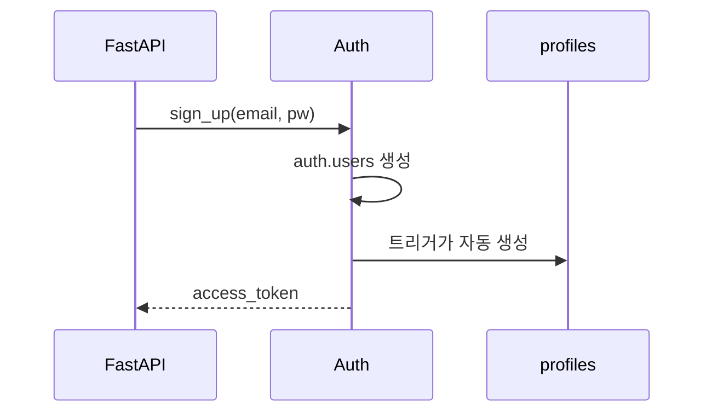
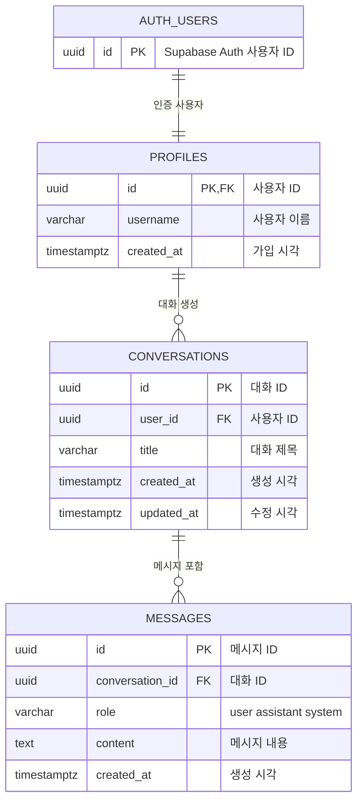
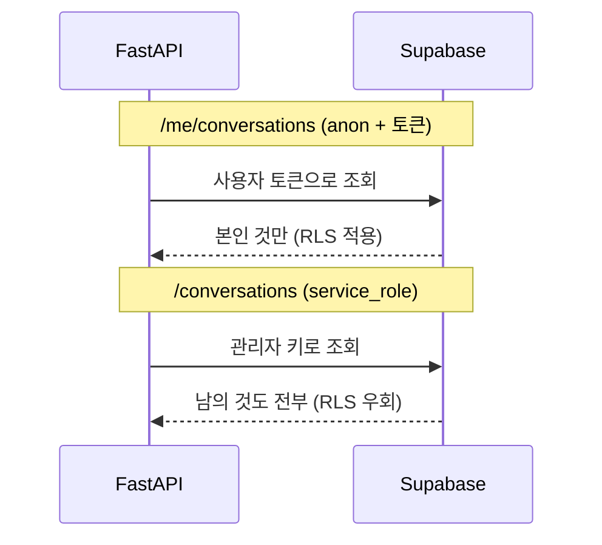

# Supabase Auth — 회원가입·로그인과 접근 제어

> [!warning] 이용 조건
> 본 교육자료는 수강생 개인의 학습 목적에 한하여 이용할 수 있으며, 외부 AI 서비스에 업로드하거나 동영상을 포함한 2차 콘텐츠로 제작·재배포하는 행위를 금지합니다. 예외적 이용은 출처 표기, 비상업적 사용, 강사의 사전 동의를 모두 충족하는 경우에 한하여 허용됩니다.

> **교육생 배포용 실습 가이드**
> 이 문서 하나만 따라 하면 실습을 처음부터 끝까지 완성할 수 있습니다.
> 수업 중 놓친 부분이 있어도 이 문서로 혼자 복습할 수 있도록 모든 결과 코드를 포함했습니다.
>
> **코드 복사 방법 (Obsidian)** — `Ctrl + E`를 눌러 **읽기 모드**로 전환한 뒤, 코드 블록 위에 마우스를 올리면 우측 상단에 복사 버튼이 나타납니다. 편집 모드에서는 보이지 않습니다.

| 항목     | 내용                                                                 |
| ------ | ------------------------------------------------------------------ |
| 교육 일차  | **13일차**                                                           |
| 과정     | Supabase Auth 기반 회원가입·로그인 구현                                       |
| 주제     | `auth.users`와 `profiles`, 회원가입·로그인 API, 토큰 인증, RLS로 사용자별 데이터 접근 제어 |
| 예제 도메인 | 챗봇 서비스 (사용자 / 대화 / 메시지)                                            |
| 소요 시간  | 이론 약 90분 + 실습 약 5시간 + 연습문제 약 60분                                   |
| 선수 조건  | 이전 차수에서 만든 FastAPI 서버(`3_chat-service/backend`)가 동작하는 상태           |
| 사용 도구  | VS Code, 파이썬, 브라우저(Swagger UI + Supabase 대시보드)                     |

---

## 0. 시작 전 체크리스트

- [ ] `3_chat-service/backend`에서 `uv run uvicorn app.main:app --reload`가 동작한다
- [ ] `/docs`에서 `/users`, `/conversations` 엔드포인트가 보인다 (오늘 `/users`는 지운다)
- [ ] Supabase 대시보드에 로그인할 수 있다
- [ ] 이전 차수의 `.env`에 `SUPABASE_URL`, `SUPABASE_SERVICE_ROLE_KEY`가 있다

### 완료 후 산출물

```
3_chat-service/backend/
├── .env                    ← SUPABASE_ANON_KEY 가 추가된다
├── .env.example
├── pyproject.toml
└── app/
    ├── main.py             ← 라우터 2개 추가 등록
    ├── db.py               ← anon 클라이언트 함수 추가
    ├── deps.py             ← 신규. 토큰 검증
    ├── schemas.py          ← 인증용 모델 추가
    └── routers/
        ├── auth.py         ← 신규. 회원가입·로그인
        ├── me.py           ← 신규. 본인 정보·대화
        └── conversations.py
```

`routers/users.py`는 **삭제합니다.** 회원가입이 그 역할을 대신합니다.

---

## 1. 개념 이해 — 왜 직접 만들지 않는가

### 이전 차수까지의 문제

`POST /users`로 사용자를 만들고, `user_id`를 요청에 직접 담아 보냈습니다.

```json
{ "user_id": "다른_사람_id", "title": "남의 대화 훔쳐보기" }
```

`user_id`만 바꾸면 **남의 대화도 만들고 조회할 수 있습니다.** 누가 요청했는지 서버가 확인할 방법이 없기 때문입니다.

### 로그인을 직접 만들려면

| 필요한 것 | 직접 만들 때의 문제 |
| --- | --- |
| 비밀번호 저장 | 평문 저장은 사고. 해싱 알고리즘 선택과 구현이 필요 |
| 로그인 상태 유지 | 토큰 발급·검증·만료 처리 |
| 이메일 인증 | 메일 발송 서버, 인증 링크 관리 |
| 비밀번호 재설정 | 임시 토큰, 만료, 재사용 방지 |
| 소셜 로그인 | 제공자별 연동 |

**인증은 잘못 만들면 그대로 보안 사고입니다.** 그래서 검증된 것을 씁니다.

### Supabase Auth가 대신하는 것

Supabase는 위 전부를 **`auth.users`** 라는 테이블에서 관리합니다. 우리가 만들 필요가 없습니다.

대신 제약이 하나 있습니다. **`auth.users`는 Supabase 관리 영역이라 우리가 컬럼을 추가할 수 없습니다.** 닉네임 같은 앱 전용 정보를 넣을 자리가 없습니다.

그래서 **`auth.users`를 1:1로 확장하는 `profiles` 테이블**을 따로 만듭니다.

```
이전 차수                 이번 차수
---------                ---------------------------------
users                    auth.users   ← Supabase 관리 (이메일, 비밀번호, 토큰)
  id                         │  1:1  (id를 공유)
  email                      ▼
  nickname               profiles     ← 우리 관리 (앱 전용 정보)
  created_at                 id  (= auth.users.id)
                             username
                             created_at
```

`users` 테이블 하나가 **두 개로 나뉜다**고 보면 됩니다.

| | 인증 정보 | 앱 정보 |
| --- | --- | --- |
| 이전 차수 | (없음) | `users.nickname` |
| 이번 차수 | `auth.users` (이메일·비밀번호·토큰) | `profiles.username` |

`conversations.user_id`가 가리키는 대상도 `users(id)`에서 **`profiles(id)`** 로 바뀝니다.

> 이전 차수에 `users`를 직접 만들어본 것이 헛수고는 아닙니다. **직접 만들어봤기 때문에** Supabase Auth가 무엇을 대신해주는지, 왜 `profiles`가 따로 필요한지가 와닿습니다.

### 토큰이란

로그인에 성공하면 서버가 **토큰**이라는 긴 문자열을 줍니다. 이후 요청마다 이 토큰을 헤더에 담아 보내면, 서버가 "누구인지"를 알 수 있습니다.

```
POST /auth/login  →  토큰 발급
GET  /me          →  Authorization: Bearer <토큰>  →  서버가 누구인지 확인
```

`user_id`를 요청 본문에 담는 것과 다릅니다. **토큰은 위조할 수 없습니다.** Supabase가 발급하고 서명했기 때문에, 남의 토큰을 만들어낼 수 없습니다.

**회원가입 한 번에 무슨 일이 일어나는지** 봅니다.



**우리 코드는 `profiles`에 아무것도 넣지 않습니다.** 트리거가 대신 만듭니다 (실습 2).

### RLS — 행단위 보안

**RLS(Row Level Security, 행 단위 보안)** 는 "이 행을 누가 볼 수 있는가"를 **데이터베이스가 직접 판단**하는 기능입니다.

```sql
create policy "select own conversations" on conversations
    for select using (auth.uid() = user_id);
```

`auth.uid()`는 **지금 요청한 사람의 id**입니다. 이 정책이 걸리면, `select * from conversations`를 실행해도 DB가 알아서 본인 것만 돌려줍니다.

**애플리케이션 코드에 `where user_id = ...`를 쓰지 않아도 걸러집니다.** 코드에서 조건을 빠뜨려도 DB가 막아주므로, 실수에 대한 마지막 방어선이 됩니다.

### 키 두 개가 필요한 이유

| 키 | 성격 | RLS |
| --- | --- | --- |
| `service_role` | 관리자 키. 서버에만 둔다 | **무시하고 전부 접근** |
| `anon` (publishable) | 공개 키. 브라우저에 둬도 된다 | **그대로 적용** |

지금까지는 `service_role` 하나만 썼습니다. 그런데 이 키로는 RLS가 걸리지 않습니다. **로그인한 사용자로서 접근하려면 `anon` 키가 필요합니다.**

이번 차수에서 두 키를 모두 씁니다. 그리고 **같은 데이터를 두 키로 조회해 결과가 어떻게 다른지** 직접 비교합니다. 그것이 이번 차수의 핵심입니다.

---

## 2. Supabase 준비

### 2-1. `anon` 키 가져오기

대시보드 → **Settings** → **API** 로 이동합니다.

> **주의 — 화면에 탭이 두 개 있습니다**
>
> Supabase가 API 키 체계를 바꾸는 중이라 화면이 이렇게 나뉘어 있습니다.

| 탭 | 키 이름 |
| --- | --- |
| `Publishable and secret API keys` (기본 화면) | `sb_publishable_...` / `sb_secret_...` |
| **`Legacy anon, service_role API keys`** | **`anon`** / `service_role` |

> **`Legacy anon, service_role API keys` 탭을 클릭**해서 `anon` 키를 복사합니다.
> 이전 차수에서 쓴 `SUPABASE_SERVICE_ROLE_KEY`가 legacy 키이므로, 두 키를 같은 체계로 맞춥니다.

`backend/.env`에 한 줄 추가합니다.

```
SUPABASE_URL=https://xxxxxxxxxxxx.supabase.co
SUPABASE_SERVICE_ROLE_KEY=여기에_service_role_key_붙여넣기
SUPABASE_ANON_KEY=여기에_anon_key_붙여넣기
```

`.env.example`에도 같은 줄을 추가해둡니다. 값은 비워 둡니다.

### 2-2. 이메일 인증 끄기

기본 설정에서는 회원가입 후 **이메일로 인증 링크를 보내고, 클릭해야 로그인이 됩니다.** 실습에서는 가짜 이메일을 쓰므로 인증 메일을 받을 수 없습니다.

대시보드 → **Authentication** → **Sign In/Providers** → **## User Signups** → **Confirm email**을 **끕니다.**

> **끄지 않으면:** 회원가입은 성공하는데 `access_token`이 `null`로 옵니다. 로그인도 되지 않아 이후 실습이 전부 막힙니다.

### 2-3. 이전 차수 테이블 정리

이전 차수의 `users` / `conversations` / `messages`를 지웁니다. `conversations`가 가리키는 대상이 바뀌기 때문입니다.

SQL Editor에서 실행합니다.

```sql
drop table if exists messages;
drop table if exists conversations;
drop table if exists users;
```

**확인:** 아래를 실행하면 **0행**이 나옵니다.

```sql
select table_name
from information_schema.tables
where table_schema = 'public'
  and table_name in ('users', 'conversations', 'messages');
```

### 2-4. 새 테이블 생성

`01_create_tables.sql`을 SQL Editor에 붙여넣고 실행합니다.  
- **`Run without RLS`** 선택합니다.

```sql
create extension if not exists "pgcrypto";

create table if not exists profiles (
    id uuid primary key references auth.users(id) on delete cascade,
    username varchar(30) not null,
    created_at timestamptz not null default now()
);

create table if not exists conversations (
    id uuid primary key default gen_random_uuid(),
    user_id uuid not null references profiles(id) on delete cascade,
    title varchar(100),
    created_at timestamptz not null default now(),
    updated_at timestamptz not null default now()
);

create table if not exists messages (
    id uuid primary key default gen_random_uuid(),
    conversation_id uuid not null references conversations(id) on delete cascade,
    role varchar(20) not null check (role in ('user', 'assistant', 'system')),
    content text not null,
    created_at timestamptz not null default now()
);

create index if not exists idx_conversations_user_id on conversations(user_id);
create index if not exists idx_messages_conversation_id on messages(conversation_id);
```

`profiles.id`가 `auth.users(id)`를 참조하는 것에 주목합니다. **회원가입으로 `auth.users`에 행이 생겨야만 `profiles`를 만들 수 있습니다.**

> **확인 창이 뜹니다 — `Run without RLS`를 누릅니다**
>
> 어느 쪽을 눌러도 최종 결과는 같습니다. 바로 다음에 실행할 SQL이 어차피 RLS를 켜기 때문입니다.

| 누른 버튼                | 이 SQL 직후          | 다음 SQL 실행 후       |
| -------------------- | ----------------- | ----------------- |
| `Run without RLS`    | RLS 꺼짐            | 다음 SQL이 켬 → 정책 적용 |
| `Run and enable RLS` | RLS 켜짐, **정책 없음** | 정책 적용             |

> `Run without RLS`를 권하는 이유는, RLS를 켜는 지점이 SQL 파일에 남아 버튼 클릭에 의존하지 않기 때문입니다. 또 다음 SQL을 깜빡했을 때 `Run and enable RLS` 쪽은 **정책 없는 RLS** 상태가 되어, 조회하면 오류 없이 빈 배열만 돌아와 원인을 찾기 어렵습니다.

**확인:** Table Editor에서 `profiles`, `conversations`, `messages` 세 테이블이 보입니다.




---

## 3. 실습 1부 — 어제 코드 정리와 RLS

각 실습은 **목표 / 요구사항 / 힌트 / 결과 코드 / 확인** 순서입니다.

### 실습 1. 어제 코드에서 Users 테이블 정리

**목표:** 방금 `users` 테이블을 지웠다. 그 테이블에 기대던 코드를 걷어낸다.

**요구사항**

- `routers/users.py`를 삭제하고 `main.py`의 등록도 지운다
- `schemas.py`에서 더는 쓰지 않는 모델을 지운다
- `conversations.py`가 `users` 대신 `profiles`를 보게 고친다
- `role`에 `system`을 추가한다

**힌트**

2-3에서 `users` 테이블을 지웠습니다. 그런데 어제 만든 코드에는 그 표를 읽는 곳이 **두 파일**에 남아 있습니다. 찾아서 고치지 않으면 **서버는 뜨는데 요청을 보내는 순간 `500`이 납니다.**

`routers/users.py`와 `routers/conversations.py`에서 `supabase.table("users")`를 검색해봅니다.

**결과 코드**

**(1) `app/routers/users.py`를 삭제합니다.**

```powershell
del app\routers\users.py
```

회원가입(`POST /auth/signup`)이 그 역할을 대신합니다. 사용자를 만드는 창구가 두 개일 이유가 없고, `users` 테이블 자체가 사라졌습니다.

**(2) `app/main.py`에서 등록을 지웁니다.**

```python
from fastapi import FastAPI

from app.routers import conversations

app = FastAPI(title="chat-service", version="0.1.0")

app.include_router(conversations.router)


@app.get("/health")
def health():
    return {"status": "ok"}
```

`users`를 지우지 않으면 `ModuleNotFoundError: No module named 'app.routers.users'`로 **서버가 아예 뜨지 않습니다.**

**(3) `app/schemas.py`에서 사용자 모델 3개를 지웁니다.**

`UserCreate`, `UserUpdate`, `UserOut`을 지웁니다. `users.py`가 없어졌으므로 쓰는 곳이 없습니다.

같은 파일에서 `MessageCreate`의 `role`에 **`system`을 추가합니다.**

```python
class MessageCreate(BaseModel):
    role: Literal["user", "assistant", "system"]
    content: str = Field(min_length=1)
```

> **왜 `system`이 늘어났나:** 2-4에서 만든 `messages` 테이블의 제약이 `check (role in ('user', 'assistant', 'system'))`입니다. **DB는 세 값을 허용하는데 Pydantic이 두 값만 받으면** 정상인 값이 `422`로 막힙니다. 둘을 맞춥니다.
>
> `system`은 AI에게 주는 지시문(예: "너는 친절한 상담원이다")을 담는 자리입니다. 뒤 차수에서 씁니다.

**(4) `app/routers/conversations.py`가 `profiles`를 보게 고칩니다.**

어제 `create_conversation`은 사용자가 있는지 `users`에서 확인했습니다. 그 표가 없으므로 `profiles`로 바꿉니다.

```python
@router.post("", response_model=ConversationOut, status_code=201)
def create_conversation(payload: ConversationCreate):
    profile = (
        supabase.table("profiles").select("id").eq("id", str(payload.user_id)).execute()
    )
    if not profile.data:
        raise HTTPException(status_code=404, detail="사용자를 찾을 수 없습니다")

    result = (
        supabase.table("conversations")
        .insert({"user_id": str(payload.user_id), "title": payload.title})
        .execute()
    )
    return result.data[0]
```

바뀐 곳은 표 이름 하나(`users` → `profiles`)와 변수 이름뿐입니다. **가리키는 대상이 바뀌었을 뿐 하는 일은 같습니다.**

> 어제 연습문제까지 푼 사람은 `conversations.py`에 `PATCH`와 `DELETE`도 있습니다. 그 둘은 `conversations` 표만 쓰므로 고칠 것이 없습니다.

**확인:**

1. 서버를 실행합니다.

```powershell
uv run uvicorn app.main:app --reload
```

2. `/docs`를 새로고침하면 **`users` 그룹이 사라졌습니다.** `conversations`만 남습니다.
3. `GET /health`가 `{"status":"ok"}`를 반환합니다.

> **주의 — 지금 `POST /conversations`를 실행하면 `404`가 납니다.** 정상입니다. `profiles`에 아직 아무도 없기 때문입니다. 회원가입을 만든 뒤(실습 6) 다시 씁니다.

---

### 실습 2. 회원가입 시 프로필 자동 생성 트리거 create

**목표:** `auth.users`에 계정이 생기면 `profiles`도 자동으로 만들어지게 한다.

**요구사항**

- 회원가입만 하면 `profiles` 행이 함께 생겨야 한다
- `username`은 이메일의 `@` 앞부분을 쓴다

**힌트**

`auth.users`는 Supabase 관리 영역이라 우리가 직접 `insert`할 수 없습니다. 대신 **트리거**로 "행이 생기면 이것도 해라"를 걸어둡니다.

**왜 필요한가:** 트리거가 없으면 회원가입 후 대화를 만들 때 외래키 위반이 납니다. `conversations.user_id`가 `profiles(id)`를 참조하는데 그 행이 없기 때문입니다.

**결과 코드**

```sql
create or replace function public.handle_new_user()
returns trigger
language plpgsql
security definer
set search_path = public
as $$
begin
    insert into public.profiles (id, username)
    values (new.id, split_part(new.email, '@', 1));
    return new;
end;
$$;

drop trigger if exists on_auth_user_created on auth.users;

create trigger on_auth_user_created
    after insert on auth.users
    for each row execute function public.handle_new_user();
```

각 부분의 의미입니다.

| 부분 | 뜻 |
| --- | --- |
| `security definer` | 함수를 만든 사람의 권한으로 실행. 이게 없으면 `profiles`에 넣을 권한이 없다 |
| `new.id` | 방금 `auth.users`에 생긴 행의 `id` |
| `split_part(new.email, '@', 1)` | `kim@example.com` → `kim` |
| `after insert` | 삽입이 끝난 뒤 실행 |
| `drop trigger if exists` | 다시 실행할 수 있게 하기 위함 |

**확인:** 이 단계에서는 눈에 보이는 변화가 없습니다. 실습 6에서 실제로 회원가입할 때 확인합니다.

---

### 실습 3. RLS 활성화와 정책 작성

**목표:** 세 테이블에 RLS를 켜고, "본인 것만" 정책을 건다.

**요구사항**

- `profiles`: 본인 것만 조회·수정
- `conversations`: 본인 소유만 조회·생성·수정·삭제
- `messages`: 본인 소유 대화에 속한 것만 조회·생성
- 이 SQL을 여러 번 실행해도 오류가 나지 않아야 한다

**힌트**

- 현재 요청자의 id: `auth.uid()`
- 조회·수정·삭제 조건: `using (...)`
- 생성 조건: `with check (...)`
- `messages`는 `conversation_id`를 타고 올라가 주인을 확인해야 하므로 `exists (...)`를 씁니다

**재실행 가능하게 만들기:** `create policy`에는 `if not exists`가 없습니다. 정책이 이미 있으면 아래 오류로 멈춥니다.

```
ERROR: 42710: policy "select own profile" for table "profiles" already exists
```

그래서 만들기 전에 같은 이름을 먼저 지웁니다.

**결과 코드**

```sql
alter table profiles enable row level security;
alter table conversations enable row level security;
alter table messages enable row level security;

drop policy if exists "select own profile" on profiles;
drop policy if exists "update own profile" on profiles;
drop policy if exists "select own conversations" on conversations;
drop policy if exists "insert own conversations" on conversations;
drop policy if exists "update own conversations" on conversations;
drop policy if exists "delete own conversations" on conversations;
drop policy if exists "select own messages" on messages;
drop policy if exists "insert own messages" on messages;

create policy "select own profile" on profiles
    for select using (auth.uid() = id);

create policy "update own profile" on profiles
    for update using (auth.uid() = id);

create policy "select own conversations" on conversations
    for select using (auth.uid() = user_id);

create policy "insert own conversations" on conversations
    for insert with check (auth.uid() = user_id);

create policy "update own conversations" on conversations
    for update using (auth.uid() = user_id);

create policy "delete own conversations" on conversations
    for delete using (auth.uid() = user_id);

create policy "select own messages" on messages
    for select using (
        exists (
            select 1 from conversations c
            where c.id = messages.conversation_id
              and c.user_id = auth.uid()
        )
    );

create policy "insert own messages" on messages
    for insert with check (
        exists (
            select 1 from conversations c
            where c.id = messages.conversation_id
              and c.user_id = auth.uid()
        )
    );
```

**확인:** `Success. No rows returned`가 나옵니다. **한 번 더 실행해도 같은 결과**가 나오면 재실행 가능하게 만든 것이 동작한 것입니다.

정책이 걸렸는지는 아래로 확인합니다. **8행**이 나옵니다.

```sql
select tablename, policyname, cmd
from pg_policies
where schemaname = 'public'
order by tablename, policyname;
```

---

## 4. 실습 2부 — 회원가입과 로그인 API

### 실습 4. anon 클라이언트 추가

**목표:** `anon` 키를 쓰는 Supabase 클라이언트를 만들 수 있게 한다.

**요구사항**

- 기존 `service_role` 클라이언트는 그대로 둔다
- `anon` 키로 새 클라이언트를 만드는 함수를 추가한다

**힌트**

`service_role` 클라이언트는 하나만 만들어 공유하지만, `anon` 클라이언트는 **요청마다 새로 만듭니다.** 사용자마다 다른 토큰을 붙여 쓰기 때문입니다.

**결과 코드**

`app/db.py`

```python
import os

from dotenv import load_dotenv
from supabase import Client, create_client

load_dotenv()

SUPABASE_URL = os.environ["SUPABASE_URL"]
SUPABASE_SERVICE_ROLE_KEY = os.environ["SUPABASE_SERVICE_ROLE_KEY"]
SUPABASE_ANON_KEY = os.environ["SUPABASE_ANON_KEY"]

supabase: Client = create_client(SUPABASE_URL, SUPABASE_SERVICE_ROLE_KEY)


def get_anon_client() -> Client:
    return create_client(SUPABASE_URL, SUPABASE_ANON_KEY)
```

**확인:** 서버를 재시작해 오류 없이 뜨면 됩니다. `KeyError: 'SUPABASE_ANON_KEY'`가 나면 `.env`에 값을 안 넣은 것입니다.

---

### 실습 5. 인증용 모델 추가

**목표:** 회원가입·로그인 요청과 응답 모델을 만든다.

**요구사항**

- 회원가입·로그인 모두 이메일과 비밀번호를 받는다
- 응답으로 토큰, 사용자 id, 이메일을 돌려준다

**결과 코드**

`app/schemas.py`에 추가합니다.

```python
class SignupRequest(BaseModel):
    email: str
    password: str


class LoginRequest(BaseModel):
    email: str
    password: str


class TokenResponse(BaseModel):
    access_token: str | None
    user_id: str
    email: str
```

`access_token`이 `str | None`인 이유는, 이메일 인증이 켜져 있으면 토큰이 `null`로 오기 때문입니다.

**확인:** 다음 실습에서 라우터에 연결한 뒤 `/docs`에서 확인합니다.

---

### 실습 6. 회원가입·로그인 엔드포인트

**목표:** `POST /auth/signup`과 `POST /auth/login`을 만든다.

**요구사항**

- 회원가입 실패는 `400`, 로그인 실패는 `401`을 반환한다
- 성공하면 토큰을 돌려준다

**힌트**

| 하려는 일 | 호출 |
| --- | --- |
| 회원가입 | `client.auth.sign_up({"email": ..., "password": ...})` |
| 로그인 | `client.auth.sign_in_with_password({...})` |

반드시 **`anon` 클라이언트**로 호출합니다. 관리자 키로는 "사용자로서 로그인"이 되지 않습니다.

**결과 코드**

`app/routers/auth.py`

```python
from fastapi import APIRouter, HTTPException

from app.db import get_anon_client
from app.schemas import LoginRequest, SignupRequest, TokenResponse

router = APIRouter(prefix="/auth", tags=["auth"])


@router.post("/signup", response_model=TokenResponse)
def signup(payload: SignupRequest):
    client = get_anon_client()
    try:
        result = client.auth.sign_up(
            {"email": payload.email, "password": payload.password}
        )
    except Exception as e:
        raise HTTPException(status_code=400, detail=str(e))

    access_token = result.session.access_token if result.session else None
    return TokenResponse(
        access_token=access_token,
        user_id=str(result.user.id),
        email=result.user.email,
    )


@router.post("/login", response_model=TokenResponse)
def login(payload: LoginRequest):
    client = get_anon_client()
    try:
        result = client.auth.sign_in_with_password(
            {"email": payload.email, "password": payload.password}
        )
    except Exception as e:
        raise HTTPException(status_code=401, detail=str(e))

    return TokenResponse(
        access_token=result.session.access_token,
        user_id=str(result.user.id),
        email=result.user.email,
    )
```

`app/main.py`에 등록합니다.

```python
from app.routers import auth, conversations

app.include_router(conversations.router)
app.include_router(auth.router)
```

**확인:**

1. `/docs`를 새로고침하면 `auth` 그룹이 생깁니다
2. `POST /auth/signup`을 `Try it out` → `Request body`를 아래로 고치고 `Execute`

```json
{ "email": "test-auth-01@example.com", "password": "test1234!" }
```

`Code`가 `200`이고 `Response body`에 **`access_token`이 긴 문자열**로 들어 있습니다. `user_id`도 함께 옵니다.

> `access_token`이 `null`이면 **이메일 인증이 켜져 있는 것**입니다. 2-2로 돌아가 `Confirm email`을 끄고, 다른 이메일로 다시 가입합니다.

3. **트리거가 동작했는지 확인합니다.** SQL Editor에서 실행하면 방금 가입한 계정의 프로필이 나옵니다.

```sql
select id, username, created_at from profiles order by created_at desc limit 3;
```

`username`이 `test-auth-01`로 들어가 있습니다. **우리가 `profiles`에 아무것도 넣지 않았는데** 트리거가 만들어준 것입니다.

4. `POST /auth/login`에 같은 이메일·비밀번호로 `Execute` → `Code` `200`, 토큰 발급
5. 비밀번호를 `"wrongpw"`로 바꿔 `Execute` → `Code` **`401`**

---

## 5. 실습 3부 — 토큰 인증과 접근 제어

### 실습 7. 토큰 검증 기능 추가

**목표:** `Authorization` 헤더의 토큰을 검증해 "누가 요청했는지"를 알아낸다.

**요구사항**

- `Bearer <토큰>` 형식이 아니면 `401`
- 토큰이 유효하지 않으면 `401`
- 유효하면 사용자 id, 이메일, 토큰을 담아 돌려준다

**힌트**

- 헤더 받기: `authorization: str = Header(...)`
- 토큰 검증: `client.auth.get_user(token)`
- `"Bearer "` 떼기: `token = authorization.removeprefix("Bearer ")`

**왜 별도 파일인가:** 여러 엔드포인트가 같은 검증을 씁니다. `deps.py`(dependencies, 의존성)에 모아두고 필요한 곳에서 가져다 씁니다.

**결과 코드**

`app/deps.py` (신규)

```python
from dataclasses import dataclass

from fastapi import Header, HTTPException

from app.db import get_anon_client


@dataclass
class CurrentUser:
    id: str
    email: str
    token: str


def get_current_user(authorization: str = Header(...)) -> CurrentUser:
    if not authorization.startswith("Bearer "):
        raise HTTPException(status_code=401, detail="Bearer 토큰이 필요합니다")

    token = authorization.removeprefix("Bearer ")

    client = get_anon_client()
    try:
        result = client.auth.get_user(token)
    except Exception:
        raise HTTPException(status_code=401, detail="유효하지 않은 토큰입니다")

    return CurrentUser(id=str(result.user.id), email=result.user.email, token=token)
```

**확인:** 다음 실습에서 엔드포인트에 연결한 뒤 확인합니다.

> **참고:** 이 함수는 요청이 올 때마다 Supabase에 토큰 검증을 물어봅니다. 호출이 잦아지면 이 왕복이 부담이 되는데, 다음 차수에서 Redis로 캐싱해 줄입니다.

> **주의 — 이 방식은 `/docs`에서 동작하지 않습니다.** 실습 8의 확인은 PowerShell로 합니다. 이유는 실습 9에서 찾아냅니다. 지금은 **헤더를 직접 다루는 코드를 손으로 써보는 것**이 목적입니다.

---

### 실습 8. 본인 정보와 본인 대화 조회

**목표:** 토큰으로 인증된 사용자의 정보와 대화를 조회한다. **RLS가 실제로 걸리는 경로를 만든다.**

**요구사항**

- `GET /me` — 내 정보
- `GET /me/conversations` — 내 대화 목록
- `/me/conversations`는 코드에 `where user_id = ...` 조건을 **쓰지 않는다**

**힌트**

- 검증 함수 연결: `current_user: CurrentUser = Depends(get_current_user)`
- 사용자 토큰으로 DB 조회: `client.postgrest.auth(current_user.token)`

**핵심:** `client.postgrest.auth(토큰)`을 호출하면 이후 조회가 **그 사용자로서** 실행됩니다. 그래서 RLS 정책의 `auth.uid()`가 그 사용자를 가리키게 되고, DB가 알아서 본인 것만 돌려줍니다.

**결과 코드**

`app/routers/me.py` (신규)

```python
from fastapi import APIRouter, Depends

from app.db import get_anon_client
from app.deps import CurrentUser, get_current_user
from app.schemas import ConversationOut

router = APIRouter(prefix="/me", tags=["me"])


@router.get("")
def read_me(current_user: CurrentUser = Depends(get_current_user)):
    return {"id": current_user.id, "email": current_user.email}


@router.get("/conversations", response_model=list[ConversationOut])
def my_conversations(current_user: CurrentUser = Depends(get_current_user)):
    client = get_anon_client()
    client.postgrest.auth(current_user.token)
    result = (
        client.table("conversations")
        .select("*")
        .order("created_at", desc=True)
        .execute()
    )
    return result.data
```

`app/main.py`에 등록합니다.

```python
from app.routers import auth, conversations, me

app.include_router(conversations.router)
app.include_router(auth.router)
app.include_router(me.router)
```

**확인:**

`/docs`에서 `GET /me`를 펼치면 `authorization` 입력칸이 보입니다. **여기에 토큰을 넣어도 동작하지 않습니다.** 왜 그런지는 실습 9에서 다룹니다. 지금은 **PowerShell로 확인**합니다.

1. `POST /auth/login`으로 토큰을 받아 복사합니다
2. 서버를 켜 둔 채 **새 터미널**을 엽니다
3. 아래를 실행합니다 (`$token`에 복사한 값을 넣습니다)

```powershell
$token = "여기에_access_token_붙여넣기"
Invoke-RestMethod -Uri http://127.0.0.1:8000/me -Headers @{ Authorization = "Bearer $token" }
```

내 `id`와 `email`이 나옵니다.

4. 토큰을 일부러 틀리게 해봅니다.

```powershell
Invoke-RestMethod -Uri http://127.0.0.1:8000/me -Headers @{ Authorization = "Bearer invalid-token" }
```

`401`이 나고 `유효하지 않은 토큰입니다`가 보입니다.

5. `Bearer` 접두어를 빼봅니다.

```powershell
Invoke-RestMethod -Uri http://127.0.0.1:8000/me -Headers @{ Authorization = $token }
```

`401` `Bearer 토큰이 필요합니다`. 우리가 쓴 `startswith("Bearer ")` 검사가 막은 것입니다.

> **`Headers @{ ... }`가 하는 일:** PowerShell에서 HTTP 헤더를 직접 붙이는 문법입니다. `Authorization: Bearer <토큰>`이라는 **헤더 한 줄을 손으로 만들어 보내는 것**이고, 우리가 실습 7에서 만든 코드가 그 문자열을 받아 처리합니다.

---

### 실습 9. Swagger UI에서는 왜 안 되는가

**목표:** `/docs`에서 토큰을 넣어도 안 가는 이유를 찾아내고, `Authorize` 버튼이 생기게 고친다.

**요구사항**

- 왜 안 가는지 원인을 직접 확인한다
- `HTTPBearer`로 바꿔 `Authorize` 버튼이 나오게 한다
- 바꾼 뒤 `/docs`에서 `GET /me`가 동작한다

**힌트**

`/docs`에서 `GET /me`를 `Try it out` → `authorization` 칸에 `Bearer <토큰>`을 넣고 `Execute` 해봅니다.

`Code`가 **`422`** 이고 `Response body`가 이렇습니다.

```json
{
  "detail": [
    { "type": "missing", "loc": ["header", "authorization"], "msg": "Field required" }
  ]
}
```

**`422`는 "값이 틀렸다"가 아니라 "값이 아예 안 왔다"는 뜻입니다.** `loc`이 `["header", "authorization"]`이고 `type`이 `missing`입니다.

`Execute` 아래 **`Curl`** 박스를 봅니다. 우리가 넣은 헤더가 없습니다.

```
curl -X 'GET' \
  'http://127.0.0.1:8000/me' \
  -H 'accept: application/json'
```

**Swagger UI가 입력칸은 그려놓고 요청에는 안 넣었습니다.**

**원인 — 명세를 직접 확인합니다**

브라우저에서 `http://127.0.0.1:8000/openapi.json`을 엽니다. `/me` 부분을 찾습니다.

```json
"/me": {
  "get": {
    "parameters": [
      { "name": "authorization", "in": "header", "required": true, ... }
    ]
  }
}
```

`components.securitySchemes`는 **비어 있습니다.**

OpenAPI 명세에 이런 규칙이 있습니다.

> `in`이 `"header"`이고 이름이 **`Accept`, `Content-Type`, `Authorization`** 이면 그 파라미터 정의는 **무시된다.**

이 셋은 파라미터가 아니라 다른 방식으로 기술하도록 정해져 있습니다. `Authorization`은 **`security`** 로 적어야 합니다. 그래서 Swagger UI는 명세를 지켜 그 입력칸을 무시합니다.

**결과 코드**

`app/deps.py`를 고칩니다.

```python
from dataclasses import dataclass

from fastapi import Depends, HTTPException
from fastapi.security import HTTPAuthorizationCredentials, HTTPBearer

from app.db import get_anon_client

bearer_scheme = HTTPBearer()


@dataclass
class CurrentUser:
    id: str
    email: str
    token: str


def get_current_user(
    credentials: HTTPAuthorizationCredentials = Depends(bearer_scheme),
) -> CurrentUser:
    # "Bearer " 접두어는 HTTPBearer 가 이미 떼어냈다.
    # 헤더가 없거나 형식이 틀리면 여기 오기 전에 401 로 막힌다.
    token = credentials.credentials

    client = get_anon_client()
    try:
        result = client.auth.get_user(token)
    except Exception:
        raise HTTPException(status_code=401, detail="유효하지 않은 토큰입니다")

    return CurrentUser(id=str(result.user.id), email=result.user.email, token=token)
```

바뀐 곳은 세 군데입니다.

| | 고치기 전 | 고친 뒤 |
| --- | --- | --- |
| 헤더 받기 | `authorization: str = Header(...)` | `credentials = Depends(bearer_scheme)` |
| `Bearer ` 떼기 | `removeprefix("Bearer ")` | **`HTTPBearer`가 처리** |
| 접두어 검사 | `if not startswith("Bearer ")` | **`HTTPBearer`가 처리** |

**`me.py`와 `conversations.py`는 고치지 않습니다.** 둘 다 `Depends(get_current_user)`만 쓰므로 그대로 동작합니다. 함수 안쪽이 바뀌어도 쓰는 쪽은 모릅니다.

**확인:**

1. 서버가 다시 시작되면 `/docs`를 **`F5`로 새로고침**합니다
2. 화면 **오른쪽 위에 `Authorize` 버튼**이 생겼습니다. 클릭합니다
3. `Value` 칸에 **토큰만** 붙여넣습니다. **`Bearer`는 쓰지 않습니다** — UI가 붙여줍니다
4. `Authorize` → `Close`
5. `GET /me`를 `Try it out` → `Execute` → `Code` `200`, 내 `id`와 `email`

`Curl` 박스에 이번에는 헤더가 보입니다.

```
curl -X 'GET' \
  'http://127.0.0.1:8000/me' \
  -H 'accept: application/json' \
  -H 'Authorization: Bearer eyJhbGciOi...'
```

6. `Authorize` → `Logout`을 누르고 `GET /me`를 다시 `Execute` → `Code` **`401`** `Not authenticated`

> **한 번만 넣으면 됩니다.** `Authorize`에 넣은 토큰은 **인증이 필요한 모든 엔드포인트**에 자동으로 붙습니다. 실습 10과 15일차에서 계속 씁니다.

> **오류 메시지가 바뀌었습니다.** 헤더가 없을 때 `Bearer 토큰이 필요합니다`(우리 문구) 대신 `Not authenticated`(FastAPI 문구)가 나옵니다. 검사를 `HTTPBearer`에 넘겼기 때문입니다.

> **그럼 처음부터 `HTTPBearer`로 하지 그랬나.** 그러면 `Authorization: Bearer <토큰>`이라는 헤더를 **직접 만들어본 적 없이** 넘어가게 됩니다. 실습 7·8에서 손으로 만들어봤기 때문에, `HTTPBearer`가 대신 해주는 일이 무엇인지 압니다. **도구가 무엇을 감추는지 알고 쓰는 것과 모르고 쓰는 것은 다릅니다.**

---

### 실습 10. RLS 대조 테스트

**목표:** 같은 데이터를 두 경로로 조회해, RLS가 실제로 막는 것을 확인한다.

**요구사항**

- 사용자 2명을 만들고 각각 대화를 만든다
- `/me/conversations`(anon + 토큰)와 `/conversations`(service_role)를 비교한다

**결과 코드**

새로 작성할 코드는 없습니다. 이미 만든 엔드포인트로 확인합니다.

**확인:**

**1) 사용자 A를 만들고 대화 2개를 만듭니다**

`POST /auth/signup` → `{"email": "rls-a@example.com", "password": "test1234!"}`
응답의 `user_id`와 `access_token`을 적어둡니다.

`POST /conversations`를 두 번 실행합니다.

```json
{ "user_id": "A의_user_id", "title": "A의 대화 1" }
```
```json
{ "user_id": "A의_user_id", "title": "A의 대화 2" }
```

**2) 사용자 B를 만들고 대화 1개를 만듭니다**

`POST /auth/signup` → `{"email": "rls-b@example.com", "password": "test1234!"}`

```json
{ "user_id": "B의_user_id", "title": "B의 대화 1" }
```

**3) `/me/conversations`를 두 토큰으로 각각 호출합니다**

실습 9에서 만든 **`Authorize` 버튼**을 씁니다. 토큰을 바꿀 때마다 `Authorize` → `Logout` → 다시 `Authorize`에 새 토큰을 넣습니다.

| `Authorize`에 넣은 토큰 | 결과 |
| --- | --- |
| **A의 토큰** | **2건** — `A의 대화 2`, `A의 대화 1` |
| **B의 토큰** | **1건** — `B의 대화 1` |

**같은 엔드포인트인데 토큰에 따라 다른 결과가 나옵니다.** 코드에는 `where user_id = ...` 조건이 없습니다. 데이터베이스가 RLS 정책으로 걸러준 것입니다.

**4) `/conversations`를 `user_id`만 바꿔 호출합니다**

| 요청 | 결과 |
| --- | --- |
| `GET /conversations?user_id=<A의 id>` | 2건 |
| `GET /conversations?user_id=<B의 id>` | **1건 — B의 대화가 그대로 보입니다** |

A로 로그인한 상태든 아니든, **토큰 없이 `user_id`만 넣으면 남의 대화가 나옵니다.** 이 경로는 `service_role` 키를 쓰기 때문에 RLS를 우회합니다.

**두 경로를 나란히 보면 이렇습니다.**



### 여기서 얻어야 할 결론

| 경로 | 사용하는 키 | RLS | 남의 데이터 |
| --- | --- | --- | --- |
| `/me/conversations` | `anon` + 사용자 토큰 | 적용됨 | **볼 수 없음** |
| `/conversations` | `service_role` | 우회 | **보임** |

- **`service_role` 키는 관리자 키입니다.** 서버 밖으로 나가면 모든 데이터가 노출됩니다
- **RLS는 애플리케이션 코드의 실수를 막아줍니다.** 코드에서 조건을 빠뜨려도 DB가 걸러줍니다
- 사용자 요청을 처리할 때는 **사용자 토큰으로 접근**해야 합니다

> 실제 서비스라면 `/conversations`도 `/me/conversations`처럼 고쳐야 합니다. 지금은 두 방식을 비교하기 위해 남겨둔 것입니다.

---

## 6. 연습문제 — 스스로 만들어보기

실습 9에서 "실제 서비스라면 고쳐야 한다"고 했습니다. **그 고치는 일을 직접 합니다.**

새로 배울 개념은 없습니다. 실습 8에서 쓴 `Depends(get_current_user)`와 `client.postgrest.auth(토큰)` 두 가지의 조합입니다. 답안은 7절에 있습니다. **먼저 풀어본 뒤에 봅니다.**

### 문제 1. 내 프로필 조회

**목표:** `GET /me/profile`을 만든다. `profiles` 표에서 내 행을 가져온다.

**요구사항**

- 토큰으로 인증한다
- `where id = ...` 조건을 **쓰지 않는다.** RLS가 걸러주게 한다
- 응답에 `id`, `username`, `created_at`이 들어간다

**힌트:** `GET /me`는 토큰에서 꺼낸 값을 그대로 돌려줄 뿐 DB를 보지 않습니다. 이번에는 DB를 봐야 합니다. `my_conversations`가 어떻게 하는지 보세요. 응답 모델도 하나 필요합니다.

**확인:** A의 토큰으로 `Execute` → `200`, `username`이 `rls-a`. B의 토큰으로 → `username`이 `rls-b`.

---

### 문제 2. 내 닉네임 수정

**목표:** `PATCH /me/profile`로 `username`을 바꾼다.

**요구사항**

- 2~30자
- 남의 프로필은 바꿀 수 없어야 한다

**힌트:** 실습 3에서 `update own profile` 정책을 이미 걸어뒀습니다. **정책이 있으므로 코드에는 조건이 필요 없습니다.** 정책이 막으면 결과가 빈 리스트로 옵니다.

**확인:** A의 토큰으로 `{"username": "에이"}` → `200`, 바뀐 값. `GET /me/profile`로 다시 확인.

---

### 문제 3. 대화 생성을 토큰 기반으로

**목표:** `POST /me/conversations`를 만든다. `user_id`를 **본문에 받지 않는다.**

**요구사항**

- 제목만 받는다
- 소유자는 토큰에서 꺼낸다
- 사용자 토큰으로 저장한다 (`service_role`을 쓰지 않는다)

**힌트:** 요청 모델에서 `user_id`를 뺀 것이 하나 필요합니다. `insert`할 때 `user_id`는 `current_user.id`를 씁니다.

**이것이 이번 차수의 결론입니다.** `POST /conversations`는 본문의 `user_id`를 믿었습니다. 남의 id를 넣으면 남의 대화가 만들어졌습니다. 이제 그럴 수 없습니다.

**확인:** A의 토큰으로 `{"title": "토큰으로 만든 대화"}` → `201`. `GET /me/conversations`에 A 토큰으로 → 그 대화가 보입니다. **B 토큰으로 → 보이지 않습니다.**

---

### 문제 4. 남의 대화에 메시지를 넣어본다

**목표:** 코드를 쓰지 않는다. RLS가 실제로 `insert`를 막는지 확인한다.

**요구사항**

- A의 대화 id를 확보한다
- B의 토큰으로 그 대화에 메시지를 넣어본다

**힌트:** 지금 있는 `POST /conversations/{conversation_id}/messages`는 `service_role`을 씁니다. **막히지 않습니다.** 막히는 것을 보려면 사용자 토큰으로 넣는 경로가 필요합니다. 문제 3에서 만든 방식을 메시지에도 적용해봅니다.

**확인:** B의 토큰으로 A의 대화에 메시지를 넣으면 실패합니다. 실습 3의 `insert own messages` 정책이 `exists (...)`로 대화 주인을 확인하기 때문입니다.

> **`service_role` 경로로는 그대로 들어갑니다.** 같은 데이터에 두 경로가 있고, 한쪽만 막힙니다. 그래서 **사용자 요청은 반드시 사용자 토큰으로** 처리해야 합니다.

---

## 7. 연습문제 답안

먼저 직접 풀어본 뒤에 봅니다.

### 문제 1. 내 프로필 조회

`app/schemas.py`에 응답 모델을 추가합니다.

```python
class ProfileOut(BaseModel):
    id: UUID
    username: str
    created_at: datetime
```

`app/routers/me.py`에 추가합니다.

```python
@router.get("/profile", response_model=ProfileOut)
def read_my_profile(current_user: CurrentUser = Depends(get_current_user)):
    client = get_anon_client()
    client.postgrest.auth(current_user.token)
    result = client.table("profiles").select("*").execute()
    if not result.data:
        raise HTTPException(status_code=404, detail="프로필을 찾을 수 없습니다")
    return result.data[0]
```

`import`에 `HTTPException`과 `ProfileOut`을 추가해야 합니다.

**조건이 한 줄도 없습니다.** `select("*")`인데 내 행만 옵니다. `select own profile` 정책의 `auth.uid() = id`가 걸러준 것입니다.

### 문제 2. 내 닉네임 수정

```python
class ProfileUpdate(BaseModel):
    username: str = Field(min_length=2, max_length=30)
```

```python
@router.patch("/profile", response_model=ProfileOut)
def update_my_profile(
    payload: ProfileUpdate,
    current_user: CurrentUser = Depends(get_current_user),
):
    client = get_anon_client()
    client.postgrest.auth(current_user.token)
    result = (
        client.table("profiles").update({"username": payload.username}).execute()
    )
    if not result.data:
        raise HTTPException(status_code=404, detail="프로필을 찾을 수 없습니다")
    return result.data[0]
```

> **`update`에 `.eq()`가 없는데 괜찮은가.** 괜찮습니다 — `update own profile` 정책이 내 행 외에는 손대지 못하게 막습니다. 다만 **정책에 의존하는 코드**라는 것을 알고 써야 합니다. 정책을 지우는 순간 이 코드는 전원의 닉네임을 덮어씁니다. 11일차의 `WHERE` 없는 `UPDATE`와 같은 모양인데, 이번에는 DB가 막아주고 있을 뿐입니다.

### 문제 3. 대화 생성을 토큰 기반으로

```python
class MyConversationCreate(BaseModel):
    title: str = Field(min_length=1, max_length=100)
```

```python
@router.post("/conversations", response_model=ConversationOut, status_code=201)
def create_my_conversation(
    payload: MyConversationCreate,
    current_user: CurrentUser = Depends(get_current_user),
):
    client = get_anon_client()
    client.postgrest.auth(current_user.token)
    result = (
        client.table("conversations")
        .insert({"user_id": current_user.id, "title": payload.title})
        .execute()
    )
    return result.data[0]
```

`user_id`가 요청 본문이 아니라 **토큰에서 옵니다.** 위조할 수 없습니다.

`insert own conversations` 정책의 `with check (auth.uid() = user_id)`가 한 겹 더 막습니다. 코드에서 실수로 다른 id를 넣어도 DB가 거부합니다.

### 문제 4. 남의 대화에 메시지 넣기

```python
@router.post("/conversations/{conversation_id}/messages", response_model=MessageOut, status_code=201)
def create_my_message(
    conversation_id: UUID,
    payload: MessageCreate,
    current_user: CurrentUser = Depends(get_current_user),
):
    client = get_anon_client()
    client.postgrest.auth(current_user.token)
    try:
        result = (
            client.table("messages")
            .insert(
                {
                    "conversation_id": str(conversation_id),
                    "role": payload.role,
                    "content": payload.content,
                }
            )
            .execute()
        )
    except Exception:
        raise HTTPException(status_code=403, detail="이 대화에 접근할 수 없습니다")
    return result.data[0]
```

B의 토큰으로 A의 대화에 넣으면 정책이 거부하고, 우리는 `403`으로 바꿔 돌려줍니다.

> **`403`과 `404` 중 무엇이 맞나.** 답이 갈리는 문제입니다. `403`은 "있지만 권한이 없다", `404`는 "없다"입니다. **`404`가 더 안전하다**는 견해가 많습니다 — `403`을 돌려주면 "그 id의 대화가 존재한다"는 사실이 새기 때문입니다. 실무에서 따져볼 만한 주제입니다.

**네 문제를 다 풀면 `/me` 그룹이 5개가 됩니다.** `/docs`에서 확인합니다.

---

## 8. 전체 완성 코드

### `app/db.py`

```python
import os

from dotenv import load_dotenv
from supabase import Client, create_client

load_dotenv()

SUPABASE_URL = os.environ["SUPABASE_URL"]
SUPABASE_SERVICE_ROLE_KEY = os.environ["SUPABASE_SERVICE_ROLE_KEY"]
SUPABASE_ANON_KEY = os.environ["SUPABASE_ANON_KEY"]

supabase: Client = create_client(SUPABASE_URL, SUPABASE_SERVICE_ROLE_KEY)


def get_anon_client() -> Client:
    return create_client(SUPABASE_URL, SUPABASE_ANON_KEY)
```

### `app/schemas.py`

사용자 모델 3개를 지우고, `role`에 `system`을 더하고, 인증용 모델 3개를 추가한 결과입니다.

```python
from datetime import datetime
from typing import Literal
from uuid import UUID

from pydantic import BaseModel, Field


class ConversationCreate(BaseModel):
    user_id: UUID
    title: str = Field(min_length=1, max_length=100)


class ConversationOut(BaseModel):
    id: UUID
    user_id: UUID
    title: str
    created_at: datetime


class MessageCreate(BaseModel):
    role: Literal["user", "assistant", "system"]
    content: str = Field(min_length=1)


class MessageOut(BaseModel):
    id: UUID
    conversation_id: UUID
    role: str
    content: str
    created_at: datetime


class SignupRequest(BaseModel):
    email: str
    password: str


class LoginRequest(BaseModel):
    email: str
    password: str


class TokenResponse(BaseModel):
    access_token: str | None
    user_id: str
    email: str
```

> `EmailStr`이 사라진 것에 주목합니다. 이메일 형식 검사는 이제 **Supabase Auth가 합니다.** 잘못된 형식이면 `sign_up`이 실패하고 우리는 `400`으로 돌려줍니다.

### `app/routers/conversations.py`

`users` → `profiles` 한 곳만 바뀌었습니다. 나머지는 어제 그대로입니다.

```python
from uuid import UUID

from fastapi import APIRouter, HTTPException

from app.db import supabase
from app.schemas import ConversationCreate, ConversationOut, MessageCreate, MessageOut

router = APIRouter(prefix="/conversations", tags=["conversations"])


@router.post("", response_model=ConversationOut, status_code=201)
def create_conversation(payload: ConversationCreate):
    profile = (
        supabase.table("profiles").select("id").eq("id", str(payload.user_id)).execute()
    )
    if not profile.data:
        raise HTTPException(status_code=404, detail="사용자를 찾을 수 없습니다")

    result = (
        supabase.table("conversations")
        .insert({"user_id": str(payload.user_id), "title": payload.title})
        .execute()
    )
    return result.data[0]


@router.get("", response_model=list[ConversationOut])
def list_conversations(user_id: UUID):
    result = (
        supabase.table("conversations")
        .select("*")
        .eq("user_id", str(user_id))
        .order("created_at", desc=True)
        .execute()
    )
    return result.data


@router.post("/{conversation_id}/messages", response_model=MessageOut, status_code=201)
def create_message(conversation_id: UUID, payload: MessageCreate):
    conversation = (
        supabase.table("conversations")
        .select("id")
        .eq("id", str(conversation_id))
        .execute()
    )
    if not conversation.data:
        raise HTTPException(status_code=404, detail="대화를 찾을 수 없습니다")

    result = (
        supabase.table("messages")
        .insert(
            {
                "conversation_id": str(conversation_id),
                "role": payload.role,
                "content": payload.content,
            }
        )
        .execute()
    )
    return result.data[0]


@router.get("/{conversation_id}/messages", response_model=list[MessageOut])
def list_messages(conversation_id: UUID):
    conversation = (
        supabase.table("conversations")
        .select("id")
        .eq("id", str(conversation_id))
        .execute()
    )
    if not conversation.data:
        raise HTTPException(status_code=404, detail="대화를 찾을 수 없습니다")

    result = (
        supabase.table("messages")
        .select("*")
        .eq("conversation_id", str(conversation_id))
        .order("created_at", desc=False)
        .execute()
    )
    return result.data
```

> 어제 연습문제를 푼 사람은 `PATCH`/`DELETE /conversations`와 `limit`/`offset`이 더 있습니다. 그대로 두면 됩니다.

### `app/deps.py`

```python
from dataclasses import dataclass

from fastapi import Depends, HTTPException
from fastapi.security import HTTPAuthorizationCredentials, HTTPBearer

from app.db import get_anon_client

bearer_scheme = HTTPBearer()


@dataclass
class CurrentUser:
    id: str
    email: str
    token: str


def get_current_user(
    credentials: HTTPAuthorizationCredentials = Depends(bearer_scheme),
) -> CurrentUser:
    # "Bearer " 접두어는 HTTPBearer 가 이미 떼어냈다.
    # 헤더가 없거나 형식이 틀리면 여기 오기 전에 401 로 막힌다.
    token = credentials.credentials

    client = get_anon_client()
    try:
        result = client.auth.get_user(token)
    except Exception:
        raise HTTPException(status_code=401, detail="유효하지 않은 토큰입니다")

    return CurrentUser(id=str(result.user.id), email=result.user.email, token=token)
```

### `app/routers/auth.py`

```python
from fastapi import APIRouter, HTTPException

from app.db import get_anon_client
from app.schemas import LoginRequest, SignupRequest, TokenResponse

router = APIRouter(prefix="/auth", tags=["auth"])


@router.post("/signup", response_model=TokenResponse)
def signup(payload: SignupRequest):
    client = get_anon_client()
    try:
        result = client.auth.sign_up(
            {"email": payload.email, "password": payload.password}
        )
    except Exception as e:
        raise HTTPException(status_code=400, detail=str(e))

    access_token = result.session.access_token if result.session else None
    return TokenResponse(
        access_token=access_token,
        user_id=str(result.user.id),
        email=result.user.email,
    )


@router.post("/login", response_model=TokenResponse)
def login(payload: LoginRequest):
    client = get_anon_client()
    try:
        result = client.auth.sign_in_with_password(
            {"email": payload.email, "password": payload.password}
        )
    except Exception as e:
        raise HTTPException(status_code=401, detail=str(e))

    return TokenResponse(
        access_token=result.session.access_token,
        user_id=str(result.user.id),
        email=result.user.email,
    )
```

### `app/routers/me.py`

```python
from fastapi import APIRouter, Depends

from app.db import get_anon_client
from app.deps import CurrentUser, get_current_user
from app.schemas import ConversationOut

router = APIRouter(prefix="/me", tags=["me"])


@router.get("")
def read_me(current_user: CurrentUser = Depends(get_current_user)):
    return {"id": current_user.id, "email": current_user.email}


@router.get("/conversations", response_model=list[ConversationOut])
def my_conversations(current_user: CurrentUser = Depends(get_current_user)):
    client = get_anon_client()
    client.postgrest.auth(current_user.token)
    result = (
        client.table("conversations")
        .select("*")
        .order("created_at", desc=True)
        .execute()
    )
    return result.data
```

### `app/main.py`

```python
from fastapi import FastAPI

from app.routers import auth, conversations, me

app = FastAPI(title="chat-service")
app.include_router(conversations.router)
app.include_router(auth.router)
app.include_router(me.router)


@app.get("/health")
def health():
    return {"status": "ok"}
```

---

## 9. 최종 확인 체크리스트

- [ ] `.env`에 `SUPABASE_ANON_KEY`를 넣었다 (Legacy 탭의 `anon` 키)
- [ ] Authentication → Providers → Email에서 `Confirm email`을 껐다
- [ ] 이전 차수의 `users` / `conversations` / `messages`를 지웠다
- [ ] `profiles` / `conversations` / `messages`를 새로 만들었다

**실습 1 (어제 코드 정리)**

- [ ] `app/routers/users.py`를 삭제하고 `main.py`의 등록도 지웠다
- [ ] `/docs`에서 `users` 그룹이 사라졌다
- [ ] `schemas.py`에서 `UserCreate` / `UserUpdate` / `UserOut`을 지웠다
- [ ] `MessageCreate`의 `role`에 `system`을 추가했다 (DB 제약과 일치)
- [ ] `conversations.py`의 사용자 확인이 `users`가 아니라 `profiles`를 본다
- [ ] RLS SQL을 실행하고 `pg_policies` 조회에서 **8행**이 나왔다
- [ ] 같은 RLS SQL을 **한 번 더** 실행해도 오류가 나지 않았다
- [ ] `POST /auth/signup`이 `200`이고 `access_token`이 **`null`이 아니다**
- [ ] 가입 직후 `select * from profiles`에 그 계정의 프로필이 **자동으로** 생겼다
- [ ] `POST /auth/login`이 토큰을 반환한다
- [ ] 틀린 비밀번호로 로그인하면 `401`
- [ ] PowerShell로 `GET /me`를 호출하면 `200`, 내 `id`와 `email`이 나온다 (실습 8)
- [ ] `Bearer invalid-token`으로 하면 `401` `유효하지 않은 토큰입니다`
- [ ] `/docs`의 `authorization` 칸에 넣으면 `422`가 나고, `Curl` 박스에 헤더가 없다 (실습 9)
- [ ] `openapi.json`에서 `securitySchemes`가 비어 있는 것을 확인했다
- [ ] `HTTPBearer`로 바꾼 뒤 `/docs` 우측 상단에 `Authorize` 버튼이 생겼다
- [ ] `Authorize`에 토큰만 넣으면 `GET /me`가 `200`이고 `Curl`에 `Authorization` 헤더가 보인다
- [ ] `Logout` 후 `GET /me`가 `401` `Not authenticated`
- [ ] 사용자 2명을 만들고 `/me/conversations`를 각 토큰으로 호출했을 때 **각자 자기 것만** 나왔다
- [ ] `/conversations?user_id=`로는 **남의 대화도 보였다**

**연습문제 (6절)**

- [ ] `GET /me/profile`이 조건 없는 `select("*")`인데 내 행만 돌아온다
- [ ] `PATCH /me/profile`로 `username`을 바꿨고, 다시 조회해 반영됐다
- [ ] `POST /me/conversations`가 본문에 `user_id`를 받지 않는다
- [ ] 그 대화가 A 토큰으로는 보이고 B 토큰으로는 보이지 않는다
- [ ] B 토큰으로 A의 대화에 메시지를 넣으면 거부된다 (`service_role` 경로로는 들어간다)
- [ ] `/me` 그룹이 **5개**가 됐다

---

## 10. 정리

### 이전 차수와 이번 차수 대응

| | 이전 차수 | 이번 차수 |
| --- | --- | --- |
| 사용자 테이블 | `users` (직접 만듦) | `auth.users` + `profiles` |
| 사용자 생성 | `POST /users` | `POST /auth/signup` |
| 사용자 식별 | 요청 본문의 `user_id` | `Authorization: Bearer <토큰>` |
| 프로필 생성 | 수동 | **트리거로 자동** |
| 남의 데이터 | 볼 수 있음 | RLS가 차단 (`/me` 경로) |
| 사용하는 키 | `service_role` 1개 | `service_role` + `anon` 2개 |

### 핵심 개념 정리

- 인증은 직접 만들면 위험합니다. `auth.users`가 비밀번호·토큰·이메일 인증을 대신합니다
- `auth.users`에 컬럼을 추가할 수 없어서 `profiles`로 1:1 확장합니다
- 트리거로 회원가입과 프로필 생성을 묶으면, 애플리케이션 코드가 그것을 신경 쓰지 않아도 됩니다
- 토큰은 위조할 수 없습니다. `user_id`를 본문에 담는 것과 근본적으로 다릅니다
- **RLS는 코드의 실수를 막는 마지막 방어선입니다.** 조건을 빠뜨려도 DB가 걸러줍니다
- `service_role` 키는 RLS를 우회합니다. **서버에만 두고, 사용자 요청은 사용자 토큰으로 처리합니다**

### 아직 남은 것

`deps.py`는 요청이 올 때마다 Supabase에 토큰 검증을 물어봅니다. `/me`를 여러 번 호출하면 그만큼 왕복이 생깁니다.

다음 차수에서 이 결과를 **Redis에 캐싱**해 왕복을 줄입니다.

---

## 11. 자주 나는 오류와 해결

| 증상 | 원인 | 해결 |
| --- | --- | --- |
| `KeyError: 'SUPABASE_ANON_KEY'` | `.env`에 `anon` 키가 없음 | Settings → API → **Legacy anon, service_role API keys** 탭에서 복사해 추가 |
| API 화면에 `anon` 키가 안 보임 | 기본 화면이 신규 키 탭 | `Legacy anon, service_role API keys` 탭 클릭 |
| `signup`은 되는데 `access_token`이 `null` | 이메일 인증이 켜져 있음 | Authentication → Providers → Email → `Confirm email` 끄기. 그 뒤 **다른 이메일**로 재가입 |
| `ERROR: 42710: policy ... already exists` | 정책이 이미 있는데 다시 만들려 함 | 실습 3의 `drop policy if exists` 블록을 포함해 실행 |
| `insert or update on table "conversations" violates foreign key constraint` | 그 사용자의 `profiles` 행이 없음 | 트리거(실습 2)를 실행했는지 확인. 트리거 적용 **전에** 가입한 계정은 프로필이 없다 |
| `duplicate key value violates unique constraint "profiles_pkey"` | 이미 프로필이 있는 계정으로 가입 시도 | 새 이메일로 가입 |
| `/docs`에서 `422` `type: missing`, `loc: ["header","authorization"]` | **Swagger UI가 헤더를 안 보냄.** OpenAPI 명세가 `Authorization` 헤더 파라미터를 무시하도록 정하고 있다 | 실습 9대로 `HTTPBearer`로 바꾼다. 그 전까지는 PowerShell로 호출 |
| `/me`가 `401` `Bearer 토큰이 필요합니다` | `Bearer ` 접두어 누락 (실습 9 이전 코드) | `Bearer` 뒤에 **한 칸 띄고** 토큰 |
| `/me`가 `401` `Not authenticated` | `Authorize`에 토큰을 안 넣었거나 `Logout` 상태 | `Authorize` 버튼에 토큰을 넣는다 |
| `Authorize`에 넣었는데 `401` | `Bearer`까지 함께 넣음 | **토큰만** 넣는다. `Bearer`는 UI가 붙인다 |
| `Authorize` 버튼이 안 보임 | 브라우저가 이전 화면을 보여줌 | `F5`로 새로고침 |
| `/me`가 `401` `유효하지 않은 토큰입니다` | 토큰이 잘못됐거나 만료됨 | `POST /auth/login`으로 새 토큰 발급 |
| `/me/conversations`가 항상 `[]` | 정책은 걸렸는데 그 사용자의 대화가 없음 | `POST /conversations`로 그 `user_id`의 대화를 먼저 만든다 |
| 조회가 오류 없이 계속 빈 배열 | 정책 없는 RLS 상태 | 실습 3의 SQL을 실행했는지 확인 (`pg_policies`에 8행) |
| `Email address ... is invalid` | Supabase가 막는 도메인 | `@example.com` 형식을 사용 |
| `ModuleNotFoundError: No module named 'app.routers.users'` | `users.py`는 지웠는데 `main.py`의 등록이 남음 | 실습 1의 `main.py`대로 `users` import와 `include_router`를 지움 |
| `POST /conversations`가 `500` | `users` 표를 읽는 어제 코드가 남음 (표는 이미 지워짐) | 실습 1(4)대로 `profiles`로 바꿈. 터미널에 `relation "public.users" does not exist`가 찍힌다 |
| `role`을 `"system"`으로 보내면 `422` `literal_error` | `MessageCreate`의 `Literal`에 `system`이 없음 | 실습 1(3)대로 세 값으로 맞춤. DB 제약은 이미 세 값을 허용한다 |
| `POST /conversations`가 계속 `404` | `profiles`에 그 `user_id`가 없음 | 회원가입(실습 6)으로 만든 계정의 `user_id`를 쓴다. 트리거 적용 전 가입분은 프로필이 없다 |

---

## 12. 부록 — 용어 사전

| 용어 | 한 줄 정의 |
| --- | --- |
| `auth.users` | Supabase Auth가 관리하는 계정 테이블. 이메일·비밀번호·토큰을 담는다 |
| `profiles` | `auth.users`를 1:1로 확장한 앱 전용 사용자 정보 테이블 |
| 토큰(access token) | 로그인 성공 시 발급되는 문자열. 이후 요청에서 신원 증명에 쓴다 |
| `Bearer` | 토큰을 헤더에 담을 때 붙이는 접두어. `Authorization: Bearer <토큰>` |
| `anon` 키 | 공개용 키. RLS가 적용된다. 신규 이름은 publishable key |
| `service_role` 키 | 관리자용 키. RLS를 우회한다. 서버에만 둔다. 신규 이름은 secret key |
| RLS | 행 단위 보안. 어떤 행을 볼 수 있는지 DB가 직접 판단 |
| 정책(policy) | RLS의 판단 규칙. 테이블·동작별로 만든다 |
| `auth.uid()` | 정책 안에서 쓰는 함수. 지금 요청한 사용자의 id |
| `using` | 조회·수정·삭제에 적용되는 정책 조건 |
| `with check` | 생성·수정 시 새 값에 적용되는 정책 조건 |
| 트리거(trigger) | 특정 동작이 일어나면 자동으로 실행되는 함수 |
| `security definer` | 함수를 만든 사람의 권한으로 실행하는 설정 |
| `Depends` | FastAPI가 엔드포인트 실행 전에 먼저 호출하는 함수를 지정 |
| `Header(...)` | HTTP 헤더 값을 함수 인자로 받는 방법. `Authorization`에는 쓸 수 없다 |
| `HTTPBearer` | `Authorization: Bearer` 를 다루는 FastAPI 보안 클래스. Swagger에 `Authorize` 버튼을 만든다 |
| `securitySchemes` | OpenAPI 명세에서 인증 방식을 기술하는 자리 |
| `openapi.json` | FastAPI가 자동 생성하는 API 명세 원본. `/docs`가 이것을 읽어 화면을 그린다 |
| `postgrest.auth(토큰)` | 이후 DB 조회를 그 사용자로서 실행하게 하는 설정 |

## 13. 부록 — 명령어와 주소 요약

**터미널**

| 명령 | 하는 일 |
| --- | --- |
| `uv add` | 패키지 추가 (이번 차수는 추가 설치 없음) |
| `uv run uvicorn app.main:app --reload` | 개발 서버 실행 |
| `Ctrl + C` | 서버 종료 |

**Supabase 대시보드**

| 하려는 일 | 위치 |
| --- | --- |
| `anon` 키 복사 | Settings → API → **Legacy anon, service_role API keys** 탭 |
| 이메일 인증 끄기 | Authentication → Providers → Email → `Confirm email` |
| 가입한 계정 확인 | Authentication → Users |
| 정책 확인 | SQL Editor에서 `select * from pg_policies where schemaname = 'public';` |

**확인용 SQL**

| 목적 | SQL |
| --- | --- |
| 정책 목록 | `select tablename, policyname, cmd from pg_policies where schemaname = 'public';` |
| 프로필 확인 | `select id, username, created_at from profiles order by created_at desc;` |
| 테이블 존재 확인 | `select table_name from information_schema.tables where table_schema = 'public';` |

---

#supabase #auth #rls #fastapi #python
