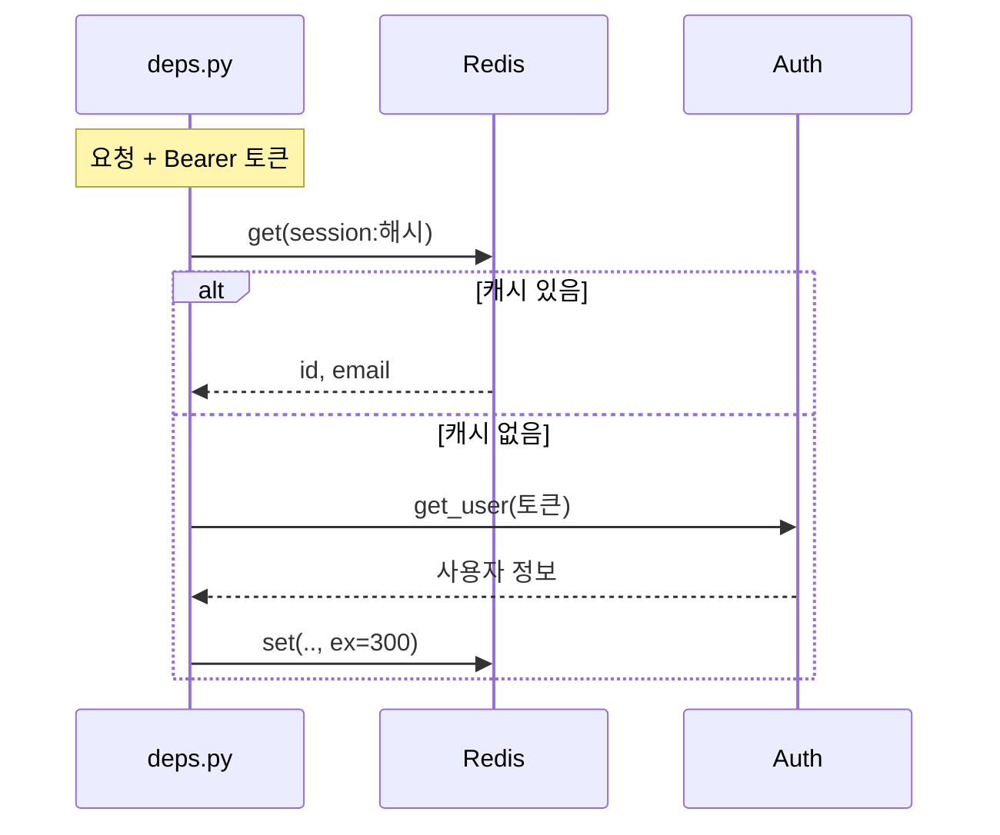
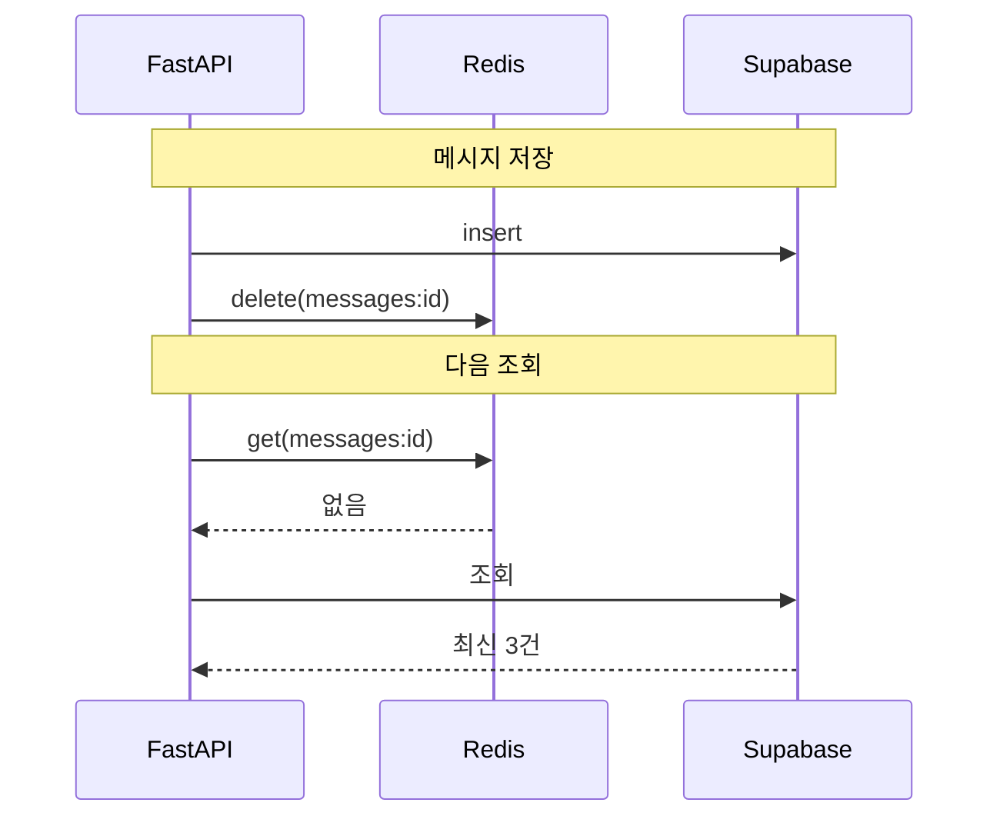

# Supabase·Redis 연동 — 사용자 정보·대화 이력 통합 관리

> [!warning] 이용 조건
> 본 교육자료는 수강생 개인의 학습 목적에 한하여 이용할 수 있으며, 외부 AI 서비스에 업로드하거나 동영상을 포함한 2차 콘텐츠로 제작·재배포하는 행위를 금지합니다. 예외적 이용은 출처 표기, 비상업적 사용, 강사의 사전 동의를 모두 충족하는 경우에 한하여 허용됩니다.

> **교육생 배포용 실습 가이드**
> 이 문서 하나만 따라 하면 실습을 처음부터 끝까지 완성할 수 있습니다.
> 수업 중 놓친 부분이 있어도 이 문서로 혼자 복습할 수 있도록 모든 결과 코드를 포함했습니다.
>
> **코드 복사 방법 (Obsidian)** — `Ctrl + E`를 눌러 **읽기 모드**로 전환한 뒤, 코드 블록 위에 마우스를 올리면 우측 상단에 복사 버튼이 나타납니다. 편집 모드에서는 보이지 않습니다.

| 항목 | 내용 |
| --- | --- |
| 교육 일차 | **15일차** |
| 과정 | Supabase·Redis 연동 |
| 주제 | 세션 캐싱, 대화 이력 캐싱, 캐시 무효화, TTL 설계, 장애 대응, 통합 점검 |
| 예제 도메인 | 챗봇 서비스 (프로필 / 대화 / 메시지) |
| 소요 시간 | 이론 약 60분 + 실습 약 5시간 + 연습문제 약 60분 |
| 선수 조건 | 13일차 FastAPI 서버(로그인·RLS)와 14일차 Redis Cloud 계정 |
| 사용 도구 | VS Code, 파이썬, 브라우저(Swagger UI + Redis Cloud 콘솔) |

---

## 0. 시작 전 체크리스트

- [ ] `3_chat-service/backend`에서 서버가 뜨고 `/docs`에 `auth` / `me` / `conversations` 그룹이 보인다
- [ ] `POST /auth/login`으로 토큰을 받을 수 있다
- [ ] Supabase에 `profiles` / `conversations` / `messages` 테이블이 있다
- [ ] 14일차에 만든 Redis Cloud 데이터베이스가 살아 있다
- [ ] 14일차 `.env`에서 `REDIS_HOST`, `REDIS_PORT`, `REDIS_PASSWORD`를 복사할 수 있다

Redis가 살아 있는지는 14일차 폴더에서 확인합니다.

```powershell
cd 2_redis-basic-test
uv run python -c "from redis_client import r; print(r.ping())"
```

`True`가 나와야 합니다. `getaddrinfo failed`가 나면 무료 플랜 데이터베이스가 삭제된 것입니다. 14일차 문서 2절대로 다시 만듭니다.

### 완료 후 산출물

```
3_chat-service/backend/
├── .env                    ← REDIS 3개가 추가된다
├── .env.example
├── pyproject.toml          ← redis 추가
└── app/
    ├── main.py                 (그대로)
    ├── db.py                   (그대로)
    ├── redis_client.py     ← 신규. Redis 접속
    ├── cache.py            ← 신규. 장애에 견디는 캐시 함수
    ├── deps.py             ← 세션 캐싱 추가
    ├── schemas.py              (그대로)
    └── routers/
        ├── auth.py         ← 로그아웃 추가 (연습문제)
        ├── me.py               (그대로)
        └── conversations.py ← 메시지 캐싱과 무효화 추가
```

**새 엔드포인트는 없습니다.** 지금 있는 것들이 더 빨라질 뿐입니다.

---

## 1. 개념 이해 — 무엇을, 왜 캐싱하나

### 14일차와 무엇이 다른가

14일차에는 Redis만 따로 익혔습니다. 오늘은 **실제 서버에 붙입니다.**

| | 14일차 | 오늘 |
| --- | --- | --- |
| 대상 | 연습용 키 (`day14:*`) | 실제 API가 쓰는 데이터 |
| 원본 | 가짜 함수 (`ask_auth_server`) | Supabase Auth, Supabase DB |
| 확인 | `print()` | Swagger UI의 응답 시간 |
| 틀리면 | 실습이 안 됨 | **사용자에게 틀린 값이 보임** |

14일차 실습 11·12(세션)와 9·10(캐시 패턴)이 그대로 옮겨옵니다. 새로 배우는 명령은 없습니다.

### 지금 무엇이 느린가

13일차에 만든 `deps.py`를 다시 봅니다.

```python
def get_current_user(credentials = Depends(bearer_scheme)):
    ...
    result = client.auth.get_user(token)   # 요청마다 Supabase Auth 에 물어본다
```

**인증이 필요한 모든 요청**이 이 줄을 지납니다. `/me`, `/me/conversations`, 앞으로 만들 모든 엔드포인트가 그렇습니다. 토큰은 그대로인데 매번 왕복이 생깁니다.

`list_messages`도 마찬가지입니다. 같은 대화를 열 번 열면 Supabase를 열 번 조회합니다. **메시지는 잘 바뀌지 않는데도** 그렇습니다.

### 무엇을 캐싱하나

| 대상 | 캐싱 안 하면 | 캐싱하면 | TTL |
| --- | --- | --- | --- |
| 토큰 검증 결과 | 요청마다 Supabase Auth 왕복 | 한 번 확인한 결과를 재사용 | **300초** |
| 대화 메시지 목록 | 요청마다 Supabase DB 조회 | 저장된 결과를 재사용 | **30초** (실습 7에서 정합니다) |

**TTL이 왜 다른지**가 오늘의 중요한 판단입니다. 실습 7에서 다룹니다.

**세션 캐싱이 붙으면 흐름이 이렇게 됩니다.**



**두 번째 요청부터는 Supabase Auth까지 가지 않습니다.** 실습 3에서 시간을 재봅니다.

### 캐싱의 대가 — 틀린 값

캐시는 공짜가 아닙니다. **원본이 바뀌어도 캐시는 모릅니다.**

```
메시지 저장  →  Supabase 에는 3건
                 Redis 에는 아직 2건짜리 캐시
                 조회하면 2건이 보인다   ← 방금 보낸 메시지가 없다
```

이걸 막는 것이 **무효화(invalidation)** 입니다. 14일차 실습 10에서 다뤘고, 오늘 실제 서버에서 같은 일이 일어나는 것을 직접 겪습니다(실습 5).

> **원칙 한 줄 — 데이터를 바꾸는 코드가 캐시도 지운다.** 읽는 쪽이 아니라 **쓰는 쪽**의 책임입니다.

### 캐시가 죽으면

Redis는 **사본**입니다. 사라져도 원본은 Supabase에 있습니다. 그러니 Redis가 죽어도 **서비스는 계속 돌아가야 합니다.** 느려질 뿐입니다.

그런데 코드를 그냥 쓰면 그렇게 되지 않습니다. `r.get()`이 예외를 던지고, 그 예외가 그대로 올라가 `500`이 됩니다. **캐시 때문에 서비스 전체가 죽습니다.** 실습 8에서 막습니다.

---

## 2. 준비

### 2-1. `redis` 패키지 설치

```powershell
cd 3_chat-service\backend
uv add redis
```

### 2-2. `.env`에 Redis 값 추가

14일차 `2_redis-basic-test/.env`에서 세 줄을 복사해 붙입니다.

```
SUPABASE_URL=https://xxxxxxxxxxxx.supabase.co
SUPABASE_SERVICE_ROLE_KEY=여기에_service_role_key_붙여넣기
SUPABASE_ANON_KEY=여기에_anon_key_붙여넣기

REDIS_HOST=redis-12345.c340.ap-northeast-2-1.ec2.cloud.redislabs.com
REDIS_PORT=12345
REDIS_PASSWORD=여기에_password_붙여넣기
```

`.env.example`에도 같은 세 줄을 추가해둡니다. 값은 비워 둡니다.

> **같은 Redis 인스턴스를 씁니다.** 14일차 실습 키(`day14:*`)는 이미 지웠으므로 부딪히지 않습니다. 오늘 만드는 키는 `session:`과 `messages:`로 시작합니다.

### 2-3. 오늘 쓸 값 준비하기

**오늘은 실습 내내 같은 값들을 씁니다.** 지금 만들어 메모장에 적어둡니다.

| 값 | 어디서 얻나 | 쓰는 곳 |
| --- | --- | --- |
| `access_token` (계정 A) | 로그인 또는 회원가입 응답 | 실습 2·3·9 |
| `user_id` (계정 A) | 같은 응답 | 아래 (2), 연습문제 1 |
| `conversation_id` | 아래 (2)에서 만든다 | 실습 4·5·6 |
| `access_token` (계정 B) | 두 번째 계정 | 실습 9 마지막 |

서버를 띄웁니다.

```powershell
uv run uvicorn app.main:app --reload
```

**(1) 계정 A로 로그인합니다.**

`/docs`에서 `POST /auth/login`을 `Try it out` → 13일차에 만든 계정으로 `Execute`.

응답의 `access_token`과 `user_id`를 **둘 다** 복사해둡니다.

**토큰은 `/docs` 오른쪽 위 `Authorize` 버튼에 넣습니다.** 13일차 실습 9에서 `HTTPBearer`로 바꿔둔 덕분입니다. `Value` 칸에 **토큰만** 넣습니다 (`Bearer`는 UI가 붙입니다). 한 번 넣으면 인증이 필요한 모든 엔드포인트에 자동으로 붙습니다.

> **토큰이 만료됐거나 계정이 기억나지 않으면** `POST /auth/signup`으로 새로 만듭니다. `@example.com` 형식을 씁니다.
>
> **어느 쪽이든 오늘 실습에는 지장이 없습니다.** (2)에서 새 대화를 만들고, 실습 4·5·6은 **그 대화 하나만** 봅니다. 다만 아래가 달라지므로 알고 있어야 합니다.

| 구분 | 13일차 계정으로 로그인 | 새 계정으로 가입 |
| --- | --- | --- |
| `GET /me/conversations` | 13일차에 만든 대화가 **보임** | **`[]`** (빈 배열) |
| 연습문제 1의 대화 목록 건수 | 여러 건 | (2)에서 만든 1건 |
| 실습 4·5·6 결과 | **차이 없음** | **차이 없음** |

**지금 데이터 상태를 확인해둡니다.** Supabase SQL Editor에서 실행합니다.

```sql
select
    (select count(*) from profiles)      as 프로필수,
    (select count(*) from conversations) as 대화수,
    (select count(*) from messages)      as 메시지수;
```

13일차를 끝까지 했다면 **대화가 몇 건 있고 메시지는 0건**입니다. 13일차 실습 9에서 대화만 만들고 메시지는 넣지 않았기 때문입니다. **그래서 조회할 메시지를 지금 만듭니다.**

**(2) 오늘 쓸 대화를 새로 만듭니다.**

13일차 대화가 남아 있더라도 **새로 하나 만듭니다.** 메시지 개수를 알고 시작해야 실습 5의 "2건 → 3건"을 확인할 수 있습니다.

`POST /conversations`를 `Try it out` → `Request body`에 아래를 넣고 `Execute`.

```json
{
  "user_id": "복사한_user_id",
  "title": "캐싱 확인용 대화"
}
```

`Code`가 `201`입니다. **응답의 `id`를 복사해둡니다.** 이것이 `conversation_id`이고, 실습 3부터 계속 씁니다.

**(3) 그 대화에 메시지를 2건 넣습니다.**

`POST /conversations/{conversation_id}/messages`를 펼치고, `conversation_id` 칸에 방금 복사한 값을 넣습니다. `Request body`를 아래로 바꿔 **두 번** 실행합니다.

```json
{ "role": "user", "content": "캐시가 되나요?" }
```
```json
{ "role": "assistant", "content": "됩니다." }
```

**확인:** `GET /conversations/{conversation_id}/messages`를 실행하면 **2건**이 나옵니다.

> **이 2건이 실습 4·5·6의 기준입니다.** 방금 만든 대화만 보므로, 13일차 데이터가 남아 있든 없든 결과가 같습니다. 실습 5에서 여기에 한 건을 더해 3건으로 만듭니다.

**(4) 계정 B를 준비합니다.** — 실습 9 마지막에서 씁니다.

13일차 실습 9에서 두 계정(`rls-a`, `rls-b`)을 만들었다면 그중 **다른 하나로** 로그인해 토큰을 받아둡니다. 없거나 기억나지 않으면 새로 가입합니다.

```json
{ "email": "day15-b@example.com", "password": "test1234!" }
```

**확인:** 계정 B의 토큰으로 `GET /me/conversations`를 실행하면 (2)에서 만든 대화가 **보이지 않습니다.** 계정 A의 것이기 때문입니다.

> **토큰을 바꿀 때는** `Authorize` → `Logout` → 다시 `Authorize`에 새 토큰을 넣습니다. 확인이 끝나면 **계정 A로 되돌려둡니다.** 실습 2·3이 계정 A 기준입니다.

> **주소에 적힌 이름 그대로 씁니다.** 문서에서 `{conversation_id}`라고 쓴 것은 Swagger UI 화면의 입력 칸 이름과 같습니다. `{id}`가 아닙니다.

---

## 3. 실습 1부 — 세션 캐싱

각 실습은 **목표 / 요구사항 / 힌트 / 결과 코드 / 확인** 순서입니다.

### 실습 1. Redis 접속 코드

**목표:** 서버에서 Redis에 접속할 수 있게 한다.

**요구사항**

- `app/redis_client.py`를 만든다
- 14일차 `redis_client.py`와 같은 구조로 쓴다

**힌트**

`app/db.py`가 Supabase 접속을 한 곳에 모아둔 것과 같은 방식입니다. 접속 코드는 한 파일에 두고 필요한 곳에서 가져다 씁니다.

**결과 코드**

`app/redis_client.py` (신규)

```python
import os

import redis
from dotenv import load_dotenv

load_dotenv()

r = redis.Redis(
    host=os.environ["REDIS_HOST"],
    port=int(os.environ["REDIS_PORT"]),
    password=os.environ["REDIS_PASSWORD"],
    decode_responses=True,
)
```

`decode_responses=True`가 없으면 조회 결과가 `b'값'` 형태로 나와 매번 `.decode()`를 해야 합니다. 14일차와 같습니다.

**확인:** 터미널에서 실행합니다.

```powershell
uv run python -c "from app.redis_client import r; print(r.ping())"
```

`True`가 나옵니다. `KeyError: 'REDIS_HOST'`가 나면 `.env`에 값을 안 넣은 것입니다.

---

### 실습 2. 토큰 검증 결과 캐싱

**목표:** `deps.py`가 요청마다 Supabase Auth에 묻지 않게 한다.

**요구사항**

- 캐시에 있으면 그대로 쓴다
- 없으면 Supabase에 확인하고 TTL과 함께 저장한다
- **토큰을 키에 그대로 넣지 않는다**
- 인증 실패는 캐시하지 않는다

**힌트**

14일차 실습 11을 그대로 옮깁니다. 달라지는 것은 `ask_auth_server()`가 `client.auth.get_user(token)`으로 바뀌는 것뿐입니다.

**토큰을 해시하는 이유:** 토큰은 그 자체가 로그인 자격입니다. Redis 키 목록에 원문이 남으면, Redis를 볼 수 있는 사람이 남의 계정을 그대로 쓸 수 있습니다. `sha256`으로 바꾸면 같은 토큰은 항상 같은 키가 되므로 조회에는 지장이 없습니다.

**결과 코드**

`app/deps.py`

```python
import hashlib
import json
from dataclasses import dataclass

from fastapi import Depends, HTTPException
from fastapi.security import HTTPAuthorizationCredentials, HTTPBearer

from app.db import get_anon_client
from app.redis_client import r

# 13일차 실습 9에서 HTTPBearer 로 바꿨다. Swagger 의 Authorize 버튼이 여기서 온다.
bearer_scheme = HTTPBearer()

SESSION_CACHE_TTL_SECONDS = 300


@dataclass
class CurrentUser:
    id: str
    email: str
    token: str


def get_current_user(
    credentials: HTTPAuthorizationCredentials = Depends(bearer_scheme),
) -> CurrentUser:
    token = credentials.credentials
    cache_key = f"session:{hashlib.sha256(token.encode()).hexdigest()}"

    cached = r.get(cache_key)
    if cached:
        data = json.loads(cached)
        return CurrentUser(id=data["id"], email=data["email"], token=token)

    client = get_anon_client()
    try:
        result = client.auth.get_user(token)
    except Exception:
        raise HTTPException(status_code=401, detail="유효하지 않은 토큰입니다")

    current_user = CurrentUser(id=str(result.user.id), email=result.user.email, token=token)
    r.set(
        cache_key,
        json.dumps({"id": current_user.id, "email": current_user.email}),
        ex=SESSION_CACHE_TTL_SECONDS,
    )
    return current_user
```

> **토큰은 캐시에 저장하지 않습니다.** `CurrentUser`에는 토큰이 들어가지만, Redis에 넣는 것은 `id`와 `email`뿐입니다. 토큰은 요청 헤더에서 매번 오므로 저장할 이유가 없습니다.

> **인증 실패는 캐시하지 않습니다.** `raise` 전에 `r.set`이 없습니다. 실패를 캐싱하면 토큰이 나중에 유효해져도 계속 막힙니다.

**확인:** `/docs`에서 `GET /me`를 **연속 세 번** 실행합니다. 눈으로는 차이를 알기 어렵습니다. 다음 실습에서 잽니다.

Redis Cloud 콘솔의 Data Browser에서 `session:*`을 검색하면 키가 하나 생겨 있습니다. **값에 토큰이 없고 `id`와 `email`만** 들어 있는 것을 확인합니다.

---

### 실습 3. 캐시 효과 직접 재기

**목표:** 캐시가 실제로 얼마나 빠른지 숫자로 확인한다.

**요구사항**

- 같은 요청을 세 번 보내고 각각의 시간을 잰다
- 첫 번째와 나머지의 차이를 본다
- **재실행해도 결과가 같아야 한다**

**힌트**

Swagger UI로는 정확히 재기 어렵습니다. 파이썬으로 직접 호출합니다. `time.perf_counter()`로 앞뒤를 감쌉니다.

**측정 전에 캐시를 비웁니다.** 안 그러면 앞선 요청이 만들어둔 캐시가 남아 있어 **첫 요청부터 `HIT`** 가 됩니다. 그러면 세 번 다 비슷한 시간이 나와 아무것도 안 보입니다.

세션 캐시 키는 토큰을 `sha256`으로 해시한 값입니다(실습 2). 그래서 여기서도 같은 방법으로 키를 만듭니다.

**결과 코드**

`measure.py`를 만듭니다. **`app/` 폴더 안이 아니라 그 바깥**, `pyproject.toml`과 같은 자리입니다.

```
3_chat-service/backend/
├── measure.py        ← 여기에 만든다
├── pyproject.toml
├── .env
└── app/
    ├── redis_client.py
    └── ...
```

코드에 `from app.redis_client import r`가 있어서, `app`을 패키지로 찾으려면 **실행 위치가 `backend`** 여야 합니다. `app/` 안에 두면 `ModuleNotFoundError: No module named 'app'`이 납니다.

(실습용 임시 파일이라 나중에 지워도 됩니다.)

```python
import hashlib
import json
import sys
import time
import urllib.request

from app.redis_client import r

sys.stdout.reconfigure(encoding="utf-8")

BASE = "http://127.0.0.1:8000"
TOKEN = "여기에_access_token_붙여넣기"
CONVERSATION_ID = "여기에_conversation_id_붙여넣기"


def call(path):
    req = urllib.request.Request(BASE + path)
    req.add_header("Authorization", "Bearer " + TOKEN)
    started = time.perf_counter()
    with urllib.request.urlopen(req) as res:
        body = json.loads(res.read())
    return body, (time.perf_counter() - started) * 1000


def measure(path, cache_key, times=3):
    """캐시를 비우고 같은 요청을 여러 번 보낸다."""
    r.delete(cache_key)          # 1회차가 확실히 MISS 가 되게 한다
    print(f"\n{path}")
    for i in range(1, times + 1):
        body, ms = call(path)
        count = len(body) if isinstance(body, list) else "-"
        print(f"  {i}회차  {ms:7.1f} ms  {count}건  남은 TTL {r.ttl(cache_key):>4}s")


measure("/me", "session:" + hashlib.sha256(TOKEN.encode()).hexdigest())
```

> **`TOKEN`은 파일에 적어두지 않는 편이 좋습니다.** 실습용이라 그대로 써도 되지만, **이 파일을 깃에 올리지 않습니다.** 토큰은 로그인 자격 그 자체입니다.

서버를 켜 둔 채 **새 터미널**에서 실행합니다. `backend` 폴더에서 실행합니다.

```powershell
cd 3_chat-serviceackend
uv run python measure.py
```

**확인:** 아래처럼 나옵니다. 절대값은 네트워크 사정에 따라 다르지만 **1회차와 2회차의 차이**가 핵심입니다.

```
/me
  1회차    886.1 ms  -건  남은 TTL  300s
  2회차    194.5 ms  -건  남은 TTL  299s
  3회차    193.0 ms  -건  남은 TTL  299s
```

**남은 TTL이 `300`에서 시작해 줄어드는 것**을 봅니다. 1회차가 캐시를 **만들었고**, 2·3회차는 **그것을 읽었을 뿐**이라 시간이 흐른 만큼만 줄었습니다.

> **`MISS`/`HIT` 라벨을 왜 안 붙였나:** 클라이언트는 서버가 캐시를 썼는지 **알 수 없습니다.** "1회차니까 MISS일 것"이라고 우리가 짐작해 라벨을 붙이면, 캐시가 이미 있을 때 **거짓말이 됩니다.** 그래서 여기서는 **시간과 TTL이라는 실제 증거**만 출력합니다.
>
> 서버가 직접 알려주게 하는 방법이 있습니다. 연습문제 3에서 `X-Cache` 헤더로 만듭니다.

> **다시 실행해도 같은 결과가 나옵니다.** `measure()`가 시작할 때 캐시를 지우기 때문입니다. 지우지 않으면 두 번째 실행부터는 1회차도 `HIT`라 세 줄이 다 비슷하게 나옵니다.

**약 10배**입니다. (2026-08-16 측정, Redis Cloud 서울 리전)

> **2회차와 3회차가 거의 같습니다.** 둘 다 Redis만 다녀왔기 때문입니다. 197ms는 대부분 **원격 Redis까지의 네트워크 왕복**입니다. Redis를 서버와 같은 곳에 두면 1ms 미만이 됩니다.

> **5분(300초)이 지나면 다시 MISS가 납니다.** TTL이 만료되어 캐시가 사라졌기 때문입니다. 기다렸다가 다시 실행해보면 1회차 시간이 나옵니다.

---

## 4. 실습 2부 — 대화 이력 캐싱

### 실습 4. 메시지 목록 캐싱

**목표:** 같은 대화를 반복해서 열 때 Supabase를 다시 조회하지 않게 한다.

**요구사항**

- 캐시에 있으면 그대로 반환한다
- 없으면 조회하고 30초 TTL로 저장한다
- 키에 대화 id를 넣어 대화마다 따로 보관한다

**힌트**

14일차 실습 9(cache-aside)와 같은 흐름입니다.

```
요청 → 캐시 확인 → 있으면(HIT) 그대로 반환
                 → 없으면(MISS) Supabase 조회 → 캐시에 저장 → 반환
```

**키를 만드는 코드를 함수로 빼둡니다.** 저장할 때와 지울 때 같은 키를 써야 하는데, 두 곳에 문자열을 각각 적으면 언젠가 어긋납니다.

**`datetime`이 JSON으로 안 바뀝니다.** `created_at`이 `datetime`이라 `json.dumps`가 거부합니다. `default=str`을 줍니다.

**결과 코드**

`app/routers/conversations.py`의 위쪽에 추가합니다.

```python
import json

from app.redis_client import r

# 우선 넉넉하게 잡는다. 얼마가 맞는지는 실습 7에서 정한다.
MESSAGES_CACHE_TTL_SECONDS = 300


def _messages_cache_key(conversation_id: UUID) -> str:
    return f"messages:{conversation_id}"
```

> **왜 300초부터 시작하나:** 실습 5·6에서 **캐시가 살아 있는 동안** 조회를 여러 번 해야 합니다. TTL이 짧으면 확인하는 사이에 캐시가 만료돼 무엇을 보고 있는지 헷갈립니다. 값을 얼마로 정할지는 실습 7에서 근거를 세워 판단합니다.

`list_messages`를 고칩니다.

```python
@router.get("/{conversation_id}/messages", response_model=list[MessageOut])
def list_messages(conversation_id: UUID):
    cache_key = _messages_cache_key(conversation_id)

    cached = r.get(cache_key)
    if cached:
        return json.loads(cached)

    result = (
        supabase.table("messages")
        .select("*")
        .eq("conversation_id", str(conversation_id))
        .order("created_at", desc=False)
        .execute()
    )
    r.set(cache_key, json.dumps(result.data, default=str), ex=MESSAGES_CACHE_TTL_SECONDS)
    return result.data
```

**확인:** `measure.py` 맨 아래에 한 줄을 덧붙여 실행합니다. `CONVERSATION_ID`에는 **2-3에서 만든 대화의 id**를 넣습니다.

```python
measure(f"/conversations/{CONVERSATION_ID}/messages", f"messages:{CONVERSATION_ID}")
```

```
/conversations/{conversation_id}/messages
  1회차    552.2 ms  2건  남은 TTL  300s
  2회차    193.0 ms  2건  남은 TTL  299s
  3회차    193.3 ms  2건  남은 TTL  299s
```

**약 3배**입니다. `건수`가 세 번 다 `2건`이고, **남은 TTL이 줄어드는 것**으로 같은 캐시를 계속 읽고 있음을 알 수 있습니다.

> **`measure()` 함수를 그대로 재사용합니다.** 캐시 키만 바꿔 넘기면 됩니다. 세션 캐시는 토큰 해시, 메시지 캐시는 대화 id — **키 짓는 규칙이 다를 뿐 캐싱하는 방식은 같습니다.**

> **세션 캐시보다 효과가 작습니다.** Supabase Auth에 토큰을 검증하러 가는 것이 단순 DB 조회보다 오래 걸리기 때문입니다. **어디가 느린지 재보고 캐싱 대상을 고른다**는 것이 요점입니다.

---

### 실습 5. 새로운 메시지 추가하기

**목표:** 캐시만 넣고 무효화를 안 하면 무슨 일이 생기는지 직접 본다.

> **지금은 코드를 고치지 않습니다.** 실습 4까지만 한 상태에서 확인합니다.

**확인:**

1. `/docs`에서 `GET /conversations/{conversation_id}/messages`를 실행합니다. **2건**이 나옵니다. (캐시에 저장됨)

2. **바로** `POST /conversations/{conversation_id}/messages`로 메시지를 하나 더 저장합니다.

```json
{ "role": "user", "content": "방금 보낸 메시지" }
```

`Code`가 `201`입니다. **저장은 됐습니다.**

3. **다시** `GET /conversations/{conversation_id}/messages`를 실행합니다.

**여전히 2건입니다.** 방금 보낸 메시지가 없습니다.

4. Supabase 대시보드의 Table Editor에서 `messages`를 봅니다. **3건이 들어 있습니다.**

```
Supabase (원본)     3건   ← 저장은 제대로 됐다
Redis   (캐시)      2건   ← 1번에서 만든 것. 아직 살아 있다
API 응답            2건   ← 캐시를 보고 답했다
```

5. 캐시가 아직 살아 있는지 확인합니다. 14일차 `00_explore.ipynb`에서 실행하거나, Redis Cloud 콘솔의 Data Browser에서 `messages:*`를 찾아봅니다.

```python
r.ttl("messages:여기에_conversation_id")
```

**양수**가 나옵니다. 남은 초입니다. 이 값이 `0`이 될 때까지 **계속 2건이 보입니다.**

6. TTL이 다 지나면(약 5분) 다시 조회할 때 **3건**이 나옵니다. 캐시가 사라져 Supabase를 다시 봤기 때문입니다.

> **이것이 실제 서비스라면:** 사용자가 메시지를 보냈는데 화면에 안 나타납니다. 한참 뒤에 갑자기 나타납니다. **버그로 신고가 들어오는데 재현이 잘 안 됩니다** — 시간이 지나면 정상으로 보이기 때문입니다.

> **TTL을 짧게 줄이면 되지 않나:** 5초로 줄여도 5초 동안은 같은 문제입니다. 그리고 짧을수록 캐시 효과가 줄어듭니다. **TTL은 이 문제의 답이 아닙니다.**

> **`r.ttl()`이 `-2`로 나오면** 캐시가 이미 사라진 것입니다. 아래 「다시 해보려면」대로 처음부터 합니다. `-2`는 "키가 없음"이라는 뜻이고, 14일차 실습 7에서 다뤘습니다.

**다시 해보려면**

한 번에 감이 안 올 수 있습니다. 몇 번이든 다시 할 수 있습니다.

**대화를 새로 만들 필요는 없습니다.** 초기화할 것은 **캐시 하나**뿐입니다.

```python
r.delete("messages:여기에_conversation_id")
```

14일차 `00_explore.ipynb`에서 실행하거나, Redis Cloud 콘솔의 Data Browser에서 그 키를 지웁니다. 그리고 위 1번부터 다시 합니다.

**개수는 달라집니다.** 앞에서 메시지를 한 건 더 넣었으므로 이번에는 "3건 → 4건"이 됩니다. 그래도 됩니다. **확인할 것은 개수가 아니라 "저장했는데 안 늘어난다"입니다.**

> **캐시를 왜 먼저 지우나:** 안 지우면 1번 조회가 **옛 캐시**를 그대로 돌려줍니다. 그러면 지금 원본이 몇 건인지 모르는 채로 시작하게 됩니다. 깨끗한 `MISS`로 시작해야 앞뒤가 맞습니다.

> **메시지가 쌓이는 것이 신경 쓰이면** Supabase SQL Editor에서 정리합니다. 2-3에서 넣은 2건만 남습니다.
>
> ```sql
> delete from messages
> where conversation_id = '여기에_conversation_id'
>   and content not in ('캐시가 되나요?', '됩니다.');
> ```
>
> **지운 뒤 캐시도 반드시 지웁니다.** 안 그러면 `/docs`에서 계속 옛 목록이 나옵니다.
>
> ```python
> r.delete("messages:여기에_conversation_id")
> ```
>
> **왜 그런가:** 무효화 코드는 `create_message` 안에 있습니다. SQL Editor로 직접 고치면 **그 코드를 지나지 않으므로** Redis는 바뀐 것을 모릅니다. 실습 7에서 다시 다룹니다.

---

### 실습 6. 무효화 추가

**목표:** 메시지를 저장하면 그 대화의 캐시를 즉시 지운다.

**요구사항**

- `create_message`가 저장 후 캐시를 지운다
- 실습 5의 증상이 사라진다

**힌트**

한 줄이면 됩니다. `_messages_cache_key()`를 그대로 씁니다. **저장할 때 쓴 키와 같은 키**여야 하므로 함수로 빼둔 것이 여기서 값을 합니다.

**결과 코드**

`app/routers/conversations.py`의 `create_message` 함수에서, `return` 바로 앞에 한 줄을 넣습니다.

```python
    result = (
        supabase.table("messages")
        .insert(
            {
                "conversation_id": str(conversation_id),
                "role": payload.role,
                "content": payload.content,
            }
        )
        .execute()
    )
    r.delete(_messages_cache_key(conversation_id))   # 이 줄을 추가
    return result.data[0]
```

**무효화가 들어간 뒤의 흐름입니다.**



`delete` 한 줄이 없으면 **다음 조회가 Redis의 옛 값(2건)을 그대로 돌려줍니다.**

**확인:** 실습 5와 같은 순서로 다시 합니다.

1. `GET .../messages` → 3건 (캐시에 저장됨)
2. `POST .../messages`로 하나 더 저장 → `201`
3. **바로** `GET .../messages` → **4건**. 방금 보낸 것이 보입니다

`measure.py`로 시간까지 보면 무효화가 동작한 것이 더 분명합니다.

```
저장 직후 조회    549.9 ms  3건   <- 캐시가 지워져 Supabase 를 다시 조회
한 번 더          198.0 ms  3건   <- 다시 HIT
```

**저장 직후 조회가 느립니다.** 캐시가 없어서 원본까지 다녀왔다는 뜻입니다. 그 다음 조회는 다시 빨라집니다.

> **왜 캐시를 지우기만 하고 새로 채우지 않나.** 지운 자리에 바로 새 값을 넣을 수도 있습니다(write-through). 하지만 **아무도 조회하지 않을 대화까지 미리 만들어두는 낭비**가 생깁니다. 지워두고 다음 조회 때 채우는 편이 단순하고 대개 낫습니다.

**무효화 전후를 다시 비교하려면**

방금 넣은 한 줄을 주석 처리했다 풀었다 하면 언제든 두 상태를 오갈 수 있습니다.

| 보고 싶은 것 | 하는 일 |
| --- | --- |
| 무효화 **없는** 상태 (실습 5) | `r.delete(...)` 줄 앞에 `#`를 붙인다 |
| 무효화 **있는** 상태 (실습 6) | `#`를 뗀다 |

`--reload` 덕분에 저장하면 서버가 알아서 다시 뜹니다. **어느 쪽이든 시작 전에 캐시 키를 지웁니다.**

```python
r.delete("messages:여기에_conversation_id")
```

> **한 줄 차이로 결과가 갈리는 것**을 직접 오가며 보면, 무효화가 왜 선택이 아니라 필수인지가 분명해집니다.

---

## 5. 실습 3부 — 설계 판단

### 실습 7. TTL은 얼마로 잡나

**목표:** 실습 4에서 미뤄둔 판단을 한다. 메시지 캐시의 TTL을 얼마로 정할 것인가.

**요구사항**

- 지금 값(300초)이 적절한지 판단한다
- 세션(300초)과 같아도 되는지 근거를 댄다
- 값을 바꿔보고 무슨 일이 생기는지 확인한다

**판단 기준은 하나입니다.**

> **TTL = 틀린 값이 보여도 괜찮은 시간**

지금 두 캐시의 TTL이 **둘 다 300초**입니다. 서로 다른 파일에 있습니다.

| 상수 | 파일 | 넣은 곳 |
| --- | --- | --- |
| `SESSION_CACHE_TTL_SECONDS = 300` | `app/deps.py` | 실습 2 |
| `MESSAGES_CACHE_TTL_SECONDS = 300` | `app/routers/conversations.py` | 실습 4 |

같아도 될까요?

| | 세션 | 메시지 |
| --- | --- | --- |
| 원본이 바뀌는 일 | 거의 없음 (로그아웃·만료) | **자주** (대화 중 계속) |
| 틀리면 생기는 일 | 로그아웃한 사람이 잠시 더 쓸 수 있음 | 방금 보낸 메시지가 안 보임 |
| 무효화 가능한가 | 가능 (로그아웃 시) | 가능 (저장 시) |
| 사용자가 알아채는가 | 거의 못 알아챔 | **바로 알아챔** |

**메시지 쪽이 더 짧아야 합니다.** 무효화(실습 6)가 있으니 대부분 즉시 반영되지만, TTL은 **무효화를 빠뜨린 경로에 대한 안전망**입니다. 그 안전망이 5분이면 너무 깁니다.

**결과 코드**

먼저 반대쪽 극단을 봅니다. **`app/routers/conversations.py`** 의 `MESSAGES_CACHE_TTL_SECONDS`를 `5`로 바꿔봅니다.

```python
MESSAGES_CACHE_TTL_SECONDS = 5
```

**확인:**

1. `measure.py`를 실행해 MISS/HIT를 봅니다
2. 6초 기다렸다가 다시 실행합니다 → **또 MISS**가 납니다
3. 캐시 효과가 거의 없어졌습니다

| TTL | 캐시 HIT 비율 | 틀린 값이 보이는 최대 시간 |
| --- | --- | --- |
| 5초 | 낮음 | 5초 |
| **30초** | **보통** | **30초** |
| 300초 | 높음 | 5분 |

**30초로 정합니다.** 캐시 효과를 살리면서 안전망도 충분히 짧습니다. 같은 파일(`app/routers/conversations.py`)에서 고칩니다.

```python
MESSAGES_CACHE_TTL_SECONDS = 30
```

> **왜 실습 4에서 바로 30으로 하지 않았나:** 실습 5·6에서 **캐시가 살아 있는 동안** 여러 번 조회해야 했습니다. 30초면 확인하는 사이에 만료돼 무엇을 보고 있는지 헷갈립니다. **먼저 넉넉히 잡고 확인한 뒤, 근거가 생기면 조인다** — 실무에서도 이 순서가 안전합니다.

> **`app/deps.py`의 세션 TTL은 300초 그대로 둡니다.** 오늘 고치는 것은 메시지 쪽 하나뿐입니다. 로그아웃은 연습문제 2에서 무효화로 처리합니다.

> **TTL이 없으면 안 되나.** 안 됩니다. 무효화를 **빠뜨린 경로**가 언젠가 생깁니다. 관리자가 DB에서 직접 고치거나, 다른 서비스가 같은 표를 건드리거나. TTL은 그때 스스로 회복하게 해줍니다.
>
> **직접 해보면 바로 압니다.** Supabase SQL Editor에서 메시지를 하나 지우고 `GET .../messages`를 호출해보세요. **여전히 지운 메시지가 보입니다.** 우리 무효화 코드는 `create_message` 안에 있는데, SQL Editor는 그 코드를 지나지 않기 때문입니다.
>
> 이때 고칠 방법은 두 가지뿐입니다 — 캐시를 손으로 지우거나(`r.delete(...)`), **TTL이 지나기를 기다리거나.** 무효화가 닿지 않는 곳을 TTL이 받아줍니다.

---

### 실습 8. Redis가 죽으면 — 장애 대응

**목표:** Redis가 멈춰도 서비스가 계속 돌아가게 한다.

**요구사항**

- 캐시 조회·저장이 실패해도 요청은 정상 처리된다
- 실패를 조용히 넘기되 로그는 남긴다

**힌트**

지금 코드는 `r.get()`이 예외를 던지면 그대로 `500`이 됩니다. **캐시는 사본일 뿐인데 서비스 전체가 죽습니다.**

`redis` 라이브러리의 예외는 전부 `RedisError`를 상속합니다. 연결 실패(`ConnectionError`)와 시간 초과(`TimeoutError`) 모두 그 아래입니다. 하나만 잡으면 됩니다.

**결과 코드**

`app/cache.py` (신규)

```python
"""캐시 접근을 감싸는 함수들.

Redis 는 원본이 아니라 사본이다. 죽어도 서비스는 계속돼야 한다.
그래서 캐시 실패는 예외로 올리지 않고 "캐시가 없는 것"으로 처리한다.
"""

import logging

from redis.exceptions import RedisError

from app.redis_client import r

logger = logging.getLogger(__name__)


def cache_get(key: str) -> str | None:
    """캐시에서 읽는다. 실패하면 None (= 캐시 없음)."""
    try:
        return r.get(key)
    except RedisError as error:
        logger.warning("캐시 조회 실패 (%s): %s", key, error)
        return None


def cache_set(key: str, value: str, ttl_seconds: int) -> None:
    """캐시에 쓴다. 실패해도 무시한다."""
    try:
        r.set(key, value, ex=ttl_seconds)
    except RedisError as error:
        logger.warning("캐시 저장 실패 (%s): %s", key, error)


def cache_delete(key: str) -> None:
    """캐시를 지운다. 실패해도 무시한다."""
    try:
        r.delete(key)
    except RedisError as error:
        logger.warning("캐시 삭제 실패 (%s): %s", key, error)
```

`deps.py`와 `conversations.py`가 이 함수들을 쓰게 바꿉니다.

`app/deps.py` — `from app.redis_client import r`를 지우고 아래로 바꿉니다.

```python
from app.cache import cache_get, cache_set
```

```python
    cached = cache_get(cache_key)
    ...
    cache_set(
        cache_key,
        json.dumps({"id": current_user.id, "email": current_user.email}),
        SESSION_CACHE_TTL_SECONDS,
    )
```

`app/routers/conversations.py` — 마찬가지로 바꿉니다.

```python
from app.cache import cache_delete, cache_get, cache_set
```

```python
    cached = cache_get(cache_key)
    ...
    cache_set(cache_key, json.dumps(result.data, default=str), MESSAGES_CACHE_TTL_SECONDS)
```

```python
    cache_delete(_messages_cache_key(conversation_id))
```

**확인:** Redis를 일부러 못 쓰게 만들어봅니다. `.env`의 포트를 틀리게 바꿉니다.

```
REDIS_PORT=9999
```

서버를 다시 시작하고 `/docs`에서 확인합니다.

| 요청 | 고치기 전 | 고친 뒤 |
| --- | --- | --- |
| `GET /me` | **`500`** | `200` (느리지만 정상) |
| `GET .../messages` | **`500`** | `200` |

터미널에는 `캐시 조회 실패` 경고가 찍힙니다. **서비스는 살아 있고, 캐시만 꺼진 상태**입니다.

확인이 끝나면 `.env`의 포트를 되돌립니다.

> **`except Exception`이 아니라 `except RedisError`인 이유:** `Exception`으로 잡으면 우리 코드의 버그(오타, `None` 참조)까지 삼켜버립니다. 그러면 진짜 문제가 조용히 묻힙니다. **잡을 것만 잡습니다.**

---

### 실습 9. 통합 점검

**목표:** 12·13·15일차에 만든 것이 처음부터 끝까지 한 줄로 이어지는지 확인한다.

**요구사항**

- 회원가입부터 캐시 히트까지 전 구간을 한 번에 통과한다

**확인:** `/docs`에서 순서대로 실행합니다.

| # | 요청 | 기대 결과 | 어느 일차 |
| --- | --- | --- | --- |
| 1 | `POST /auth/signup` | `200`, `access_token`이 `null`이 아님 | 13 |
| 2 | Supabase에서 `select * from profiles` | 그 계정의 프로필이 **자동 생성**됨 (트리거) | 13 |
| 3 | `GET /me` (토큰) | `200`, 내 `id`와 `email` | 13 |
| 4 | `GET /me` **다시** | `200`, **훨씬 빠름** (세션 캐시 HIT) | **15** |
| 5 | `POST /conversations` | `201` | 12 |
| 6 | `POST .../messages` ×2 | `201` | 12 |
| 7 | `GET .../messages` | `200`, 2건, `user` → `assistant` 순서 | 12 |
| 8 | `GET .../messages` **다시** | `200`, **빠름** (메시지 캐시 HIT) | **15** |
| 9 | `POST .../messages` 한 건 더 | `201` | 12 |
| 10 | `GET .../messages` **바로** | `200`, **3건** (무효화 동작) | **15** |
| 11 | `GET /me/conversations` (**2-3(4)의 계정 B 토큰**) | 5번 대화가 **안 보임** (RLS) | 13 |

> **실습 9는 1번에서 계정을 새로 만듭니다.** 그래서 2-3에서 무엇을 했든, 지금까지 무슨 계정을 썼든 결과가 같습니다. 11번에서만 **다른 계정**이 필요한데, 2-3(4)에서 준비해둔 계정 B를 씁니다.

**11번이 특히 중요합니다.** 캐싱을 붙였다고 접근 제어가 느슨해지면 안 됩니다.

> **세션 캐시는 RLS를 우회하지 않습니다.** 캐시에 담은 것은 "이 토큰이 누구인지"뿐이고, 실제 DB 조회는 여전히 그 사용자의 토큰으로 나갑니다. `/me/conversations`가 `client.postgrest.auth(current_user.token)`을 쓰는 것은 그대로입니다.

Redis Cloud 콘솔에서 `session:*`과 `messages:*` 키가 보이는지 확인하며 마칩니다.

---

## 6. 연습문제 — 스스로 만들어보기

여기까지가 오늘의 필수 범위입니다. 아래 네 문제는 **결과 코드를 보지 않고 직접** 만들어봅니다.

새 개념은 없습니다. 실습 4·6·8에서 쓴 `cache_get` / `cache_set` / `cache_delete` 세 함수의 조합입니다. 답안은 7절에 있습니다.

### 문제 1. 대화 목록도 캐싱하기

**목표:** `GET /conversations?user_id=`에 캐싱을 붙인다.

**요구사항**

- 사용자마다 따로 캐싱한다
- TTL은 60초
- **대화를 새로 만들면 그 사용자의 캐시를 지운다**

**힌트:** 키에 `user_id`를 넣습니다. 무효화는 `create_conversation`에서 합니다. 실습 6과 같은 모양입니다.

**확인:** 같은 `user_id`로 두 번 조회 → 두 번째가 빠릅니다. 대화를 하나 만든 뒤 바로 조회 → 새 대화가 **바로** 보입니다.

---

### 문제 2. 로그아웃

**목표:** `POST /auth/logout`을 만든다. 세션 캐시를 즉시 지운다.

**요구사항**

- 토큰으로 인증한다
- 그 토큰의 세션 캐시를 지운다
- `204`를 반환한다

**힌트:** 14일차 실습 12와 같습니다. 캐시 키를 만드는 방법이 `deps.py`에 있는데, **두 곳에 같은 해시 코드를 적으면 언젠가 어긋납니다.** 함수로 빼서 나눠 씁니다.

**왜 필요한가:** TTL이 300초라 로그아웃해도 **5분 동안 그 토큰이 계속 통합니다.** 즉시 지워야 합니다.

**확인:** 로그인 → `GET /me`(200) → 로그아웃(204) → Redis 콘솔에서 `session:*` 키가 사라짐.

---

### 문제 3. 캐시 적중을 응답 헤더로 알리기

**목표:** `GET /conversations/{conversation_id}/messages`가 캐시에서 답했는지 응답 헤더로 알려준다.

**요구사항**

- `X-Cache: HIT` 또는 `X-Cache: MISS`
- 응답 본문은 그대로

**힌트:** FastAPI에서 헤더를 직접 넣으려면 함수 인자에 `response: Response`를 받고 `response.headers["X-Cache"] = ...`로 씁니다. `from fastapi import Response`.

**왜 필요한가:** 지금은 캐시가 도는지 **시간을 재봐야** 압니다. 헤더로 노출하면 브라우저 개발자도구에서 바로 보입니다. **20~21일차 로그 대시보드**에서 이런 값을 모읍니다.

**확인:** `/docs`에서 실행하고 `Response headers`를 봅니다. 첫 요청 `MISS`, 두 번째 `HIT`.

---

### 문제 4. 프로필을 고치면 무엇을 지워야 하나

**목표:** 13일차 연습문제에서 만든 `PATCH /me/profile`에 무효화를 넣는다. **무엇을 지워야 하는지 스스로 판단한다.**

**요구사항**

- `username`을 바꾼 뒤, 낡은 캐시가 남지 않게 한다
- 지울 필요가 없는 것은 지우지 않는다

**힌트:** 지금 캐싱하고 있는 것이 무엇인지 목록을 적어봅니다. 그중 `username`이 들어 있는 것은 어느 것입니까?

> **함정입니다.** 세션 캐시에는 `id`와 `email`만 있고 `username`은 없습니다. 메시지 캐시에도 없습니다. **지울 것이 없는 것이 정답일 수 있습니다.**
>
> 13일차 연습문제 1(`GET /me/profile`)까지 만들었고 거기에 캐싱을 붙였다면, 그때는 지워야 합니다.

**확인:** 캐싱한 것 중 `username`을 담은 것이 있는지 확인하고, 있으면 지우고 없으면 "지울 것 없음"을 근거와 함께 적습니다.

---

## 7. 연습문제 답안

먼저 직접 풀어본 뒤에 봅니다.

### 문제 1. 대화 목록 캐싱

`app/routers/conversations.py`

```python
CONVERSATIONS_CACHE_TTL_SECONDS = 60


def _conversations_cache_key(user_id: UUID) -> str:
    return f"conversations:{user_id}"


@router.get("", response_model=list[ConversationOut])
def list_conversations(user_id: UUID):
    cache_key = _conversations_cache_key(user_id)

    cached = cache_get(cache_key)
    if cached:
        return json.loads(cached)

    result = (
        supabase.table("conversations")
        .select("*")
        .eq("user_id", str(user_id))
        .order("created_at", desc=True)
        .execute()
    )
    cache_set(cache_key, json.dumps(result.data, default=str), CONVERSATIONS_CACHE_TTL_SECONDS)
    return result.data
```

`create_conversation`에 무효화를 넣습니다.

```python
    cache_delete(_conversations_cache_key(payload.user_id))
    return result.data[0]
```

> **대화를 지우는 기능(13일차 연습문제)이 있다면 거기에도 넣어야 합니다.** 무효화는 **데이터를 바꾸는 모든 경로**에 필요합니다. 하나라도 빠뜨리면 그 경로에서만 낡은 값이 보입니다 — 재현이 어려운 버그의 전형입니다.

### 문제 2. 로그아웃

`app/deps.py`에 키 만드는 함수를 빼둡니다.

```python
def session_cache_key(token: str) -> str:
    return f"session:{hashlib.sha256(token.encode()).hexdigest()}"
```

`get_current_user` 안에서도 이 함수를 씁니다.

```python
    cache_key = session_cache_key(token)
```

`app/routers/auth.py`

```python
from fastapi import Depends

from app.cache import cache_delete
from app.deps import CurrentUser, get_current_user, session_cache_key


@router.post("/logout", status_code=204)
def logout(current_user: CurrentUser = Depends(get_current_user)):
    cache_delete(session_cache_key(current_user.token))
```

> **Supabase Auth의 토큰 자체는 무효화되지 않습니다.** 우리가 지운 것은 캐시뿐이고, 토큰은 만료 시각까지 유효합니다. 완전히 막으려면 `client.auth.sign_out()`을 함께 호출하거나 차단 목록을 둡니다. **오늘 범위에서는 캐시 무효화까지만** 합니다.

### 문제 3. `X-Cache` 헤더

```python
from fastapi import Response


@router.get("/{conversation_id}/messages", response_model=list[MessageOut])
def list_messages(conversation_id: UUID, response: Response):
    cache_key = _messages_cache_key(conversation_id)

    cached = cache_get(cache_key)
    if cached:
        response.headers["X-Cache"] = "HIT"
        return json.loads(cached)

    response.headers["X-Cache"] = "MISS"
    result = (
        supabase.table("messages")
        .select("*")
        .eq("conversation_id", str(conversation_id))
        .order("created_at", desc=False)
        .execute()
    )
    cache_set(cache_key, json.dumps(result.data, default=str), MESSAGES_CACHE_TTL_SECONDS)
    return result.data
```

`response: Response`를 인자에 적기만 하면 FastAPI가 넣어줍니다. 경로 파라미터로 착각하지 않습니다.

> **관측 가능성(observability)의 첫걸음입니다.** 시스템이 무엇을 하고 있는지 **밖에서 알 수 있게** 만드는 일입니다. 20~21일차에 이런 값을 모아 대시보드를 만듭니다.

### 문제 4. 프로필 수정 시 무효화

**지금 캐싱하고 있는 것과 그 안에 든 값입니다.**

| 캐시 | 담긴 값 | `username` 포함? |
| --- | --- | --- |
| `session:*` | `id`, `email` | **없음** |
| `messages:*` | 메시지 목록 | **없음** |
| `conversations:*` (문제 1) | 대화 목록 | **없음** |

**셋 다 지울 필요가 없습니다.** `username`을 담은 캐시가 없기 때문입니다.

13일차 연습문제 1의 `GET /me/profile`에 캐싱을 붙였다면 그것만 지웁니다.

```python
    cache_delete(f"profile:{current_user.id}")
```

> **"일단 다 지우자"가 왜 나쁜가.** 관계없는 캐시까지 지우면 **캐시 효과가 사라집니다.** 프로필을 고칠 때마다 메시지 캐시가 날아가면, 메시지를 캐싱한 의미가 없습니다.
>
> **무엇을 지울지는 "그 캐시에 바뀐 값이 들어 있는가"로 정합니다.** 그러려면 무엇을 어디에 캐싱했는지 알고 있어야 합니다. 캐시가 늘어날수록 이 목록을 문서로 관리하게 되는 이유입니다.

---

## 8. 전체 완성 코드

실습 8까지 마친 상태입니다. 연습문제는 포함하지 않았습니다.

### `app/redis_client.py`

```python
import os

import redis
from dotenv import load_dotenv

load_dotenv()

r = redis.Redis(
    host=os.environ["REDIS_HOST"],
    port=int(os.environ["REDIS_PORT"]),
    password=os.environ["REDIS_PASSWORD"],
    decode_responses=True,
)
```

### `app/cache.py`

```python
"""캐시 접근을 감싸는 함수들.

Redis 는 원본이 아니라 사본이다. 죽어도 서비스는 계속돼야 한다.
그래서 캐시 실패는 예외로 올리지 않고 "캐시가 없는 것"으로 처리한다.
"""

import logging

from redis.exceptions import RedisError

from app.redis_client import r

logger = logging.getLogger(__name__)


def cache_get(key: str) -> str | None:
    try:
        return r.get(key)
    except RedisError as error:
        logger.warning("캐시 조회 실패 (%s): %s", key, error)
        return None


def cache_set(key: str, value: str, ttl_seconds: int) -> None:
    try:
        r.set(key, value, ex=ttl_seconds)
    except RedisError as error:
        logger.warning("캐시 저장 실패 (%s): %s", key, error)


def cache_delete(key: str) -> None:
    try:
        r.delete(key)
    except RedisError as error:
        logger.warning("캐시 삭제 실패 (%s): %s", key, error)
```

### `app/deps.py`

```python
import hashlib
import json
from dataclasses import dataclass

from fastapi import Depends, HTTPException
from fastapi.security import HTTPAuthorizationCredentials, HTTPBearer

from app.cache import cache_get, cache_set
from app.db import get_anon_client

bearer_scheme = HTTPBearer()

SESSION_CACHE_TTL_SECONDS = 300


@dataclass
class CurrentUser:
    id: str
    email: str
    token: str


def session_cache_key(token: str) -> str:
    return f"session:{hashlib.sha256(token.encode()).hexdigest()}"


def get_current_user(
    credentials: HTTPAuthorizationCredentials = Depends(bearer_scheme),
) -> CurrentUser:
    token = credentials.credentials
    cache_key = session_cache_key(token)

    cached = cache_get(cache_key)
    if cached:
        data = json.loads(cached)
        return CurrentUser(id=data["id"], email=data["email"], token=token)

    client = get_anon_client()
    try:
        result = client.auth.get_user(token)
    except Exception:
        raise HTTPException(status_code=401, detail="유효하지 않은 토큰입니다")

    current_user = CurrentUser(id=str(result.user.id), email=result.user.email, token=token)
    cache_set(
        cache_key,
        json.dumps({"id": current_user.id, "email": current_user.email}),
        SESSION_CACHE_TTL_SECONDS,
    )
    return current_user
```

### `app/routers/conversations.py`

```python
import json
from uuid import UUID

from fastapi import APIRouter, HTTPException

from app.cache import cache_delete, cache_get, cache_set
from app.db import supabase
from app.schemas import ConversationCreate, ConversationOut, MessageCreate, MessageOut

router = APIRouter(prefix="/conversations", tags=["conversations"])

MESSAGES_CACHE_TTL_SECONDS = 30


def _messages_cache_key(conversation_id: UUID) -> str:
    return f"messages:{conversation_id}"


@router.post("", response_model=ConversationOut, status_code=201)
def create_conversation(payload: ConversationCreate):
    profile = (
        supabase.table("profiles").select("id").eq("id", str(payload.user_id)).execute()
    )
    if not profile.data:
        raise HTTPException(status_code=404, detail="사용자를 찾을 수 없습니다")

    result = (
        supabase.table("conversations")
        .insert({"user_id": str(payload.user_id), "title": payload.title})
        .execute()
    )
    return result.data[0]


@router.get("", response_model=list[ConversationOut])
def list_conversations(user_id: UUID):
    result = (
        supabase.table("conversations")
        .select("*")
        .eq("user_id", str(user_id))
        .order("created_at", desc=True)
        .execute()
    )
    return result.data


@router.post("/{conversation_id}/messages", response_model=MessageOut, status_code=201)
def create_message(conversation_id: UUID, payload: MessageCreate):
    conversation = (
        supabase.table("conversations")
        .select("id")
        .eq("id", str(conversation_id))
        .execute()
    )
    if not conversation.data:
        raise HTTPException(status_code=404, detail="대화를 찾을 수 없습니다")

    result = (
        supabase.table("messages")
        .insert(
            {
                "conversation_id": str(conversation_id),
                "role": payload.role,
                "content": payload.content,
            }
        )
        .execute()
    )
    cache_delete(_messages_cache_key(conversation_id))
    return result.data[0]


@router.get("/{conversation_id}/messages", response_model=list[MessageOut])
def list_messages(conversation_id: UUID):
    cache_key = _messages_cache_key(conversation_id)

    cached = cache_get(cache_key)
    if cached:
        return json.loads(cached)

    result = (
        supabase.table("messages")
        .select("*")
        .eq("conversation_id", str(conversation_id))
        .order("created_at", desc=False)
        .execute()
    )
    cache_set(cache_key, json.dumps(result.data, default=str), MESSAGES_CACHE_TTL_SECONDS)
    return result.data
```

### `.env.example`

```
SUPABASE_URL=
SUPABASE_SERVICE_ROLE_KEY=
SUPABASE_ANON_KEY=

REDIS_HOST=
REDIS_PORT=
REDIS_PASSWORD=
```

---

## 9. 최종 확인 체크리스트

- [ ] `uv add redis`를 실행했고 `.env`에 `REDIS_HOST`/`REDIS_PORT`/`REDIS_PASSWORD`가 있다
- [ ] `uv run python -c "from app.redis_client import r; print(r.ping())"`가 `True`를 반환한다
- [ ] `GET /me`를 두 번 호출했을 때 두 번째가 **눈에 띄게 빠르다**
- [ ] Redis 콘솔의 `session:*` 값에 **토큰 원문이 없다** (`id`와 `email`만)
- [ ] `GET .../messages`를 두 번 호출했을 때 두 번째가 빠르다
- [ ] **무효화 전**: 메시지를 저장해도 목록에 안 나타났다 (실습 5)
- [ ] **무효화 후**: 메시지를 저장하면 바로 나타난다 (실습 6)
- [ ] 저장 직후 조회는 느리고, 그다음 조회는 다시 빠르다
- [ ] TTL을 5초로 바꾸면 캐시 효과가 줄어드는 것을 확인했다
- [ ] `.env`의 `REDIS_PORT`를 틀리게 해도 `GET /me`가 `500`이 아니라 `200`이다
- [ ] 그때 터미널에 `캐시 조회 실패` 경고가 찍힌다
- [ ] 통합 점검 11단계를 모두 통과했다
- [ ] 다른 계정 토큰으로는 남의 대화가 보이지 않는다 (RLS가 그대로 동작)

**연습문제 (6절)**

- [ ] `GET /conversations`가 캐싱되고, 대화를 만들면 바로 반영된다
- [ ] `POST /auth/logout` 후 Redis에서 그 `session:*` 키가 사라진다
- [ ] `GET .../messages`의 응답 헤더에 `X-Cache: HIT`/`MISS`가 나온다
- [ ] 프로필 수정 시 지울 캐시가 무엇인지 근거를 대고 답했다

---

## 10. 정리

### 세 일차가 하나로 이어졌습니다

| 일차 | 만든 것 | 오늘 어떻게 쓰였나 |
| --- | --- | --- |
| 12 | 대화·메시지 CRUD API | 그 조회에 캐시를 붙였다 |
| 13 | 로그인·토큰 검증·RLS | 그 토큰 검증을 캐싱했다 |
| 14 | Redis 자료구조·TTL·캐시 패턴 | 그 패턴을 실제 서버에 적용했다 |

**오늘 새로 만든 엔드포인트는 없습니다.** 있던 것이 빨라졌을 뿐입니다. 그게 캐싱입니다.

### 핵심 개념 정리

- **캐시는 사본입니다.** 죽어도 원본은 남아 있고, 서비스는 느려질 뿐 멈추면 안 됩니다
- **데이터를 바꾸는 코드가 캐시도 지웁니다.** 쓰는 쪽의 책임입니다
- **무효화는 모든 쓰기 경로에 필요합니다.** 하나라도 빠뜨리면 그 경로에서만 낡은 값이 보입니다
- **TTL은 "틀린 값이 보여도 괜찮은 시간"입니다.** 원본이 얼마나 자주 바뀌는지로 정합니다
- **TTL은 무효화의 대체재가 아니라 안전망입니다.** 무효화를 빠뜨린 경로를 스스로 회복시킵니다
- 토큰처럼 민감한 값은 **해시해서** 키에 넣습니다
- 캐싱을 붙여도 **접근 제어는 그대로 유지돼야 합니다**
- 잡을 예외만 잡습니다. `except Exception`은 우리 코드의 버그까지 삼킵니다

### 캐시 목록 관리

캐시가 늘어나면 "무엇을 어디에 담았는지"를 아는 사람이 없어집니다. 지금 것을 적어둡니다.

| 키 | 담는 것 | TTL | 지우는 곳 |
| --- | --- | --- | --- |
| `session:<토큰해시>` | `id`, `email` | 300초 | 로그아웃 (연습문제 2) |
| `messages:<대화id>` | 메시지 목록 | 30초 | 메시지 저장 시 |
| `conversations:<사용자id>` | 대화 목록 | 60초 | 대화 생성 시 (연습문제 1) |

### 마치기 전에

**테이블도 코드도 지우지 않습니다.** 16일차부터 이 백엔드 위에 Streamlit 화면을 얹습니다.

Redis 실습 키만 정리해둡니다. Redis Cloud 콘솔이나 14일차 `00_explore.ipynb`에서 확인할 수 있습니다.

```python
for key in r.scan_iter("session:*"):
    r.delete(key)
for key in r.scan_iter("messages:*"):
    r.delete(key)
```

> **Redis Cloud 계정은 그대로 둡니다.** 21일차 배포에서 같은 인스턴스를 씁니다.

### 다음 차수

16일차부터는 **화면**을 만듭니다. 지금까지 Swagger UI로 확인하던 것을 Streamlit으로 사람이 쓸 수 있는 모양으로 바꿉니다.

오늘 캐싱한 것이 거기서 값을 합니다. 화면은 API를 자주 호출하기 때문입니다.

---

## 11. 자주 나는 오류와 해결

| 증상 | 원인 | 해결 |
| --- | --- | --- |
| `KeyError: 'REDIS_HOST'` | `.env`에 Redis 값이 없음 | 14일차 `.env`에서 세 줄을 복사해 추가 |
| `ModuleNotFoundError: No module named 'redis'` | 패키지 미설치 | `uv add redis` |
| `measure.py` 실행 시 `ModuleNotFoundError: No module named 'app'` | `app/` 안에 만들었거나 다른 폴더에서 실행 | `measure.py`를 `backend/`(= `app/`의 바깥)에 두고 `cd 3_chat-serviceackend` 후 실행 |
| `getaddrinfo failed` | 무료 플랜 DB가 삭제됨 | Redis Cloud 콘솔에서 DB 확인, 없으면 14일차 2절대로 재생성 |
| `ValueError: invalid literal for int()` | `REDIS_PORT`에 `호스트:포트`를 통째로 넣음 | 콜론 **뒤**만 포트에 넣는다 |
| `AuthenticationError` | 비밀번호 틀림 | Configuration → Security → Default user password 재확인 |
| `TypeError: Object of type datetime is not JSON serializable` | `created_at`이 `datetime` | `json.dumps(값, default=str)` |
| 메시지를 저장했는데 목록에 안 나옴 | **무효화를 빠뜨림** | `create_message`에 `cache_delete(...)` 추가 (실습 6) |
| 실습 5인데 3건이 나옴 (2건이어야 하는데) | 조회 사이에 **TTL이 만료**돼 캐시가 사라짐 | `r.ttl("messages:<id>")`가 `-2`면 만료된 것. 실습 5의 1번부터 다시 한다. `MESSAGES_CACHE_TTL_SECONDS`가 `300`인지 확인 |
| 실습 5인데 아무리 빨리 해도 3건 | `create_message`에 **무효화가 이미 들어 있음** | 실습 6을 먼저 적용한 것이다. 그 줄을 잠시 지우면 실습 5가 재현된다 |
| **SQL Editor에서 지웠는데 `/docs`에는 그대로** | API를 거치지 않아 **무효화 코드가 실행되지 않음** | `r.delete("messages:<id>")`로 캐시를 지운다. TTL이 지나도 회복된다 |
| Supabase 대시보드에서 고친 값이 API에 안 보임 | 위와 같은 이유 | 같은 방법. **원본을 직접 고치면 캐시도 직접 지운다** |
| 캐시에 넣었는데 계속 MISS | 저장·조회 키가 다름 | 키 만드는 코드를 함수로 빼서 한 곳에서 관리 |
| 캐시가 영원히 안 사라짐 | `set`으로 덮어써서 TTL이 초기화됨 | `cache_set`은 항상 `ttl_seconds`를 받는다 |
| `r.ttl(...)`이 `-2` | 키가 없다는 뜻 (만료됐거나 만든 적 없음) | 조회를 한 번 해서 캐시를 다시 만든다 |
| Redis가 멈추자 API가 전부 `500` | 캐시 예외가 그대로 올라감 | `app/cache.py`로 감싼다 (실습 8) |
| `/me`가 로그아웃 후에도 `200` | 세션 캐시가 남아 있음 | 로그아웃에서 캐시 삭제 (연습문제 2) |
| 두 번째 호출도 여전히 느림 | 캐시가 저장되지 않음 | Redis 콘솔에서 키가 생기는지 확인. `cache_set` 경고 로그 확인 |
| 남의 대화가 보임 | `service_role` 경로(`/conversations`)로 조회 | 사용자 요청은 `/me/conversations`로 (13일차) |

---

## 12. 부록 — 용어 사전

| 용어 | 한 줄 정의 |
| --- | --- |
| 캐시(cache) | 자주 쓰는 데이터의 사본. 원본보다 빠른 곳에 둔다 |
| cache-aside | 캐시를 먼저 보고, 없으면 원본에서 읽어 캐시에 넣는 방식 |
| 캐시 히트(HIT) | 캐시에서 값을 찾은 경우 |
| 캐시 미스(MISS) | 캐시에 없어 원본까지 간 경우 |
| 무효화(invalidation) | 원본이 바뀔 때 캐시를 지우는 것 |
| write-through | 원본을 바꿀 때 캐시도 새 값으로 함께 채우는 방식 |
| TTL | Time To Live. 키의 남은 수명(초) |
| 세션 | 로그인 상태를 나타내는 정보 |
| 해시(hash 함수) | 값을 고정 길이 문자열로 바꾸는 계산. 되돌릴 수 없다 |
| `sha256` | 널리 쓰이는 해시 함수. 같은 입력은 항상 같은 결과 |
| `RedisError` | `redis` 라이브러리 예외의 최상위. 연결 실패·시간 초과가 이 아래 |
| 폴백(fallback) | 주 경로가 실패했을 때 대신 쓰는 경로 |
| 관측 가능성 | 시스템이 무엇을 하고 있는지 밖에서 알 수 있는 정도 |
| `Response` | FastAPI에서 응답 헤더·상태 코드를 직접 다루는 객체 |
| `Depends` | FastAPI가 엔드포인트 실행 전에 먼저 호출하는 함수를 지정 |
| `scan_iter` | 키를 조금씩 나눠 찾는 명령. `keys`와 달리 Redis를 멈추지 않는다 |

## 13. 부록 — 명령어와 주소 요약

**터미널**

| 명령 | 하는 일 |
| --- | --- |
| `uv add redis` | Redis 패키지 추가 |
| `uv run uvicorn app.main:app --reload` | 개발 서버 실행 |
| `uv run python -c "from app.redis_client import r; print(r.ping())"` | Redis 연결 확인 |
| `uv run python measure.py` | 캐시 효과 측정 (서버를 켜 둔 채 새 터미널에서) |
| `Ctrl + C` | 서버 종료 |

**주소**

| 주소 | 내용 |
| --- | --- |
| `http://127.0.0.1:8000/docs` | Swagger UI |
| `http://127.0.0.1:8000/health` | 서버 상태 확인 |
| [app.redislabs.com](https://app.redislabs.com) | Redis Cloud 콘솔 |

**Redis 확인**

| 목적 | 방법 |
| --- | --- |
| 키 목록 보기 | Redis Cloud 콘솔 → Data Browser → `session:*` 또는 `messages:*` |
| 코드로 보기 | 14일차 `00_explore.ipynb`의 `show_all("session:*")` |
| 남은 수명 | `r.ttl(키)` — 양수 / `-1` 만료 없음 / `-2` 키 없음 |

---

#supabase #redis #cache #fastapi #python
