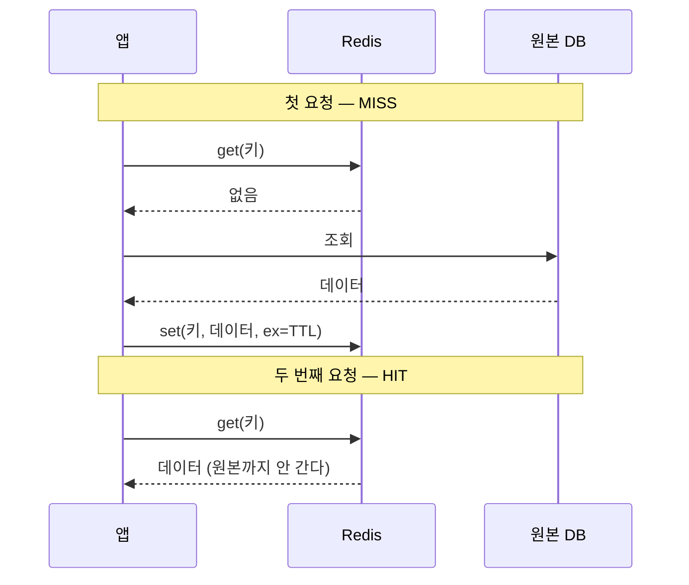

# Redis — 자료구조·TTL·세션·대화이력

> [!warning] 이용 조건
> 본 교육자료는 수강생 개인의 학습 목적에 한하여 이용할 수 있으며, 외부 AI 서비스에 업로드하거나 동영상을 포함한 2차 콘텐츠로 제작·재배포하는 행위를 금지합니다. 예외적 이용은 출처 표기, 비상업적 사용, 강사의 사전 동의를 모두 충족하는 경우에 한하여 허용됩니다.

> **교육생 배포용 실습 가이드**
> 이 문서 하나만 따라 하면 실습을 처음부터 끝까지 완성할 수 있습니다.
> 수업 중 놓친 부분이 있어도 이 문서로 혼자 복습할 수 있도록 모든 결과 코드를 포함했습니다.
>
> **코드 복사 방법 (Obsidian)** — `Ctrl + E`를 눌러 **읽기 모드**로 전환한 뒤, 코드 블록 위에 마우스를 올리면 우측 상단에 복사 버튼이 나타납니다. 편집 모드에서는 보이지 않습니다.

| 항목 | 내용 |
| --- | --- |
| 교육 일차 | **14일차** |
| 과정 | Redis 개념과 활용 |
| 주제 | 인메모리 키-값 구조, 자료구조 5종, TTL, 캐시 패턴, 세션 관리, 대화 이력 저장 |
| 소요 시간 | 이론 약 60분 + 실습 약 5시간 + 연습문제 약 60분 |
| 선수 조건 | 파이썬 기초, 이전 차수에서 만든 Supabase 프로젝트 |
| 사용 도구 | VS Code, 파이썬, 브라우저(Redis Cloud 콘솔) |

---

## 0. 시작 전 체크리스트

- [ ] `uv --version` 실행 시 버전이 출력된다
- [ ] Supabase 프로젝트에 `profiles` 테이블과 데이터가 있다
- [ ] 이전 차수의 `.env`에서 `SUPABASE_URL`, `SUPABASE_SERVICE_ROLE_KEY`를 복사할 수 있다

Redis 계정은 1절에서 만듭니다.

### 완료 후 산출물

```
2_redis-basic-test/
├── .env                      ← 접속 정보 (직접 작성, 공유 금지)
├── .env.example
├── pyproject.toml
├── redis_client.py           ← Redis 접속
├── db.py                     ← Supabase 접속
├── 00_explore.ipynb          ← 저장한 데이터 조회 도구
├── 01_datastructures.ipynb   ← 자료구조 5종
├── 02_ttl.ipynb              ← TTL
├── 03_cache_aside.ipynb      ← 캐시 패턴
├── 04_session.ipynb          ← 세션 관리
└── 05_chat_history.ipynb     ← 대화 이력
```

---

## 1. 개념 이해 — Redis란

### 데이터베이스인데 왜 또 필요한가

이미 Supabase(PostgreSQL)가 있습니다. 그런데도 Redis를 쓰는 이유가 있습니다.

| | PostgreSQL (Supabase) | Redis |
| --- | --- | --- |
| 저장 위치 | 디스크 | **메모리** |
| 속도 | 상대적으로 느림 | 빠름 |
| 저장 구조 | 테이블 (행과 열) | **키-값** |
| 관계·조인 | 지원 | 없음 |
| 데이터 영속성 | 안전하게 보관 | 껐다 켜면 사라질 수 있음 |
| 용도 | **원본 데이터** | **자주 읽는 데이터의 사본, 임시 데이터** |

핵심은 **원본은 PostgreSQL에 두고, 자주 읽는 것만 Redis에 복사해둔다**는 것입니다. Redis의 데이터가 사라져도 원본은 남아 있으므로 다시 채우면 됩니다.

### 키-값 구조

Redis는 테이블이 없습니다. **키 하나에 값 하나**입니다.

```
"user:1"              →  '{"name": "김철수", "point": 100}'
"session:abc123"      →  '{"id": "u1", "email": "kim@example.com"}'
"history:conv-001"    →  ["안녕하세요", "무엇을 도와드릴까요?"]
```

조회 조건도 `WHERE`가 없습니다. **키를 정확히 알아야 값을 꺼낼 수 있습니다.** 그래서 키 이름을 규칙적으로 짓는 것이 설계의 절반입니다.

```
종류:식별자        예: user:1, session:abc123, history:conv-001
```

콜론(`:`)은 Redis의 문법이 아니라 **관례**입니다. 폴더처럼 읽히도록 구분하는 용도입니다.

### 이번 차수에서 만드는 것

| 실습 | 배우는 것 | 다음 차수에서 쓰이는 곳 |
| --- | --- | --- |
| 1. 자료구조 | String / Hash / List / Set / Sorted Set | 어떤 구조를 고를지 판단 |
| 2. TTL | 키의 수명 | 캐시가 오래된 값을 들고 있지 않게 |
| 3. 캐시 패턴 | MISS → HIT → 만료, 무효화 | 메시지 목록 캐싱 |
| 4. 세션 관리 | 토큰 검증 결과 캐싱 | FastAPI의 `deps.py` |
| 5. 대화 이력 | List로 최근 N개 유지 | 챗봇 문맥 관리 |

---

## 2. Redis Cloud 준비

### 2-1. 무료 데이터베이스 만들기

[app.redislabs.com](https://app.redislabs.com)에 가입하고 로그인합니다.

1. **New database** 클릭
2. 구독 유형에서 **Essentials** 선택
3. 클라우드 제공자와 리전 선택 — `AWS` / `ap-northeast-2 (Seoul)` 권장
4. 플랜 목록에서 **가격이 `$0`인 30MB 항목** 선택
5. 데이터베이스 이름을 입력하고 생성

> **주의 — "Free"라는 버튼은 없습니다**
> 무료 플랜은 **Essentials 안에 들어 있습니다.** 플랜 카드 중 가격이 `$0`으로 표시된 것이 무료 플랜입니다.
> 사양은 30MB, 초당 100 ops, 동시 연결 30개입니다. 실습에는 충분합니다.

### 2-2. 접속 정보 확인

생성된 데이터베이스를 클릭하고 **Configuration** 탭을 봅니다.

| 항목 | 어디에 있나 |
| --- | --- |
| 호스트와 포트 | **Public endpoint** — `호스트:포트` 한 덩어리로 표시됩니다 |
| 비밀번호 | **Security** → **Default user password** |

Public endpoint는 콜론 기준으로 나눠서 넣습니다.

```
redis-12345.c340.ap-northeast-2-1.ec2.cloud.redislabs.com:12345
└──────────────── REDIS_HOST ────────────────────────────┘ └PORT┘
```

### 2-3. 프로젝트 준비

`2_redis-basic-test` 폴더에서 패키지를 설치합니다. `pyproject.toml`에 필요한 것이 이미 적혀 있습니다.

```powershell
cd 2_redis-basic-test
uv sync
```

| 패키지 | 하는 일 |
| --- | --- |
| `redis` | Redis 접속 |
| `supabase` | Supabase 접속 (실습 9에서 원본 데이터를 읽을 때) |
| `python-dotenv` | `.env` 파일 읽기 |

폴더 안에는 아래가 이미 들어 있습니다. **실습은 노트북(`.ipynb`)으로 진행합니다.**

| 파일 | 상태 |
| --- | --- |
| `redis_client.py`, `db.py` | 완성. 2-4에서 내용만 확인합니다 |
| `00_explore.ipynb` | 저장한 데이터를 들여다보는 도구 (2-6) |
| `01_datastructures.ipynb` | `# TODO` 7개 (실습 1~5) |
| `02_ttl.ipynb` | `# TODO` 4개 (실습 6~8) |
| `03_cache_aside.ipynb` | `# TODO` 5개 (실습 9·10) |
| `04_session.ipynb` | `# TODO` 5개 (실습 11·12) |
| `05_chat_history.ipynb` | `# TODO` 4개 (실습 13~15) |

각 실습에서 해당 `# TODO`를 지우고 결과 코드를 채워 넣습니다.

VS Code에서 `.ipynb` 파일을 열고, 오른쪽 위 **커널 선택**에서 이 폴더의 `.venv`를 고릅니다. 셀을 위에서부터 `Shift + Enter`로 실행합니다.

> **왜 노트북인가:** TTL이 줄어드는 것, 캐시 MISS와 HIT의 시간 차이처럼 **같은 셀을 여러 번 실행해 변화를 보는** 실습이 많습니다. 스크립트로는 매번 처음부터 다시 돌려야 합니다.

> **참고:** 처음부터 직접 만들어보고 싶다면 빈 폴더에서 `uv init`으로 시작해도 됩니다.
> 그때는 `uv add redis supabase python-dotenv`로 패키지를 넣고, `uv init`이 만들어준 `main.py`는 지웁니다.

### 2-4. 접속 코드 확인

`redis_client.py` — 이미 채워져 있습니다.

```python
import os

import redis
from dotenv import load_dotenv

load_dotenv()

r = redis.Redis(
    host=os.environ["REDIS_HOST"],
    port=int(os.environ["REDIS_PORT"]),
    password=os.environ["REDIS_PASSWORD"],
    decode_responses=True,
)
```

`decode_responses=True`가 중요합니다. 이게 없으면 조회 결과가 `b'값'` 형태의 bytes로 나와 매번 `.decode()`를 해야 합니다.

`db.py` — 실습 9에서 Supabase 원본(`profiles`)을 읽을 때 씁니다. 이전 차수의 `db.py`와 같은 구조입니다.

```python
import os

from dotenv import load_dotenv
from supabase import Client, create_client

load_dotenv()

SUPABASE_URL = os.environ["SUPABASE_URL"]
SUPABASE_SERVICE_ROLE_KEY = os.environ["SUPABASE_SERVICE_ROLE_KEY"]

supabase: Client = create_client(SUPABASE_URL, SUPABASE_SERVICE_ROLE_KEY)
```

### 2-5. 접속 정보 작성

`.env` 파일을 만들고 다섯 값을 채웁니다. Supabase 값 두 개는 이전 차수의 `.env`에서 복사합니다.

```
SUPABASE_URL=https://xxxxxxxxxxxx.supabase.co
SUPABASE_SERVICE_ROLE_KEY=여기에_service_role_key_붙여넣기

REDIS_HOST=redis-12345.c340.ap-northeast-2-1.ec2.cloud.redislabs.com
REDIS_PORT=12345
REDIS_PASSWORD=여기에_password_붙여넣기
```

**확인:** 아래를 실행해 `True`가 나오면 준비 완료입니다.

```powershell
uv run python -c "from redis_client import r; print(r.ping())"
```

> **`getaddrinfo failed`가 나면** 호스트 이름이 DNS에 없다는 뜻입니다. 무료 플랜 데이터베이스는 오래 쓰지 않으면 삭제될 수 있습니다. Redis Cloud 콘솔에서 데이터베이스가 살아 있는지, Public endpoint 값이 `.env`와 같은지 확인합니다.

### 2-6. 저장한 데이터를 확인하는 방법

Supabase에는 **Table Editor**가 있어서 저장한 데이터를 눈으로 볼 수 있었습니다. Redis에는 그런 화면이 기본으로 없습니다. 두 가지를 씁니다.

**방법 1 — Redis Cloud 콘솔**

1. 만들어둔 데이터베이스를 클릭
2. 위쪽 탭에서 **Data Browser** 클릭 (콘솔에 따라 **RedisInsight**로 표시됩니다)
3. 검색창에 `day14:*`를 넣으면 실습 키만 걸러집니다

왼쪽에 키 목록, 키를 클릭하면 오른쪽에 값·종류·TTL이 나옵니다.

> **주의:** 콘솔은 자동으로 갱신되지 않습니다. 방금 넣은 키가 안 보이면 새로고침 버튼을 누릅니다.

**방법 2 — `00_explore.ipynb`**

실습 도중 반복해서 확인할 때는 콘솔보다 빠릅니다. 노트북을 열고 `show_all("day14:*")`를 실행하면 이렇게 나옵니다.

```
키                         종류        TTL  값
------------------------------------------------------------------
day14:chat                 list       없음  ['안녕하세요', '무엇을 도와드릴까요?']
day14:greeting             string     없음  안녕하세요
day14:ranking              zset       없음  [('이영희', 500.0), ('김철수', 300.0)]
day14:temp                 string      26s  30초 뒤 사라짐
day14:user                 hash       없음  {'name': '김철수', 'point': '150'}
```

**Redis는 종류마다 값을 꺼내는 명령이 다릅니다.** `get` 하나로는 안 됩니다.

| 종류 | 꺼내는 명령 |
| --- | --- |
| `string` | `r.get(키)` |
| `hash` | `r.hgetall(키)` |
| `list` | `r.lrange(키, 0, -1)` |
| `set` | `r.smembers(키)` |
| `zset` | `r.zrevrange(키, 0, -1, withscores=True)` |

`string`이 아닌 키에 `get`을 쓰면 `WRONGTYPE` 오류가 납니다. 그래서 `r.type(키)`로 종류를 먼저 물어보고 맞는 명령을 고릅니다. `show_all()`이 하는 일이 그것입니다.

### 2-7. 실습 키 규칙

모든 실습은 키 이름을 `day14:` 로 시작합니다. 마지막 절에서 이 이름으로 시작하는 키만 지우므로 다른 데이터에 영향을 주지 않습니다.

```python
r.set("day14:greeting", "안녕하세요")
```

정리는 이렇게 합니다.

```python
keys = r.keys("day14:*")
for key in keys:
    r.delete(key)

print(len(keys), "개 삭제")
print("남은 키 개수:", r.dbsize())
```

> **`keys()` 대신 `scan_iter()`를 쓰는 편이 좋습니다.** 결과는 같지만 `keys("*")`는 키가 많을 때 **Redis 전체를 잠시 멈춥니다.** 실습에서는 키가 몇 개뿐이라 차이가 없지만, 운영 중인 서버에서는 사고가 됩니다. `00_explore.ipynb`에 두 명령의 비교가 있습니다.

---

## 3. 실습 1부 — 자료구조

각 실습은 **목표 / 요구사항 / 힌트 / 결과 코드 / 확인** 순서입니다.
노트북은 `01_datastructures.ipynb`입니다. 셀을 위에서부터 실행합니다.

### 실습 1. String — 값 하나

**목표:** 가장 단순한 키-값을 저장하고, 숫자 증감을 써본다.

**요구사항**

- 문자열 하나를 저장하고 꺼낸다
- 숫자를 증가시킨다
- 여러 개를 한 번에 저장하고 한 번에 꺼낸다

**힌트**

| 하려는 일 | 명령 |
| --- | --- |
| 저장 / 조회 | `r.set(키, 값)` / `r.get(키)` |
| 1 증가 / n 증가 | `r.incr(키)` / `r.incrby(키, n)` |
| 여러 개 | `r.mset({...})` / `r.mget(키1, 키2, ...)` |
| 존재 확인 | `r.exists(키)` |

**결과 코드**

```python
r.set("day14:greeting", "안녕하세요")
print("저장한 값:", r.get("day14:greeting"))

# 숫자를 넣으면 증가시킬 수 있다. 방문자 수 같은 것에 쓴다.
r.set("day14:visits", 0)
r.incr("day14:visits")
r.incr("day14:visits")
print("두 번 증가:", r.get("day14:visits"))

r.incrby("day14:visits", 10)
print("10 더하기:", r.get("day14:visits"))

print("키가 있나:", r.exists("day14:greeting"))
print("없는 키를 꺼내면:", r.get("day14:없는키"))
```

**확인:** 아래처럼 출력됩니다.

```
저장한 값: 안녕하세요
두 번 증가: 2
10 더하기: 12
키가 있나: 1
없는 키를 꺼내면: None
```

`incr` 3회 후가 **12**인 것에 주목합니다. `incr` 두 번(+2)과 `incrby(10)`을 더한 값입니다. **없는 키를 조회하면 오류가 아니라 `None`** 이 나옵니다.

---

### 실습 2. Hash — 필드가 여러 개인 객체

**목표:** 사용자 정보처럼 항목이 여러 개인 데이터를 저장한다.

**요구사항**

- 이름·이메일·포인트를 한 키에 저장한다
- 포인트만 50 증가시킨다

**힌트**

| 하려는 일 | 명령 |
| --- | --- |
| 저장 | `r.hset(키, 필드, 값)` |
| 필드 하나 조회 | `r.hget(키, "필드")` |
| 전체 조회 | `r.hgetall(키)` |
| 필드 증가 | `r.hincrby(키, "필드", n)` |

**String에 JSON을 넣어도 되는데 왜 Hash인가:** String이라면 포인트만 바꾸려 해도 **전체를 읽어 → 파싱하고 → 고쳐서 → 다시 써야** 합니다. Hash는 `hincrby` 한 줄입니다.

**결과 코드**

```python
r.hset("day14:user", "name", "김철수")
r.hset("day14:user", "email", "kim@example.com")
r.hset("day14:user", "point", 100)

print("이름만 꺼내기:", r.hget("day14:user", "name"))
print("전체 꺼내기:", r.hgetall("day14:user"))

# 포인트만 50 올린다. 나머지는 건드리지 않는다.
r.hincrby("day14:user", "point", 50)
print("포인트 50 올린 뒤:", r.hget("day14:user", "point"))
```

**확인:**

```
이름만 꺼내기: 김철수
전체 꺼내기: {'name': '김철수', 'email': 'kim@example.com', 'point': '100'}
포인트 50 올린 뒤: 150
```

`point`가 `'100'`처럼 **문자열로** 나오는 것에 주목합니다. Redis는 값을 문자열로 보관합니다. `hincrby`는 숫자로 해석해 계산해줍니다.

---

### 실습 3. List — 순서가 있는 목록

**목표:** 순서를 유지하며 쌓고, 최근 N개만 남긴다.

**요구사항**

- 메시지 3개를 순서대로 쌓는다
- 최근 2개만 남긴다

**힌트**

| 하려는 일 | 명령 |
| --- | --- |
| 오른쪽에 추가 | `r.rpush(키, 값)` |
| 범위 조회 | `r.lrange(키, 0, -1)` — `-1`은 마지막 |
| 개수 | `r.llen(키)` |
| 잘라내기 | `r.ltrim(키, -2, -1)` — 뒤에서 2개만 남김 |

**결과 코드**

```python
r.delete("day14:chat")

r.rpush("day14:chat", "안녕하세요")
r.rpush("day14:chat", "무엇을 도와드릴까요?")
r.rpush("day14:chat", "파이썬 질문이 있어요")

print("전체:", r.lrange("day14:chat", 0, -1))
print("개수:", r.llen("day14:chat"))

# 뒤에서 2개만 남기고 나머지는 버린다.
r.ltrim("day14:chat", -2, -1)
print("최근 2개만 남긴 뒤:", r.lrange("day14:chat", 0, -1))
```

**확인:**

```
전체: ['안녕하세요', '무엇을 도와드릴까요?', '파이썬 질문이 있어요']
개수: 3
최근 2개만 남긴 뒤: ['무엇을 도와드릴까요?', '파이썬 질문이 있어요']
```

`ltrim` 후 **첫 메시지가 사라졌습니다.** 실습 5에서 대화 이력을 관리할 때 이 명령을 씁니다.

---

### 실습 4. Set — 중복 없는 모음

**목표:** 중복을 자동으로 제거하고, 포함 여부를 확인한다.

**요구사항**

- 사용자 3명을 넣고, 이미 있는 값을 한 번 더 넣어본다
- 특정 값이 있는지 확인한다

**힌트**

`r.sadd(키, 값)` / `r.smembers(키)` / `r.scard(키)` / `r.sismember(키, 값)` / `r.srem(키, 값)`

**결과 코드**

```python
r.delete("day14:online")

r.sadd("day14:online", "user1")
r.sadd("day14:online", "user2")
r.sadd("day14:online", "user1")   # 이미 있으니 안 들어간다

print("전체:", r.smembers("day14:online"))
print("몇 명:", r.scard("day14:online"))
print("user2 있나:", r.sismember("day14:online", "user2"))
print("user9 있나:", r.sismember("day14:online", "user9"))
```

**확인:**

```
전체: {'user1', 'user2'}
몇 명: 2
user2 있나: 1
user9 있나: 0
```

`user1`을 두 번 넣었는데 **인원 수가 2**입니다. 중복이 자동으로 제거됩니다.

> 출력이 `{ }`로 감싸여 나오는 것은 Set이기 때문입니다. **순서가 없어서** 실행할 때마다 나오는 차례가 달라질 수 있습니다.

---

### 실습 5. Sorted Set — 점수로 정렬

**목표:** 점수를 함께 저장해 순위를 만든다.

**요구사항**

- 이름과 점수를 저장한다
- 높은 점수순으로 조회한다
- 특정 대상의 점수를 올린다

**힌트**

| 하려는 일 | 명령 |
| --- | --- |
| 저장 | `r.zadd(키, {"이름": 점수, ...})` |
| 낮은 점수순 | `r.zrange(키, 0, -1)` |
| 높은 점수순 | `r.zrevrange(키, 0, -1)` |
| 점수 증가 | `r.zincrby(키, 증가값, "이름")` |

**결과 코드**

```python
r.delete("day14:ranking")

r.zadd("day14:ranking", {"김철수": 300})
r.zadd("day14:ranking", {"이영희": 500})
r.zadd("day14:ranking", {"박민수": 100})

print("점수 낮은 순:", r.zrange("day14:ranking", 0, -1))
print("점수 높은 순:", r.zrevrange("day14:ranking", 0, -1))
print("1등:", r.zrevrange("day14:ranking", 0, 0))

r.zincrby("day14:ranking", 250, "박민수")
print("박민수에게 250점 더한 뒤:", r.zrevrange("day14:ranking", 0, -1))
```

**확인:**

```
점수 낮은 순: ['박민수', '김철수', '이영희']
점수 높은 순: ['이영희', '김철수', '박민수']
1등: ['이영희']
박민수에게 250점 더한 뒤: ['이영희', '박민수', '김철수']
```

`zincrby` 후 **박민수가 김철수를 앞질러 2위**가 됐습니다. 정렬은 Redis가 알아서 유지합니다.

---

### 자료구조 선택 기준

| 구조 | 언제 쓰나 | 대표 예 |
| --- | --- | --- |
| String | 값 하나 | 카운터, JSON 문자열 |
| Hash | 필드가 여러 개, 일부만 읽고 쓸 때 | 사용자 정보 |
| List | 순서가 중요, 최근 N개 | 대화 이력 |
| Set | 중복 제거, 포함 여부 | 접속 중인 사용자, 태그 |
| Sorted Set | 점수로 정렬 | 랭킹, 최근순 |

> **같은 데이터도 구조에 따라 할 수 있는 일이 달라집니다.**
> 대화 이력을 String(JSON)에 넣으면 "최근 2개만 남기기"를 하려고 전체를 읽어 고쳐 써야 하지만, List면 `ltrim` 한 줄입니다.

---

## 4. 실습 2부 — TTL

노트북은 `02_ttl.ipynb`입니다.

### 실습 6. TTL 걸기

**목표:** 키에 수명을 주는 두 가지 방법을 익힌다.

**힌트**

| 방법 | 명령 |
| --- | --- |
| 저장하면서 함께 | `r.set(키, 값, ex=초)` |
| 이미 있는 키에 | `r.expire(키, 초)` |

> 예전 코드에는 `setex(키, 초, 값)`이 자주 보입니다. `set`과 인자 순서가 달라 헷갈리기 쉬운데, 지금은 `set(키, 값, ex=초)`로 통일하는 것이 권장됩니다.

**결과 코드**

```python
# 방법 1) 저장하면서 같이 건다. ex 는 초 단위다.
r.set("day14:a", "3초 뒤 사라짐", ex=3)

# 방법 2) 이미 있는 키에 나중에 건다.
r.set("day14:b", "값")
r.expire("day14:b", 10)

print("a 의 TTL:", r.ttl("day14:a"))
print("b 의 TTL:", r.ttl("day14:b"))
```

**확인:** 세 키의 TTL이 각각 3, 10, 30 근처로 나옵니다.

---

### 실습 7. TTL 값 읽기와 만료 관찰

**목표:** `ttl()`이 돌려주는 값의 뜻을 알고, 만료를 직접 본다.

**힌트**

| 반환값 | 뜻 |
| --- | --- |
| 양수 | 남은 초 |
| `-1` | 키는 있지만 만료가 없음 |
| `-2` | 키가 아예 없음 |

**결과 코드**

```python
r.set("day14:forever", "만료 없음")

print("만료가 있는 키:", r.ttl("day14:b"), "  남은 초")
print("만료가 없는 키:", r.ttl("day14:forever"), "  -1 이면 만료 없음")
print("아예 없는 키:", r.ttl("day14:없는키"), "  -2 이면 키가 없음")

# 바로 위에서 건 키는 여기 오기까지 시간이 흘렀으니 새로 건다.
r.set("day14:watch", "3초 뒤 사라짐", ex=3)
print("3초 만료로 걸었다. 1초마다 확인한다.")
print()

for i in range(5):
    ttl = r.ttl("day14:watch")
    value = r.get("day14:watch")
    print(i, "초 경과   TTL:", ttl, "  값:", value)
    time.sleep(1)
```

**확인:**

```
0 초 경과   TTL: 3   값: 3초 뒤 사라짐
1 초 경과   TTL: 1   값: 3초 뒤 사라짐
2 초 경과   TTL: 0   값: None
3 초 경과   TTL: -2   값: None
4 초 경과   TTL: -2   값: None
```

키가 **스스로 사라집니다.** 지우는 코드를 쓰지 않았습니다.

---

### 실습 8. TTL 제거와 갱신 — 가장 많이 틀리는 부분

**목표:** `set`으로 값을 덮어쓰면 TTL이 어떻게 되는지 확인한다.

**결과 코드**

```python
r.set("day14:d", "값", ex=100)
print("만료 100초로 저장:", r.ttl("day14:d"))

# 만료를 없애고 싶으면 persist 를 쓴다.
r.persist("day14:d")
print("persist 로 만료 제거:", r.ttl("day14:d"))

r.expire("day14:d", 100)
print("다시 100초 걸기:", r.ttl("day14:d"))

# 여기가 함정이다. 값만 덮어쓰면 만료가 사라진다.
r.set("day14:d", "새 값")
print("set 으로 값만 덮어쓰면:", r.ttl("day14:d"), "  만료가 사라졌다")

r.set("day14:d", "새 값", ex=100)
print("ex 를 다시 주면:", r.ttl("day14:d"))
```

**확인:**

```
만료 100초로 저장: 100
persist 로 만료 제거: -1
다시 100초 걸기: 100
set 으로 값만 덮어쓰면: -1   만료가 사라졌다
ex 를 다시 주면: 100
```

> **가장 많이 틀리는 부분 — `set`은 TTL을 초기화합니다**
> 캐시를 갱신할 때 `r.set(key, 새값)`만 쓰면 만료가 사라져 **영구히 남습니다.** 반드시 `ex=`를 다시 지정합니다.

### TTL은 얼마로 잡나

정답은 없고, **"틀린 값이 보여도 괜찮은 시간"** 으로 잡습니다.

| 대상 | TTL | 근거 |
| --- | --- | --- |
| 세션(로그인 상태) | 300초 | 자주 바뀌지 않음. 로그아웃은 키를 지워 처리 |
| 대화 이력 | 30초 | 대화 중에는 자주 바뀜 |
| 공지사항 | 3600초 | 거의 안 바뀜 |

짧게 잡으면 최신성은 좋지만 DB 조회가 늘고, 길게 잡으면 빠르지만 오래된 값을 보여줄 수 있습니다.

---

## 5. 실습 3부 — 캐시 패턴

**cache-aside 패턴의 흐름입니다.** 오늘 3·4·5부가 전부 이 모양입니다.



**캐시를 먼저 보고, 없을 때만 원본에 간다.** 이 한 줄이 전부입니다.

노트북은 `03_cache_aside.ipynb`입니다.

### 실습 9. cache-aside 구현

**목표:** 가장 많이 쓰는 캐싱 방식을 직접 구현한다.

**요구사항**

- 캐시에 있으면 그대로 반환한다 (HIT)
- 없으면 DB에서 읽고, 캐시에 저장한 뒤 반환한다 (MISS)

**힌트**

Redis는 문자열만 저장하므로 딕셔너리는 `json.dumps`로 바꿔 넣고, 꺼낼 때 `json.loads`로 되돌립니다. `datetime` 같은 값이 섞여 있으면 `json.dumps(..., default=str)`를 씁니다.

**결과 코드**

```python
def get_profile(profile_id):
    """프로필을 가져온다. 캐시에 있으면 캐시에서, 없으면 DB 에서."""
    key = "day14:profile:" + profile_id

    cached = r.get(key)
    if cached:
        print("  캐시에서 가져옴")
        return json.loads(cached)

    print("  DB 에서 가져옴")
    rows = supabase.table("profiles").select("*").eq("id", profile_id).execute().data
    if not rows:
        return None

    profile = rows[0]
    # Redis 는 문자열만 담으므로 json 문자열로 바꿔서 넣는다.
    # 5초 뒤에 사라지게 한다.
    r.set(key, json.dumps(profile, default=str), ex=5)
    return profile
```

시간을 재려면 앞뒤로 `time.time()`을 찍습니다.

```python
start = time.time()
get_profile(profile_id)
print("  걸린 시간:", round(time.time() - start, 3), "초")
```

**확인:** 같은 id로 세 번 조회하고, 5초를 기다린 뒤 한 번 더 조회합니다.

```
1번째 호출
  DB 에서 가져옴
  걸린 시간: 0.611 초
2번째 호출
  캐시에서 가져옴
  걸린 시간: 0.188 초
3번째 호출
  캐시에서 가져옴
  걸린 시간: 0.186 초

5초 기다린다...
4번째 호출
  DB 에서 가져옴
  걸린 시간: 0.611 초
```

**약 3배 차이**가 납니다. 5초가 지나자 캐시가 사라져 다시 DB로 갔습니다.

> 캐시에서 가져오는데도 0.19초가 걸리는 이유는 Redis가 원격(클라우드)에 있기 때문입니다. 같은 서버 안이라면 1ms 미만입니다. **여기서 볼 것은 절대값이 아니라 차이**입니다.

---

### 실습 10. 무효화 — TTL만으로 부족한 경우

**목표:** 데이터가 바뀌었을 때 캐시를 지워야 하는 이유를 확인한다.

**요구사항**

- 캐시에 옛 값이 들어 있는 상황을 만든다
- 무효화 없이 조회해 틀린 값이 나오는 것을 본다
- 캐시를 지우고 다시 조회한다

**결과 코드**

```python
key = "day14:profile:" + profile_id

# 캐시에 옛날 값이 들어 있는 상황을 만든다.
r.set(key, json.dumps({"username": "옛날이름"}), ex=300)
print("캐시에 옛날 값을 넣어뒀다.")

profile = get_profile(profile_id)
print("  가져온 이름:", profile["username"], "  <- 틀린 값이다")

print()
print("캐시를 지운다.")
r.delete(key)

profile = get_profile(profile_id)
print("  가져온 이름:", profile["username"], "  <- 올바른 값이다")
```

**확인:**

```
캐시에 옛날 값을 넣어뒀다.
  캐시에서 가져옴
  가져온 이름: 옛날이름   <- 틀린 값이다

캐시를 지운다.
  DB 에서 가져옴
  가져온 이름: test_user   <- 올바른 값이다
```

> **규칙: 데이터를 바꾸는 코드가 캐시도 지웁니다.**
> `insert` / `update` / `delete` 직후에 관련 키를 `delete` 합니다. 이 한 줄을 빠뜨리면 **"방금 저장했는데 안 보이는"** 문제가 됩니다. TTL이 끝날 때까지 계속 옛 값을 보여줍니다.

---

## 6. 실습 4부 — 세션 관리

노트북은 `04_session.ipynb`입니다. **다음 차수에서 FastAPI의 `deps.py`에 그대로 적용합니다.**

### 실습 11. 토큰 검증 결과 캐싱

**목표:** 매 요청마다 인증 서버에 묻는 대신, 한 번 확인한 결과를 캐싱한다.

**요구사항**

- 캐시에 있으면 그대로 쓴다
- 없으면 인증 서버에 확인하고 TTL과 함께 저장한다
- **인증 실패는 캐시하지 않는다**
- 토큰을 키에 그대로 넣지 않는다

**힌트**

토큰은 그 자체가 로그인 자격입니다. Redis 키 목록에 원문이 남으면 Redis에 접근할 수 있는 사람이 남의 계정을 그대로 쓸 수 있습니다. **해시로 바꿔서** 키를 만듭니다. 같은 토큰은 항상 같은 해시가 되므로 조회에는 문제가 없습니다.

**결과 코드**

```python
def make_key(token):
    """토큰으로 키를 만든다. 토큰을 그대로 쓰지 않고 해시로 바꾼다."""
    hashed = hashlib.sha256(token.encode()).hexdigest()
    return "day14:session:" + hashed


def get_user(token):
    """로그인한 사용자를 가져온다. 캐시에 있으면 캐시에서."""
    key = make_key(token)

    cached = r.get(key)
    if cached:
        print("  캐시에서 가져옴")
        return json.loads(cached)

    print("  인증 서버에 물어봄")
    user = ask_auth_server(token)

    if user is None:
        print("  토큰이 잘못됐다")
        return None

    # 5초 동안만 담아둔다. 실제 서비스에서는 300초 정도로 잡는다.
    r.set(key, json.dumps(user), ex=5)
    return user
```

**확인:** 같은 토큰으로 세 번 요청합니다.

```
1번째 요청
  인증 서버에 물어봄
  걸린 시간: 0.711 초
2번째 요청
  캐시에서 가져옴
  걸린 시간: 0.224 초
3번째 요청
  캐시에서 가져옴
  걸린 시간: 0.2 초
```

**첫 요청만 인증 서버에 다녀오고, 이후는 Redis에서 바로 답합니다.**

TTL이 지나면 다시 확인합니다.

```
다시 요청
  인증 서버에 물어봄
```

잘못된 토큰은 캐시하지 않습니다.

```
  인증 서버에 물어봄
  토큰이 잘못됐다
```

> **실패를 캐시하면 안 되는 이유:** 토큰이 나중에 유효해져도 캐시 때문에 계속 막힙니다.

키에 해시를 쓴 결과도 확인합니다.

```
토큰 원문: valid-user123
실제 키  : day14:session:25690402e2287406f3dd620bb5e5d2e059e951ae721dda99c4a6577b876b42ee
```

---

### 실습 12. 로그아웃

**목표:** TTL을 기다리지 않고 즉시 무효화한다.

**결과 코드**

```python
get_user(token)
print("로그인 상태의 캐시:", r.exists(make_key(token)))

r.delete(make_key(token))
print("로그아웃 후 캐시:", r.exists(make_key(token)))

print()
print("다시 요청하면")
get_user(token)
```

**확인:**

```
로그인 상태의 캐시: 1
로그아웃 후 캐시: 0

다시 요청하면
  인증 서버에 물어봄
```

> 캐시를 쓸 때는 **"언제 지울 것인가"를 항상 함께 정해야 합니다.** TTL은 자동 만료, `delete`는 즉시 무효화입니다.

---

## 7. 실습 5부 — 대화 이력

노트북은 `05_chat_history.ipynb`입니다.

### 실습 13. List로 최근 N개 유지

**목표:** 챗봇 대화 이력을 저장하고, 최근 N개만 남긴다.

**요구사항**

- 메시지를 추가하면서 최근 `KEEP`개만 유지한다
- 메시지를 추가할 때마다 TTL을 다시 건다

**힌트**

`rpush`로 추가하고 `ltrim`으로 자릅니다. **`rpush`는 기존 TTL을 갱신하지 않으므로** `expire`를 다시 걸어야 합니다.

**결과 코드**

```python
KEEP = 4    # 최근 4개(2턴)만 남긴다


def add_message(conversation_id, role, content):
    """메시지를 추가하고 최근 KEEP 개만 남긴다."""
    key = "day14:history:" + conversation_id
    message = json.dumps({"role": role, "content": content}, ensure_ascii=False)

    r.rpush(key, message)          # 오른쪽에 붙인다
    r.ltrim(key, -KEEP, -1)        # 뒤에서 KEEP 개만 남긴다
    r.expire(key, 30)              # rpush 는 TTL 을 갱신하지 않으니 다시 건다


def show_history(conversation_id):
    """대화 이력을 보기 좋게 출력한다."""
    key = "day14:history:" + conversation_id

    for item in r.lrange(key, 0, -1):
        message = json.loads(item)
        print("   ", message["role"], ":", message["content"])
```

`ensure_ascii=False`를 쓰면 한글이 `안녕` 대신 그대로 저장돼 Redis에서 눈으로 확인하기 쉽습니다.

**확인:** 메시지 4개를 넣은 뒤 2개를 더 넣습니다.

```
2개를 더 넣었다. 현재 이력:
    user : 튜플과 차이는요?
    assistant : 리스트는 고칠 수 있고 튜플은 없습니다.
    user : 딕셔너리는요?
    assistant : 키와 값의 쌍으로 저장합니다.
```

6개를 넣었는데 **4개만 남았습니다.** 처음 두 메시지(리스트 질문)가 밀려났습니다.

---

### 실습 14. TTL 갱신 확인

**목표:** `rpush`가 TTL을 갱신하지 않는 것을 확인한다.

**결과 코드**

```python
key = "day14:history:" + conversation_id

print("현재 TTL:", r.ttl(key))

r.rpush(key, json.dumps({"role": "user", "content": "TTL 확인"}, ensure_ascii=False))
print("rpush 만 했을 때 TTL:", r.ttl(key), "  그대로다")

r.expire(key, 30)
print("expire 를 다시 걸면:", r.ttl(key))
```

**확인:**

```
현재 TTL: 29
rpush 만 했을 때 TTL: 29   그대로다
expire 를 다시 걸면: 30
```

> **대화가 계속되는데 TTL이 끝나면 이력이 통째로 사라집니다.** 메시지를 추가할 때마다 `expire`를 다시 걸어 "마지막 활동 시각으로부터 N초"가 되게 합니다.

---

### 실습 15. 대화별 분리

**목표:** 여러 대화가 서로 영향을 주지 않게 한다.

**결과 코드**

```python
add_message("conv-002", "user", "다른 대화의 첫 메시지")

print("conv-001 의 이력:")
show_history("conv-001")

print("conv-002 의 이력:")
show_history("conv-002")
```

**확인:**

```
conv-001 의 이력:
    assistant : 리스트는 고칠 수 있고 튜플은 없습니다.
    user : 딕셔너리는요?
    assistant : 키와 값의 쌍으로 저장합니다.
    user : TTL 확인
conv-002 의 이력:
    user : 다른 대화의 첫 메시지
```

키에 대화 id를 넣어 구분합니다. 이것이 Redis에서 "테이블 없이 데이터를 나누는" 방법입니다.

---

## 8. 연습문제 — 스스로 만들어보기

여기까지가 오늘의 필수 범위입니다. 아래 네 문제는 **결과 코드를 보지 않고 직접** 만들어봅니다.

새 명령은 없습니다. 실습 1~15에서 쓴 것들의 조합입니다. **어떤 자료구조를 고를지**가 문제의 절반입니다. 답안은 9절에 있습니다.

새 노트북 `06_practice.ipynb`를 만들어 작업합니다. 키는 `day14:ex:` 로 시작합니다.

---

### 문제 1. 로그인 시도 제한

**목표:** 같은 계정으로 5번 틀리면 60초 동안 잠근다.

**요구사항**

- 실패할 때마다 횟수를 센다
- 5회에 도달하면 잠근다. 남은 잠금 시간을 알려준다
- 60초가 지나면 자동으로 풀린다
- 로그인에 성공하면 실패 횟수를 지운다

**힌트**

| 하려는 일 | 쓸 것 |
| --- | --- |
| 실패 횟수 세기 | 실습 1의 `incr` |
| 60초 뒤 자동 해제 | 실습 6의 `expire` |
| 남은 시간 | 실습 7의 `ttl` |

**틀리기 쉬운 곳:** 실패할 때마다 `expire`를 다시 걸면 어떻게 될까요? 계속 틀리는 사람은 **영원히 잠기지 않습니다.** 창(window)이 매번 초기화되기 때문입니다. `expire`는 **첫 실패에만** 걸어야 "첫 실패로부터 60초"가 됩니다.

**확인:** 7번 연속 틀립니다.

```
1 ('실패', 남은 4회)
...
5 ('실패', 남은 0회)
6 ('잠김', 58초)
7 ('잠김', 58초)
```

---

### 문제 2. 인기 질문 순위

**목표:** 사용자가 많이 물어본 질문의 순위를 매긴다.

**요구사항**

- 같은 질문이 들어올 때마다 횟수를 1 올린다
- 상위 3개를 횟수와 함께 보여준다
- 하루가 지나면 초기화된다

**힌트:** 실습 5를 그대로 씁니다. **"점수를 올리면서 정렬을 유지"** 하는 자료구조가 무엇이었는지 떠올립니다.

> **20~21일차로 이어집니다.** 실시간 로그 대시보드에서 "많이 들어온 질문"을 보여줄 때 이 구조를 씁니다.

**확인:** 6번 질문을 넣으면 아래처럼 나옵니다.

```
1위 파이썬 리스트 (3회)
2위 SQL JOIN (2회)
3위 Redis TTL (1회)
```

---

### 문제 3. 글자 수 예산으로 대화 이력 자르기

**목표:** 실습 13은 최근 **N개**를 남겼다. 이번에는 최근 **N글자**를 남긴다.

**요구사항**

- 메시지를 추가한 뒤, `content` 길이의 합이 예산을 넘으면 **오래된 것부터** 버린다
- 메시지가 1개만 남으면 예산을 넘어도 버리지 않는다

**힌트**

| 하려는 일 | 쓸 것 |
| --- | --- |
| 왼쪽(오래된 쪽)에서 하나 빼기 | `r.lpop(키)` |
| 전체 꺼내 계산 | 실습 3의 `lrange` |

`ltrim`은 **개수**로 자릅니다. 글자 수로 자르려면 하나씩 빼면서 확인해야 합니다.

**왜 개수가 아니라 글자 수인가:** AI에게 대화 이력을 보낼 때 요금은 **글자(토큰) 수**로 매겨집니다. 짧은 메시지 10개와 긴 메시지 3개는 개수가 달라도 비용이 비슷할 수 있습니다.

> **19일차(연속 대화)로 이어집니다.** 멀티턴 대화에서 이력을 어디까지 보낼지 정하는 것이 이 문제입니다.

**확인:** 예산 40자로 메시지 4개를 넣습니다.

```
남은 메시지: ['파이썬 리스트가 뭔가요', '수정 가능한 순서 있는 자료형입니다']
글자수 합: 31 (예산 40)
```

앞의 두 메시지가 밀려났습니다.

---

### 문제 4. 무효화가 빠진 코드 고치기

**목표:** 버그가 있는 코드를 받아 고친다.

아래 함수는 프로필을 수정합니다. **버그가 있습니다.**

```python
def update_username(profile_id, new_name):
    supabase.table("profiles").update({"username": new_name}).eq("id", profile_id).execute()
    print("수정 완료:", new_name)
```

**요구사항**

- 무엇이 문제인지 말로 설명한다
- 고친다

**힌트:** 실습 10을 다시 봅니다. **데이터를 바꾸는 코드가 해야 할 일이 하나 더 있습니다.**

**확인:** 고치기 전과 후를 비교합니다.

1. `get_profile()`로 한 번 조회해 캐시에 넣는다
2. `update_username()`으로 이름을 바꾼다
3. 다시 `get_profile()` → **고치기 전에는 옛 이름**이 나온다
4. 고친 뒤에는 새 이름이 나온다

> 이것이 15일차에 FastAPI에서 그대로 반복됩니다. 메시지를 저장한 뒤 캐시를 지우지 않으면, 방금 보낸 메시지가 30초 동안 보이지 않습니다.

---

## 9. 연습문제 답안

먼저 직접 풀어본 뒤에 봅니다.

### 문제 1. 로그인 시도 제한

```python
LIMIT = 5       # 이 횟수까지 틀리면 잠근다
WINDOW = 60     # 잠금 시간(초)


def try_login(email, password):
    key = "day14:ex:login_fail:" + email

    fails = r.get(key)
    if fails and int(fails) >= LIMIT:
        return "잠김", r.ttl(key)

    if password != "correct":
        count = r.incr(key)
        if count == 1:              # 첫 실패에만 창을 연다
            r.expire(key, WINDOW)
        return "실패", LIMIT - count

    r.delete(key)                   # 성공하면 실패 기록을 지운다
    return "성공", None
```

> **`if count == 1`이 핵심입니다.** 매번 `expire`를 걸면 창이 계속 밀려 영원히 잠기지 않습니다. `incr`는 없는 키를 `0`에서 시작하므로 **첫 호출의 반환값이 항상 `1`** 이라는 성질을 씁니다.

> **잠긴 동안에는 비밀번호가 맞아도 막힙니다.** 의도한 동작입니다. 무차별 대입을 막는 것이 목적이므로, 잠금 중에는 검사 자체를 하지 않습니다.

### 문제 2. 인기 질문 순위

```python
KEY = "day14:ex:popular"


def record_question(question):
    r.zincrby(KEY, 1, question)
    r.expire(KEY, 86400)            # 하루


def top_questions(n=3):
    for rank, (q, score) in enumerate(r.zrevrange(KEY, 0, n - 1, withscores=True), 1):
        print(f"  {rank}위 {q} ({int(score)}회)")
```

Sorted Set은 **점수를 올리면 정렬이 자동으로 유지됩니다.** 매번 정렬할 필요가 없습니다. List로 만들었다면 전체를 꺼내 세고 정렬해야 합니다.

`zrevrange`는 높은 점수부터, `zrange`는 낮은 점수부터입니다.

### 문제 3. 글자 수 예산으로 자르기

```python
BUDGET = 40     # 이력 전체의 글자 수 상한


def add_message(conversation_id, role, content):
    key = "day14:ex:hist:" + conversation_id
    r.rpush(key, json.dumps({"role": role, "content": content}, ensure_ascii=False))

    while True:
        items = r.lrange(key, 0, -1)
        total = sum(len(json.loads(i)["content"]) for i in items)
        if total <= BUDGET or len(items) <= 1:
            break
        r.lpop(key)                 # 가장 오래된 것부터 버린다

    r.expire(key, 30)               # rpush 는 TTL 을 갱신하지 않는다
```

> **`len(items) <= 1` 조건이 없으면 무한 루프**가 될 수 있습니다. 메시지 하나가 예산보다 길면 계속 빼려다 빈 리스트가 되고, `lrange`가 빈 목록을 돌려주면 합이 `0`이라 멈추긴 하지만 **방금 넣은 메시지까지 사라집니다.**

`r.expire`를 마지막에 다시 거는 것은 실습 14와 같은 이유입니다.

### 문제 4. 무효화가 빠진 코드

**무엇이 문제인가:** DB는 바꿨는데 **Redis에 남아 있는 옛 값을 지우지 않았습니다.** 다음 조회는 캐시에서 옛 이름을 돌려줍니다. TTL이 끝날 때까지 계속 틀린 값이 보입니다.

```python
def update_username(profile_id, new_name):
    supabase.table("profiles").update({"username": new_name}).eq("id", profile_id).execute()
    r.delete("day14:ex:profile:" + profile_id)      # 이 줄이 빠져 있었다
    print("수정 완료:", new_name)
```

> **원칙 하나로 정리합니다 — 데이터를 바꾸는 코드가 캐시도 지운다.** 읽는 쪽이 아니라 **쓰는 쪽**의 책임입니다. 읽는 쪽에서 "혹시 옛 값인가"를 매번 확인하려 들면 캐시를 쓰는 의미가 없어집니다.

**네 문제를 다 풀면 마지막에 키를 정리합니다.**

```python
keys = r.keys("day14:ex:*")
for key in keys:
    r.delete(key)
print(len(keys), "개 삭제")
```

---

## 10. 최종 확인 체크리스트

- [ ] `uv run python -c "from redis_client import r; print(r.ping())"`가 `True`를 반환한다
- [ ] `incr` 3회 후 값이 `12`로 나온다
- [ ] `hincrby`로 포인트만 `150`으로 바뀐다
- [ ] `ltrim(-2,-1)` 후 첫 메시지가 사라진다
- [ ] `user1`을 두 번 넣어도 Set 인원 수가 `3`이다
- [ ] `zincrby` 후 박민수가 2위로 올라온다
- [ ] TTL이 `3 → 1 → 사라짐`으로 관찰된다
- [ ] `ttl()`이 `-1`(만료 없음)과 `-2`(키 없음)를 구분해 반환한다
- [ ] `set`으로 덮어쓰면 TTL이 `-1`이 된다
- [ ] 캐시 MISS와 HIT의 시간 차이가 3배 이상 난다
- [ ] 캐시에 옛 값이 있으면 틀린 값이 나오고, `delete` 후 올바른 값이 나온다
- [ ] 같은 토큰으로 두 번째 요청부터 `캐시`에서 답한다
- [ ] 잘못된 토큰은 `인증 실패`이고 캐시되지 않는다
- [ ] 세션 키에 토큰 원문이 보이지 않는다
- [ ] 메시지 6개를 넣어도 `KEEP=4`면 4개만 남는다
- [ ] `rpush` 직후 TTL이 갱신되지 않는다
- [ ] 각 실습 마지막에 `남은 키 개수: 0`이 나온다

**연습문제 (8절)**

- [ ] 5회 틀리면 잠기고, 6번째부터 남은 잠금 시간이 나온다
- [ ] 계속 틀려도 잠금이 풀리지 않는다 (`expire`를 첫 실패에만 걸었다)
- [ ] 인기 질문이 횟수 내림차순으로 나온다
- [ ] 글자 수 예산을 넘으면 오래된 메시지부터 밀려난다
- [ ] 무효화를 넣기 전에는 옛 이름이, 넣은 뒤에는 새 이름이 나온다
- [ ] `day14:ex:*` 키를 정리해 `남은 키 개수: 0`이 나온다

---

## 11. 정리

### 명령 요약

| 자료구조 | 저장 | 조회 | 특징 |
| --- | --- | --- | --- |
| String | `set` / `mset` | `get` / `mget` | `incr`로 카운터 |
| Hash | `hset` | `hget` / `hgetall` | `hincrby`로 필드 하나만 증가 |
| List | `rpush` | `lrange` / `lindex` | `ltrim`으로 최근 N개 |
| Set | `sadd` | `smembers` / `sismember` | 중복 자동 제거 |
| Sorted Set | `zadd` | `zrange` / `zrevrange` | `zincrby`로 점수 증가, 정렬 유지 |

| TTL | 명령 |
| --- | --- |
| 저장하며 만료 | `set(키, 값, ex=초)` |
| 기존 키에 만료 | `expire(키, 초)` |
| 만료 확인 | `ttl(키)` — 양수 / `-1` 만료 없음 / `-2` 키 없음 |
| 만료 제거 | `persist(키)` |
| 즉시 삭제 | `delete(키)` |

### 핵심 개념 정리

- Redis는 **원본이 아니라 사본**입니다. 사라져도 DB에서 다시 채우면 됩니다
- 테이블이 없으므로 **키 이름 규칙이 곧 설계**입니다 (`종류:식별자`)
- 자료구조를 잘 고르면 코드가 짧아집니다. 대화 이력은 List + `ltrim`
- **`set`은 TTL을 초기화합니다.** 갱신할 때 `ex=`를 다시 줍니다
- TTL은 "틀린 값이 보여도 괜찮은 시간"으로 잡습니다
- **데이터를 바꾸는 코드가 캐시도 지웁니다.** 무효화를 빠뜨리면 "방금 저장했는데 안 보이는" 문제가 됩니다
- 실패한 결과는 캐시하지 않습니다
- 토큰처럼 민감한 값은 **해시해서** 키에 넣습니다

### 다음 시간 예고

지금까지는 Redis만 따로 다뤘습니다. 다음 차수에서 **FastAPI 서버에 실제로 적용**합니다.

- 실습 11·12(세션) → `deps.py`의 토큰 검증 캐싱
- 실습 9·10(캐시 패턴) → 메시지 목록 캐싱과 무효화

---

## 12. 자주 나는 오류와 해결

| 증상 | 원인 | 해결 |
| --- | --- | --- |
| `getaddrinfo failed` | 호스트 이름이 DNS에 없음. 무료 DB가 삭제됐을 수 있음 | Redis Cloud 콘솔에서 DB 존재 확인, Public endpoint 재확인 |
| `AuthenticationError` | 비밀번호가 틀림 | Configuration → Security → Default user password 재확인 |
| `KeyError: 'REDIS_HOST'` | `.env`가 없거나 값이 빔 | `.env.example`을 복사해 값 5개를 채움 |
| `ValueError: invalid literal for int()` | `REDIS_PORT`에 숫자가 아닌 값 | Public endpoint에서 콜론 **뒤**만 포트에 넣는다 |
| 조회 결과가 `b'값'` 형태 | `decode_responses=True`가 없음 | `redis_client.py` 확인 |
| `TypeError: Object of type datetime is not JSON serializable` | `json.dumps`가 `datetime`을 못 다룸 | `json.dumps(값, default=str)` |
| 캐시에 넣었는데 계속 MISS | 저장·조회 키가 다름 | 키를 만드는 코드를 함수로 분리해 한 곳에서 관리 |
| 캐시가 영원히 안 사라짐 | `set`으로 덮어써서 TTL이 초기화됨 | `set(키, 값, ex=초)`로 다시 지정 |
| 방금 저장했는데 옛 값이 보임 | 무효화를 빠뜨림 | 데이터를 바꾼 직후 `r.delete(관련 키)` |
| 대화 이력이 갑자기 통째로 사라짐 | `rpush`가 TTL을 갱신하지 않음 | 메시지 추가 때마다 `expire` 재설정 |
| Set 결과 순서가 매번 다름 | Set에는 순서가 없음 | 정상. 순서가 필요하면 List나 Sorted Set |
| 한글이 `안녕`로 저장됨 | `json.dumps` 기본 동작 | `ensure_ascii=False` |

---

## 13. 부록 — 용어 사전

| 용어 | 한 줄 정의 |
| --- | --- |
| Redis | 메모리에 데이터를 두는 키-값 저장소 |
| 인메모리 | 디스크가 아니라 메모리에 보관. 빠르지만 휘발성 |
| 키-값 | 키 하나에 값 하나를 대응시키는 저장 방식 |
| String | 값 하나를 담는 가장 단순한 자료구조 |
| Hash | 필드가 여러 개인 객체를 담는 자료구조 |
| List | 순서가 있는 목록 |
| Set | 중복이 없고 순서도 없는 모음 |
| Sorted Set | 점수를 함께 저장해 정렬되는 모음 |
| TTL | Time To Live. 키의 남은 수명(초) |
| `persist` | 만료를 없애 영구 보관으로 바꾸는 명령 |
| 캐시(cache) | 자주 쓰는 데이터의 사본 |
| cache-aside | 캐시를 먼저 보고, 없으면 원본에서 읽어 캐시에 넣는 방식 |
| 캐시 히트(HIT) | 캐시에서 값을 찾은 경우 |
| 캐시 미스(MISS) | 캐시에 없어 원본까지 간 경우 |
| 무효화(invalidation) | 데이터가 바뀔 때 캐시를 지우는 것 |
| 세션 | 로그인 상태를 나타내는 정보 |
| 해시(hash 함수) | 값을 고정 길이 문자열로 바꾸는 계산. 되돌릴 수 없다 |
| `decode_responses` | 조회 결과를 문자열로 돌려줄지 정하는 설정 |

## 14. 부록 — 명령어 요약

**터미널**

| 명령 | 하는 일 |
| --- | --- |
| `uv sync` | 가상환경 생성 + 패키지 설치 |
| VS Code에서 `.ipynb` 열기 → 커널로 `.venv` 선택 | 실습 진행 |
| `uv run python -c "from redis_client import r; print(r.ping())"` | 연결 확인 |

**Redis Cloud 콘솔**

| 하려는 일 | 위치 |
| --- | --- |
| 무료 DB 만들기 | New database → Essentials → `$0` 30MB 플랜 |
| 호스트·포트 확인 | 데이터베이스 → Configuration → Public endpoint |
| 비밀번호 확인 | 같은 화면 → Security → Default user password |

**실습 중 유용한 확인 명령**

| 목적 | 코드 |
| --- | --- |
| 연결 확인 | `r.ping()` |
| 전체 키 개수 | `r.dbsize()` |
| 접두어로 키 찾기 | `r.keys("day14:*")` |
| 여러 키 삭제 | `r.delete(*keys)` |
| 값의 종류 확인 | `r.type(키)` |

---

#redis #cache #ttl #session #python
