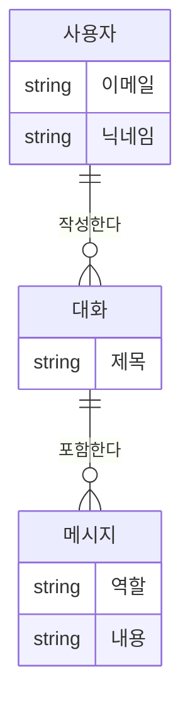
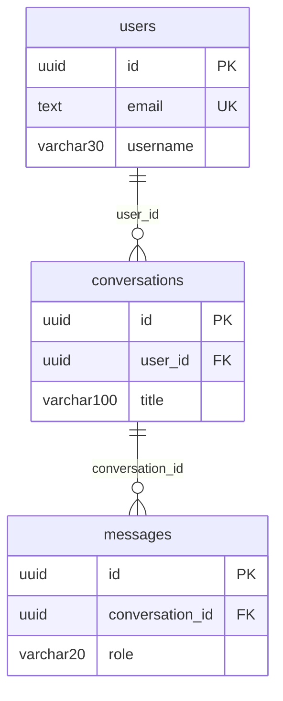

# 부록 — 데이터베이스 설계 심화

> [!warning] 이용 조건
> 본 교육자료는 수강생 개인의 학습 목적에 한하여 이용할 수 있으며, 외부 AI 서비스에 업로드하거나 동영상을 포함한 2차 콘텐츠로 제작·재배포하는 행위를 금지합니다. 예외적 이용은 출처 표기, 비상업적 사용, 강사의 사전 동의를 모두 충족하는 경우에 한하여 허용됩니다.

> **교육생 배포용 보충 자료**
> 11일차 수업에서 요점만 다룬 세 가지를 자세히 다룹니다. **수업 진도와 별개로 읽는 자료입니다.**
> 이 문서 하나만 따라 하면 실습을 처음부터 끝까지 완성할 수 있습니다.
>
> **코드 복사 방법 (Obsidian)** — `Ctrl + E`를 눌러 **읽기 모드**로 전환한 뒤, 코드 블록 위에 마우스를 올리면 우측 상단에 복사 버튼이 나타납니다. 편집 모드에서는 보이지 않습니다.

| 항목 | 내용 |
| --- | --- |
| 관련 차수 | **11일차** 보충 |
| 주제 | 정규화(1NF~3NF)와 이상현상, 논리·물리 ERD, 컬럼 정의서 |
| 소요 시간 | 읽기 약 40분 + 실습 약 50분 |
| 선수 조건 | 11일차 3~4교시를 마쳐 `users` / `conversations` / `messages` 테이블이 있는 상태 |
| 사용 도구 | 브라우저(Supabase SQL Editor) |

---

## 0. 이 문서를 읽는 이유

11일차 수업에서는 **"왜 테이블을 나누는가"** 를 직관으로 다뤘습니다.

> 한 테이블에 전부 담으면 닉네임을 바꿀 때 모든 행을 고쳐야 한다.

맞는 설명이지만, 실무와 면접에서는 **용어로** 묻습니다.

| 수업에서 쓴 말 | 정식 용어 |
| --- | --- |
| 테이블을 나눈다 | **정규화(normalization)** |
| 고칠 곳이 여러 군데라 어긋난다 | **갱신 이상(update anomaly)** |
| 대화 없는 사용자를 넣을 수 없다 | **삽입 이상(insertion anomaly)** |
| 그림으로 그린 설계도 | **논리 ERD / 물리 ERD** |

**이 문서는 같은 내용에 이름을 붙이고, 왜 그 이름인지를 설명합니다.** 새로운 설계를 배우는 것이 아닙니다.

### 시작 전 확인

11일차 3~4교시를 마쳐 테이블 세 개가 있어야 합니다. SQL Editor에서 확인합니다.

```sql
select
    (select count(*) from users)         as 사용자수,
    (select count(*) from conversations) as 대화수,
    (select count(*) from messages)      as 메시지수;
```

`4 / 4 / 9`가 나오면 됩니다.

---

## 1. 이상현상 — 나누지 않으면 무슨 일이 생기나

11일차 1절의 "잘못된 예"를 다시 봅니다.

| 사용자이메일 | 사용자닉네임 | 대화제목 | 메시지 |
| --- | --- | --- | --- |
| kim@example.com | 김철수 | 파이썬 기초 질문 | 리스트가 뭔가요 |
| kim@example.com | 김철수 | 파이썬 기초 질문 | 수정 가능한 목록입니다 |
| kim@example.com | 김철수 | 이직 고민 상담 | 이직해야 할까요 |

**사용자·대화·메시지 세 가지가 한 표에 섞여 있습니다.** 여기서 세 종류의 문제가 생깁니다.

### 갱신 이상 (update anomaly)

김철수가 닉네임을 바꾸면 **3행을 전부 고쳐야** 합니다. 하나라도 빠뜨리면 같은 사람의 닉네임이 두 가지가 됩니다.

행이 3개일 때는 눈에 보이지만, 메시지가 만 건이면 그렇지 않습니다.

### 삽입 이상 (insertion anomaly)

**최지은은 이 표에 넣을 수 없습니다.**

11일차 4교시 샘플 데이터에서 최지은은 **대화가 하나도 없는 사용자**입니다. LEFT JOIN 실습용으로 일부러 그렇게 만들었습니다.

그런데 위 표는 한 행에 사용자·대화·메시지가 함께 있어야 합니다. 대화가 없으면 넣을 자리가 없습니다.

| 사용자이메일 | 사용자닉네임 | 대화제목 | 메시지 |
| --- | --- | --- | --- |
| choi@example.com | 최지은 | **?** | **?** |

빈칸(`NULL`)으로 넣을 수는 있지만, **"대화가 없는 사용자"와 "제목을 못 정한 대화"를 구분할 수 없게** 됩니다.

> **가입은 했지만 아직 아무것도 안 한 사용자를 저장할 수 없다.** 이것이 삽입 이상입니다.

### 삭제 이상 (deletion anomaly)

이영희에게 대화가 `SQL 공부 방법` 하나뿐이라고 합시다. 그 대화를 지우면 **이영희의 이메일과 닉네임도 함께 사라집니다.** 그 정보는 그 행에만 있었기 때문입니다.

> **대화를 지웠을 뿐인데 사용자가 없어진다.** 이것이 삭제 이상입니다.

### 세 가지를 한눈에

| 이상 | 무엇을 하려 할 때 | 무슨 일이 생기나 | 나눈 뒤 |
| --- | --- | --- | --- |
| **갱신** | 닉네임 변경 | 여러 행을 고쳐야 하고 빠뜨리면 어긋남 | `users` 한 곳만 |
| **삽입** | 대화 없는 사용자 등록 | 넣을 자리가 없음 | `users`에만 넣으면 됨 |
| **삭제** | 마지막 대화 삭제 | 사용자 정보까지 사라짐 | `conversations`만 지워짐 |

**정규화는 이 셋을 없애는 작업입니다.** "중복을 줄인다"는 결과이고, 목적은 이상현상 제거입니다.

---

## 2. 함수 종속 — 정규형을 판단하는 기준

정규형을 이야기하려면 **어떤 값이 어떤 값을 결정하는가**를 먼저 봐야 합니다.

`A → B` 는 **"A가 정해지면 B도 하나로 정해진다"** 는 뜻이고, 이를 **함수 종속(functional dependency)** 이라 합니다.

위 표에서 찾아봅니다.

| 종속 | 읽는 법 | 성립하나 |
| --- | --- | --- |
| `사용자이메일 → 사용자닉네임` | 이메일이 정해지면 닉네임이 하나로 정해진다 | 성립 |
| `대화제목 → 사용자이메일` | 제목이 정해지면 주인이 정해진다 | 성립 (제목이 유일하다면) |
| `사용자이메일 → 대화제목` | 이메일이 정해지면 대화가 하나로 정해진다 | **성립 안 함** (한 사람이 여러 대화) |

**`→`의 오른쪽은 반드시 하나여야 합니다.** 여러 개면 종속이 아닙니다.

> **왜 이걸 보나:** 정규형은 전부 "어떤 종속을 없앤 상태인가"로 정의됩니다. 종속을 못 찾으면 정규형도 판단할 수 없습니다.

---

## 3. 정규형 1NF · 2NF · 3NF

### 1NF — 한 칸에 값 하나

**모든 칸에 값이 하나만 들어 있어야 합니다.**

**위반 예**

| 사용자 | 대화제목 |
| --- | --- |
| 김철수 | 파이썬 기초 질문, 이직 고민 상담 |

한 칸에 대화 두 개가 쉼표로 들어 있습니다. 이러면 "이직 고민 상담을 가진 사람" 을 찾을 때 `like '%이직%'` 같은 문자열 검색을 해야 하고, 정렬·집계도 안 됩니다.

**고친 뒤**

| 사용자 | 대화제목 |
| --- | --- |
| 김철수 | 파이썬 기초 질문 |
| 김철수 | 이직 고민 상담 |

> **11일차 설계는 이미 1NF입니다.** 모든 컬럼이 값 하나만 담습니다. `varchar(30)`, `text` 같은 타입 자체가 값 하나를 전제합니다.

### 2NF — 기본키 일부에만 딸린 값을 뺀다

**기본키가 두 컬럼 이상일 때만 문제가 됩니다.** 기본키가 한 컬럼이면 2NF는 자동으로 만족합니다.

챗봇 도메인에는 복합키가 없어 예를 만들 수 없으니, **다른 도메인에서 빌려옵니다.**

**위반 예 — 수강신청**

| 학번 (PK) | 과목코드 (PK) | 성적 | 학생이름 |
| --- | --- | --- | --- |
| 2026001 | CS101 | A | 김철수 |
| 2026001 | CS102 | B | 김철수 |
| 2026002 | CS101 | A | 이영희 |

기본키는 `(학번, 과목코드)` 두 개입니다. 종속을 봅니다.

| 종속 | 딸린 대상 |
| --- | --- |
| `(학번, 과목코드) → 성적` | 기본키 **전체** |
| `학번 → 학생이름` | 기본키 **일부** ← 문제 |

**학생이름은 과목과 아무 상관이 없는데 이 표에 있습니다.** 이것을 **부분 종속(partial dependency)** 이라 하고, 그 결과 김철수의 이름이 두 번 반복됩니다.

**고친 뒤** — 표를 둘로 나눕니다.

```
수강신청(학번 PK, 과목코드 PK, 성적)
학생    (학번 PK, 학생이름)
```

> **11일차 설계는 이미 2NF입니다.** 세 테이블의 기본키가 전부 `id` 하나라 부분 종속이 생길 수 없습니다.

### 3NF — 키가 아닌 값끼리의 종속을 뺀다

**기본키가 아닌 컬럼이 다른 일반 컬럼을 결정하면** 위반입니다. 이를 **이행 종속(transitive dependency)** 이라 합니다.

`기본키 → A → B` 형태입니다. B는 기본키에 직접 딸린 것이 아니라 A를 거쳐 딸려 있습니다.

**위반 예 — 대화 표에 사용자 정보가 섞인 경우**

| id (PK) | user_id | user_email | title |
| --- | --- | --- | --- |
| c-001 | u-1 | kim@example.com | 파이썬 기초 질문 |
| c-002 | u-1 | kim@example.com | 이직 고민 상담 |

종속을 봅니다.

```
id → user_id → user_email
```

`user_email`은 `id`에 직접 딸린 것이 아니라 **`user_id`를 거쳐** 딸려 있습니다. 그래서 김철수의 이메일이 두 번 반복되고, 이메일을 바꾸면 갱신 이상이 생깁니다.

**고친 뒤** — `user_email`을 빼고 필요할 때 JOIN으로 가져옵니다.

```
conversations(id PK, user_id FK, title)
users        (id PK, email, username)
```

> **이것이 11일차에 한 일입니다.** JOIN을 배우는 이유이기도 합니다 — 나눠놨으니 볼 때는 이어붙여야 합니다.

### 우리 설계가 3NF인지 확인하기

| 테이블 | 기본키 | 일반 컬럼 | 컬럼끼리 종속이 있나 |
| --- | --- | --- | --- |
| `users` | `id` | `email`, `username`, `created_at` | 없음. 셋 다 `id`에만 딸림 |
| `conversations` | `id` | `user_id`, `title`, `created_at` | 없음 |
| `messages` | `id` | `conversation_id`, `role`, `content`, `created_at` | 없음 |

**세 테이블 모두 3NF입니다.**

> **`email`이 `username`을 결정하지 않나?** 실제로는 한 사람이 하나씩 가지므로 `email → username`이 성립해 보입니다. 하지만 `email`도 후보키(UNIQUE)라 **키가 키를 결정하는 것**이고, 3NF 위반이 아닙니다. 3NF가 금지하는 것은 **키가 아닌 컬럼**이 다른 컬럼을 결정하는 경우입니다.

### 세 정규형 요약

| 정규형 | 없애는 것 | 언제 문제되나 |
| --- | --- | --- |
| **1NF** | 한 칸에 여러 값 | 항상 |
| **2NF** | 부분 종속 (기본키 일부에만 딸림) | **복합키일 때만** |
| **3NF** | 이행 종속 (일반 컬럼이 일반 컬럼을 결정) | 항상 |

> **더 높은 정규형도 있습니다** (BCNF, 4NF, 5NF). 실무에서는 **3NF까지 맞추는 것이 표준**이고, 조회 성능이 문제가 되면 일부러 되돌리기도 합니다(역정규화). 그건 3NF를 알고 나서 하는 선택입니다.

---

## 4. 논리 ERD와 물리 ERD

11일차에 ERD를 한 장 그렸습니다. 실무에서는 **두 단계로 나눠** 그립니다.

| | 논리 ERD | 물리 ERD |
| --- | --- | --- |
| 언제 | 요구사항을 정리한 직후 | 테이블을 만들기 직전 |
| 담는 것 | 엔티티 · 속성 · 관계 · **카디널리티** | 테이블 · 컬럼 · **데이터 타입** · PK/FK · **인덱스** |
| 이름 | 사람 말 (사용자, 대화) | DB 이름 (`users`, `conversations`) |
| DBMS | 무관 | PostgreSQL 기준 |
| 누가 보나 | 기획자와 함께 | 개발자 |

**같은 설계를 두 관점에서 그린 것**이고, **서로 어긋나면 안 됩니다.**

### 카디널리티 — 관계의 개수

11일차에서 쓴 `||──o<` 기호가 **카디널리티(cardinality)** 표기입니다. 관계의 양쪽에 몇 개가 올 수 있는지를 나타냅니다.

```
기호   뜻
----   ----------------
||     정확히 1개
o|     0개 또는 1개
|<     1개 이상
o<     0개 이상        ← 오늘 쓰는 것
```

세로줄(`｜`)은 "반드시", 동그라미(`o`)는 "없어도 됨", 부등호(`<`)는 "여러 개"로 읽으면 외우기 쉽습니다.

```
users ||──o< conversations
```

**"사용자 1명에 대화가 0개 이상"** 입니다. `o`가 붙은 이유가 최지은입니다 — 대화가 하나도 없는 사용자가 있으므로 `|<`(1개 이상)가 아니라 `o<`여야 합니다.

> **카디널리티를 잘못 잡으면 설계가 틀립니다.** `|<`로 잡으면 "모든 사용자는 대화를 최소 하나 가진다"는 뜻이 되어, 가입 직후 사용자를 저장할 수 없는 설계가 됩니다.

### 논리 ERD

, ==**엔티티(Entity), 속성(Attribute), 관계(Relationship), 식별자(Identifier)**==의 4가지 핵심 요소로 구성됩니다.



**타입도 PK/FK도 없습니다.** 무엇이 있고 어떻게 이어지는지만 담습니다.

### 물리 ERD



**타입과 키가 들어갑니다.** 여기에 인덱스(`idx_conversations_user_id`, `idx_messages_conversation_id`)까지 적으면 `CREATE TABLE`을 그대로 쓸 수 있습니다.

### 논리 → 물리 변환 규칙

| 논리 | 물리 |
| --- | --- |
| 엔티티 | 테이블 |
| 속성 | 컬럼 + **데이터 타입** |
| 식별자 | **기본키(PK)** |
| 관계 | **외래키(FK)** |
| 1:N 관계 | N쪽에 FK를 둔다 |
| — | **인덱스**를 추가로 판단 (FK 컬럼에는 대개 건다) |

식별자는 엔티티 내의 인스턴스들을 서로 구분할 수 있는 기준이 되는 대표 속성으로 주식별자(Primary Identifier, PK)와 보조/외래식별자(FK)로 구분합니다.

**1:N에서 FK가 N쪽에 가는 이유:** 사용자 1명이 대화 5개를 가질 때, `users`에 대화 id를 담으려면 칸이 5개 필요합니다. 1NF 위반입니다. `conversations`에 `user_id`를 하나씩 두면 해결됩니다.

### 두 ERD가 일치하는지 확인하기

물리 ERD는 **DB에서 뽑아** 논리 ERD와 맞춰봅니다. 손으로 그린 것과 실제가 어긋나는 일이 흔합니다.

```sql
-- 테이블과 컬럼
select table_name, column_name, data_type
from information_schema.columns
where table_schema = 'public'
  and table_name in ('users', 'conversations', 'messages')
order by table_name, ordinal_position;

-- 관계 (외래키)
select
    tc.table_name        as 자식테이블,
    kcu.column_name      as 외래키컬럼,
    ccu.table_name       as 부모테이블
from information_schema.table_constraints tc
join information_schema.key_column_usage kcu
    on tc.constraint_name = kcu.constraint_name
join information_schema.constraint_column_usage ccu
    on tc.constraint_name = ccu.constraint_name
where tc.constraint_type = 'FOREIGN KEY'
  and tc.table_schema = 'public';
```

**확인:** 외래키 조회에서 아래 두 행이 나옵니다.

```
conversations | user_id         | users
messages      | conversation_id | conversations
```

논리 ERD에 그린 관계 두 개와 같은지 봅니다.

> **Supabase 대시보드에도 스키마를 그림으로 보여주는 화면이 있습니다.** 메뉴 위치가 자주 바뀌므로 Database 또는 Table Editor 쪽을 찾아봅니다. 그림으로 보면 대조가 빠릅니다. - Schema Visualizer

---

## 5. 컬럼 정의서

컬럼정의서는 ==데이터베이스 테이블 안의 각 열(Column, 필드)이 어떤 의미를 가지며, 어떤 형태의 데이터를 저장하는지 자세히 적어둔 문서==입니다.
앞서 `CREATE TABLE` SQL 에는 타입·길이·제약조건·기본값이 있습니다.  다만 **설명(문서)는 없습니다.**

```sql
username varchar(30) not null check (length(username) >= 2),
```

`-- varchar(30): 최대 30자` 같은 주석이 붙어 있지만, **그 주석은 SQL 파일에만 있습니다.** 파일을 안 본 사람은 못 봅니다.

### `COMMENT ON` — 설명을 DB에 저장한다

PostgreSQL은 컬럼 설명을 **데이터베이스 안에** 저장할 수 있습니다.

```sql
comment on table  users            is '서비스 사용자';
comment on column users.id         is '사용자 식별자. 자동 생성되는 UUID';
comment on column users.email      is '로그인 이메일. 중복 불가';
comment on column users.username   is '화면에 보이는 이름. 로그인 아이디가 아니다';
comment on column users.created_at is '가입 시각. 입력하지 않으면 현재 시각';
```

| | SQL 파일 주석 (`--`) | `COMMENT ON` |
| --- | --- | --- |
| 저장 위치 | 파일 | **데이터베이스** |
| 누가 볼 수 있나 | 파일을 가진 사람 | **DB에 접속하는 누구나** |
| 도구 연동 | 안 됨 | Table Editor, ERD 도구에 표시됨 |
| 쿼리로 조회 | 안 됨 | **됨** |

### 정의서를 손으로 쓰지 않는다

컬럼 정의서를 엑셀로 관리하면 **DB와 어긋납니다.** 컬럼을 추가하고 표를 안 고치는 일이 반드시 생깁니다.

**DB에서 뽑으면 항상 최신입니다.**

```sql
select
    c.column_name                    as 컬럼,
    c.data_type                      as 타입,
    c.character_maximum_length       as 길이,
    c.is_nullable                    as null허용,
    c.column_default                 as 기본값,
    col_description(('public.' || c.table_name)::regclass, c.ordinal_position) as 설명
from information_schema.columns c
where c.table_schema = 'public'
  and c.table_name = 'users'
order by c.ordinal_position;
```

**확인:** `COMMENT ON`을 실행하기 **전에** 돌리면 `설명`이 전부 비어 있습니다.

```
컬럼        타입                       길이   null허용  기본값              설명
id          uuid                       NULL   NO        gen_random_uuid()   NULL
email       text                       NULL   NO        NULL                NULL
username    character varying          30     NO        NULL                NULL
created_at  timestamp with time zone   NULL   NO        now()               NULL
```

`COMMENT ON`을 실행한 뒤 다시 돌리면 `설명` 열이 채워집니다.

> **타입 이름이 다르게 나옵니다.** `varchar(30)`으로 만들었는데 `character varying`으로, `timestamptz`는 `timestamp with time zone`으로 나옵니다. 앞의 것은 줄임말이고 뒤가 표준 이름입니다. 같은 타입입니다.

### 정의서에 담을 항목

| 항목 | 어디서 나오나 |
| --- | --- |
| 컬럼명 | `column_name` |
| 데이터 타입 | `data_type` |
| 길이 | `character_maximum_length` |
| NULL 허용 | `is_nullable` |
| 기본값 | `column_default` |
| 설명 | `COMMENT ON`으로 넣은 값 |
| 제약조건 | `information_schema.table_constraints` (별도 조회) |

---

## 6. 실습

각 실습은 **목표 / 요구사항 / 힌트 / 결과 코드 / 확인** 순서입니다. 전부 SQL Editor에서 진행합니다.

### 실습 1. 이상현상을 직접 만들어본다

**목표:** 정규화하지 않은 표에서 세 가지 이상현상을 실제로 겪는다.

**요구사항**

- 사용자·대화·메시지를 한 표에 담은 `bad_design` 테이블을 만든다
- 갱신·삽입·삭제 이상을 각각 확인한다
- 확인 후 지운다

**결과 코드**

```sql
create table bad_design (
    user_email    text not null,
    user_username text not null,
    title         text,
    content       text
);

insert into bad_design values
    ('kim@example.com', '김철수', '파이썬 기초 질문', '리스트가 뭔가요'),
    ('kim@example.com', '김철수', '파이썬 기초 질문', '수정 가능한 목록입니다'),
    ('kim@example.com', '김철수', '이직 고민 상담',   '이직해야 할까요'),
    ('lee@example.com', '이영희', 'SQL 공부 방법',    'JOIN이 어려워요');
```

**확인 1 — 갱신 이상**

김철수의 닉네임을 바꿉니다. 실수로 한 행만 고쳐봅니다.

```sql
update bad_design
set user_username = '김철수리'
where user_email = 'kim@example.com' and title = '이직 고민 상담';

select distinct user_email, user_username from bad_design;
```

**같은 이메일에 닉네임이 두 개** 나옵니다. 데이터가 어긋났습니다.

```
kim@example.com | 김철수
kim@example.com | 김철수리
```

**확인 2 — 삽입 이상**

대화가 없는 최지은을 넣어봅니다.

```sql
insert into bad_design values ('choi@example.com', '최지은', null, null);

select * from bad_design where user_email = 'choi@example.com';
```

들어가긴 합니다. 그런데 **이 행이 "대화가 없는 사용자"인지 "제목을 못 정한 대화"인지 구분할 방법이 없습니다.** 그리고 사용자 수를 세면 이렇게 됩니다.

```sql
select count(*) as 행수, count(distinct user_email) as 사용자수 from bad_design;
```

사용자 수를 세려면 `distinct`가 필요합니다. 나눠둔 표에서는 `select count(*) from users` 한 줄입니다.

**확인 3 — 삭제 이상**

이영희의 유일한 대화를 지웁니다.

```sql
delete from bad_design where title = 'SQL 공부 방법';

select * from bad_design where user_email = 'lee@example.com';
```

**0행입니다. 이영희가 사라졌습니다.** 대화만 지우려 했는데 사용자 정보까지 없어졌습니다.

**정리**

```sql
drop table bad_design;
```

---

### 실습 2. 3NF 위반을 찾아 고친다

**목표:** 이행 종속이 있는 설계를 3NF로 고친다.

**요구사항**

- 아래 표에서 이행 종속을 찾는다
- 표를 나눠 3NF로 만든다

**문제**

```sql
create table bad_conversations (
    id         uuid primary key default gen_random_uuid(),
    user_id    uuid not null,
    user_email text not null,
    title      text
);
```

**힌트:** `id`가 정해지면 무엇이 정해집니까? 그중 **다른 컬럼을 거쳐** 정해지는 것이 있습니까?

**결과 코드**

이행 종속은 이것입니다.

```
id → user_id → user_email
```

`user_email`은 `id`에 직접 딸린 것이 아니라 `user_id`를 거칩니다. **`user_email`을 빼면** 3NF가 됩니다.

```sql
create table good_conversations (
    id      uuid primary key default gen_random_uuid(),
    user_id uuid not null references users(id) on delete cascade,
    title   text
);
```

이메일이 필요하면 JOIN으로 가져옵니다.

```sql
select c.title, u.email
from good_conversations c
join users u on u.id = c.user_id;
```

**확인:** 11일차에 만든 `conversations` 테이블과 구조가 같습니다. 이미 3NF로 만들어져 있었습니다.

```sql
select column_name from information_schema.columns
where table_schema = 'public' and table_name = 'conversations'
order by ordinal_position;
```

`user_email` 같은 컬럼이 없습니다.

```sql
drop table if exists good_conversations;
```

---

### 실습 3. 물리 ERD를 DB에서 뽑아 대조한다

**목표:** 손으로 그린 논리 ERD와 실제 테이블이 일치하는지 확인한다.

**요구사항**

- 실제 관계(외래키)를 조회한다
- 1교시에 팀별로 그린 논리 ERD와 맞춰본다

**결과 코드**

```sql
select
    tc.table_name   as 자식테이블,
    kcu.column_name as 외래키컬럼,
    ccu.table_name  as 부모테이블,
    rc.delete_rule  as 삭제규칙
from information_schema.table_constraints tc
join information_schema.key_column_usage kcu
    on tc.constraint_name = kcu.constraint_name
join information_schema.constraint_column_usage ccu
    on tc.constraint_name = ccu.constraint_name
join information_schema.referential_constraints rc
    on tc.constraint_name = rc.constraint_name
where tc.constraint_type = 'FOREIGN KEY'
  and tc.table_schema = 'public'
order by tc.table_name;
```

**확인:** 두 행이 나옵니다.

```
conversations | user_id         | users         | CASCADE
messages      | conversation_id | conversations | CASCADE
```

논리 ERD에 그린 관계 두 개(`사용자 ||--o{ 대화`, `대화 ||--o{ 메시지`)와 같습니다. `CASCADE`는 논리 ERD에 없던 정보입니다 — **물리 단계에서 정해지는 것**입니다.

인덱스도 확인합니다.

```sql
select tablename, indexname, indexdef
from pg_indexes
where schemaname = 'public'
  and tablename in ('users', 'conversations', 'messages')
order by tablename;
```

기본키 인덱스는 자동으로 생기고, `idx_conversations_user_id`와 `idx_messages_conversation_id`는 4교시에 직접 만든 것입니다.

---

### 실습 4. 컬럼 정의서 만들기

**목표:** `COMMENT ON`으로 설명을 넣고, 정의서를 쿼리로 뽑는다.

**요구사항**

- `users` 세 테이블에 테이블·컬럼 설명을 넣는다
- 정의서를 조회해 설명이 채워진 것을 확인한다

**결과 코드**

넣기 전에 먼저 조회해 **설명이 비어 있는 것**을 봅니다.

```sql
select
    c.column_name              as 컬럼,
    c.data_type                as 타입,
    c.character_maximum_length as 길이,
    c.is_nullable              as null허용,
    c.column_default           as 기본값,
    col_description(('public.' || c.table_name)::regclass, c.ordinal_position) as 설명
from information_schema.columns c
where c.table_schema = 'public' and c.table_name = 'users'
order by c.ordinal_position;
```

`설명` 열이 전부 `NULL`입니다.

이제 설명을 넣습니다.

```sql
comment on table  users            is '서비스 사용자';
comment on column users.id         is '사용자 식별자. 자동 생성되는 UUID';
comment on column users.email      is '로그인 이메일. 중복 불가';
comment on column users.username   is '화면에 보이는 이름. 로그인 아이디가 아니다';
comment on column users.created_at is '가입 시각. 입력하지 않으면 현재 시각';

comment on table  conversations            is '사용자별 대화';
comment on column conversations.id         is '대화 식별자';
comment on column conversations.user_id    is '대화 주인. users.id 참조. 사용자가 지워지면 함께 삭제';
comment on column conversations.title      is '대화 제목';
comment on column conversations.created_at is '대화 시작 시각';

comment on table  messages                 is '대화에 속한 메시지';
comment on column messages.id              is '메시지 식별자';
comment on column messages.conversation_id is '소속 대화. conversations.id 참조';
comment on column messages.role            is '작성 주체. user 또는 assistant';
comment on column messages.content         is '메시지 본문';
comment on column messages.created_at      is '작성 시각. 대화 순서를 이 값으로 정렬';
```

**확인:** 위 조회 쿼리를 다시 실행하면 `설명` 열이 채워집니다.

```
컬럼        타입                       길이   null허용  기본값              설명
id          uuid                       NULL   NO        gen_random_uuid()   사용자 식별자. 자동 생성되는 UUID
email       text                       NULL   NO        NULL                로그인 이메일. 중복 불가
username    character varying          30     NO        NULL                화면에 보이는 이름. 로그인 아이디가 아니다
created_at  timestamp with time zone   NULL   NO        now()               가입 시각. 입력하지 않으면 현재 시각
```

**Table Editor에서도 보입니다.** 컬럼 이름 위에 마우스를 올리면 설명이 나타납니다.

세 테이블을 한 번에 뽑으려면 `table_name` 조건을 바꿉니다.

```sql
select
    c.table_name               as 테이블,
    c.column_name              as 컬럼,
    c.data_type                as 타입,
    c.character_maximum_length as 길이,
    c.is_nullable              as null허용,
    c.column_default           as 기본값,
    col_description(('public.' || c.table_name)::regclass, c.ordinal_position) as 설명
from information_schema.columns c
where c.table_schema = 'public'
  and c.table_name in ('users', 'conversations', 'messages')
order by c.table_name, c.ordinal_position;
```

**13행**이 나옵니다.

---

## 7. 최종 확인 체크리스트

- [ ] `bad_design` 표에서 한 행만 `update` 해 닉네임이 두 개가 되는 것을 봤다 (갱신 이상)
- [ ] 대화 없는 최지은을 넣었을 때 `NULL`로만 표현되는 것을 확인했다 (삽입 이상)
- [ ] 유일한 대화를 지우자 사용자까지 사라지는 것을 봤다 (삭제 이상)
- [ ] `bad_design`을 지웠다
- [ ] `id → user_id → user_email` 이 이행 종속이라는 것을 설명할 수 있다
- [ ] `conversations`에 `user_email` 같은 컬럼이 없는 것을 조회로 확인했다
- [ ] 외래키 조회에서 **2행**이 나오고, 논리 ERD의 관계 두 개와 일치했다
- [ ] `pg_indexes`에서 4교시에 만든 인덱스 두 개를 확인했다
- [ ] `COMMENT ON` 실행 **전에는** `설명` 열이 전부 `NULL`이었다
- [ ] 실행 **후에는** 채워졌다
- [ ] 세 테이블 정의서를 한 번에 조회해 **13행**이 나왔다

---

## 8. 정리

### 11일차 수업과의 대응

| 수업에서 한 것 | 이 문서의 이름 |
| --- | --- |
| 테이블을 나눴다 | 정규화. 결과적으로 **3NF** |
| "닉네임을 여러 곳에서 고쳐야 한다" | **갱신 이상** |
| 최지은에게 대화가 없다 | **삽입 이상**의 근거. 카디널리티가 `o<`인 이유 |
| 팀별로 ERD를 그렸다 | **논리 ERD** |
| `CREATE TABLE`을 실행했다 | **물리 ERD**의 구현 |
| SQL 주석으로 설명을 달았다 | `COMMENT ON`으로 옮기면 DB가 갖는다 |

### 핵심 개념 정리

- **정규화의 목적은 중복 제거가 아니라 이상현상 제거입니다.** 중복이 줄어드는 것은 결과입니다
- 이상현상은 셋입니다 — **삽입 / 갱신 / 삭제**
- 정규형은 **함수 종속**으로 판단합니다. `A → B`는 "A가 정해지면 B가 하나로 정해진다"
- **2NF는 복합키일 때만 문제가 됩니다.** 기본키가 한 컬럼이면 자동으로 만족합니다
- **3NF는 일반 컬럼끼리의 종속(이행 종속)을 없앤 상태**입니다. 실무 표준입니다
- 논리 ERD와 물리 ERD는 **같은 설계의 두 관점**이고, 어긋나면 안 됩니다
- **카디널리티를 잘못 잡으면 저장할 수 없는 데이터가 생깁니다**
- 정의서는 **손으로 쓰지 말고 DB에서 뽑습니다.** 손으로 쓰면 반드시 어긋납니다

### 더 볼 것

- **역정규화(denormalization)** — 조회 성능을 위해 일부러 중복을 두는 것. 3NF를 알고 나서 하는 선택입니다
- **BCNF** — 3NF보다 엄격한 정규형. 후보키가 여러 개일 때 문제가 됩니다
- 15일차 **캐싱**도 넓게 보면 같은 고민입니다. 원본은 정규화해두고, 자주 읽는 조합을 따로 보관합니다

---

## 9. 자주 나는 오류와 해결

| 증상 | 원인 | 해결 |
| --- | --- | --- |
| 정의서 조회가 `Success. No rows returned` | 그 이름의 테이블이 없음 | `table_name` 값을 확인. 11일차 3~4교시를 먼저 실행 |
| `relation "public.users" does not exist` | `col_description`이 없는 테이블을 참조 | 위와 같음 |
| `설명` 열이 계속 `NULL` | `COMMENT ON`을 실행하지 않음 | 실습 4의 `comment on` 블록을 실행 |
| `comment on ... is` 에서 문법 오류 | 설명을 큰따옴표로 감쌈 | **작은따옴표**를 쓴다. `is '설명'` |
| 타입이 `varchar`가 아니라 `character varying`으로 나옴 | 표준 이름으로 표시됨 | 정상. 같은 타입 |
| `drop table bad_design` 이 안 됨 | 다른 쿼리 창에서 쓰는 중 | 편집기를 새로고침한 뒤 재시도 |
| 외래키 조회가 2행보다 많음 | 다른 실습 테이블이 남아 있음 | `table_name` 조건을 세 테이블로 제한 |

---

## 10. 부록 — 용어 사전

| 용어 | 한 줄 정의 |
| --- | --- |
| 정규화 | 이상현상이 생기지 않도록 표를 나누는 작업 |
| 이상현상 | 나누지 않은 표에서 생기는 삽입·갱신·삭제 문제 |
| 삽입 이상 | 다른 정보가 없어서 넣고 싶은 것을 넣을 수 없는 문제 |
| 갱신 이상 | 같은 값이 여러 곳에 있어 일부만 고치면 어긋나는 문제 |
| 삭제 이상 | 한 가지를 지웠는데 다른 정보까지 사라지는 문제 |
| 함수 종속 | `A → B`. A가 정해지면 B가 하나로 정해지는 관계 |
| 부분 종속 | 복합키의 **일부**에만 딸린 종속. 2NF가 없애는 것 |
| 이행 종속 | `키 → A → B` 형태로 A를 거쳐 딸린 종속. 3NF가 없애는 것 |
| 1NF | 한 칸에 값이 하나만 있는 상태 |
| 2NF | 1NF이면서 부분 종속이 없는 상태 |
| 3NF | 2NF이면서 이행 종속이 없는 상태 |
| 후보키 | 행을 유일하게 구분할 수 있는 컬럼(조합). 그중 하나를 기본키로 고른다 |
| 논리 ERD | 엔티티·속성·관계·카디널리티를 담은 설계도. DBMS와 무관 |
| 물리 ERD | 테이블·컬럼·타입·PK/FK·인덱스를 담은 설계도. DBMS에 맞춘 것 |
| 카디널리티 | 관계의 양쪽에 몇 개가 올 수 있는지 |
| 역정규화 | 조회 성능을 위해 일부러 중복을 두는 것 |
| `COMMENT ON` | 테이블·컬럼 설명을 데이터베이스에 저장하는 명령 |
| `col_description` | 컬럼 설명을 꺼내는 PostgreSQL 함수 |
| `information_schema` | 테이블·컬럼·제약조건 정보를 담은 표준 스키마 |

#supabase #database #정규화 #erd #부록
